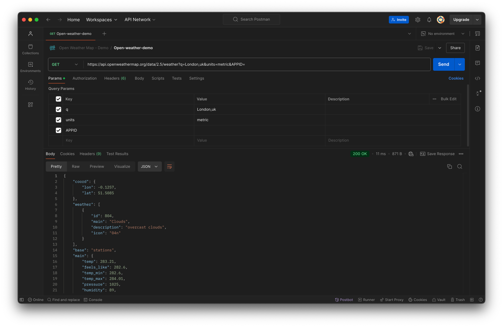

## Getting Started with APIs and Endpoints (Background Information)

An **API (Application Programming Interface)** is a set of rules and protocols for building and interacting with software applications. APIs allow different software systems to communicate with each other. In the context of web development, APIs often allow your application to request data or services from another application over the internet.

### Understanding APIs

APIs work by sending **requests** and receiving **responses**. A request is made to an API endpoint, which is a specific URL that handles the request. The response is the data returned from the API, typically in a format like JSON or XML.

For example, when you use a weather app, it might request the current weather data from a weather API. The API processes the request and sends back the weather data, which the app then displays to you.

### Key Components

- **Endpoint**: A specific URL where an API receives requests and sends responses.
- **HTTP Methods**: The actions you want to perform on the resource. Common methods include:
  - **GET**: Retrieve data from the server.
  - **POST**: Send data to the server to create a new resource.
  - **PUT/PATCH**: Update an existing resource on the server.
  - **DELETE**: Remove data from the server.
- **Parameters**: Additional data you can send with your request to specify exactly what you want. These can be query parameters in the URL or data in the body of the request.
- **Headers**: Additional information passed with the request or response, often including authentication tokens or content type.
- **Authentication**: Many APIs require you to authenticate yourself before you can access their data. This often involves using an API key or token.

### Tips for Working with APIs

- Always Read the Documentation: All the answers are there, you just need to find them.
- Handle Errors Gracefully: Always check for error responses and handle them appropriately in your application.
- **Secure Your API Keys: Never expose your API keys in public repositories or client-side code. Use environment variables or github secrets. You may want to add `.env` to your `.gitignore` file.**
- Be Mindful of Rate Limits: APIs often limit the number of requests you can make in a given time period.

### Video Walkthrough: Introduction to APIs and Postman

- REST APIs Explained 
  - [REST API Tutorial (~10 mins)](https://youtu.be/BRdcRFvuqsE?si=BY5TLmb9D83Ka3da)
  - [Net Ninja Playlist](https://www.youtube.com/playlist?list=PL4cUxeGkcC9jBcybHMTIia56aV21o2cZ8)
- Open Weather API [API Doc Link](https://openweathermap.org/api)
  - [How to Use Weather API for Beginners | Open Weather Map API (~3 mins)](https://youtu.be/MdIfZJ08g2I?si=1b3ArvSyhn7WzpIE)
- Weather API [API Doc Link](https://www.weatherapi.com/)
  - [Weather API Tutorial (~5 mins)](https://youtu.be/72bgA3nHrXs?si=GQvoZZNtuIibYilp)

### Step-by-Step Guide to Interacting with an API

Let's walk through how to interact with an API using the [OpenWeatherMap API](https://openweathermap.org/api) as an example.

#### Step 1: Sign Up and Obtain an API Key

Most APIs require an API key for authentication.

1. **Sign Up**: Go to [OpenWeatherMap Sign Up](https://home.openweathermap.org/users/sign_up) and create an account.
2. **Get Your API Key**: After signing up, navigate to the "my API keys" section in your account to find your unique API key.

#### Step 2: Understand the API Documentation

Before making requests, read the [OpenWeatherMap API Documentation](https://openweathermap.org/api) to understand:

- Available endpoints
- Required parameters
- Response formats
- Rate limits and usage policies

#### Step 3: Make a General Data Retrieval Request (GET Request)

We'll start by retrieving the current weather data for a specific city.

**Base Endpoint**: 
```shell
https://api.openweathermap.org/data/2.5/weather
```

**Required Parameters**:

- `q`: City name (e.g., `London,uk`)
- `APPID`: Your API key

**Example Request URL**:

```shell
https://api.openweathermap.org/data/2.5/weather?q=London,uk&APPID=YOUR_API_KEY
```

Using Postman:

1. Open Postman and create a new GET request.
2. Enter the request URL, replacing `YOUR_API_KEY` with your actual API key.
3. Click “Send” to make the request.
4. View the response, which should contain the current weather data for London, UK.

#### Step 4: Make a Parameter-Specific Data Retrieval Request

Now, let’s refine our request by adding parameters.

**Adding Units Parameter:** 

- To get temperature data in Celsius instead of the default Kelvin, add the units parameter.

**Modified Request URL:**

```shell
https://api.openweathermap.org/data/2.5/weather?q=London,uk&units=metric&APPID=YOUR_API_KEY
```

Using Postman:

1. In your existing request, add a query parameter:
   - Key: units
   - Value: metric
2. Click “Send” to make the request.
3. The response will now show temperatures in Celsius.



#### Step 5: Simulate an Error (Invalid Request)

Let’s see how the API handles errors by making a request with missing or incorrect parameters.

Example: Missing API Key

Request URL:

```shell
https://api.openweathermap.org/data/2.5/weather?q=London,uk
```

#### Expected Response:

A JSON object with an error message, indicating that the API key is missing.

Using Postman:

1. Remove the appid parameter from your request.
2. Click “Send” to make the request.
3. Observe the error response.

#### Step 6: Analyze the API Responses

- Success Response: Contains weather data in JSON format.
- Error Response: Contains an error code and message.

### Code Snippets

While tools like Postman are great for testing, you might also interact with APIs programmatically.

#### Python Example Using requests Library:

```python
import requests

API_KEY = 'YOUR_API_KEY'
city = 'London,uk'
url = 'https://api.openweathermap.org/data/2.5/weather'

params = {
    'q': city,
    'APPID': API_KEY,
    'units': 'metric'
}

response = requests.get(url, params=params)
data = response.json()

print(f"Temperature in {city}: {data['main']['temp']}°C")
```

#### JavaScript Example Using fetch:

```javascript
const API_KEY = 'YOUR_API_KEY';
const city = 'London,uk';
const url = `https://api.openweathermap.org/data/2.5/weather?q=${city}&units=metric&APPID=${API_KEY}`;

fetch(url)
  .then(response => response.json())
  .then(data => {
    console.log(`Temperature in ${city}: ${data.main.temp}°C`);
  })
  .catch(error => console.error('Error:', error));
```

