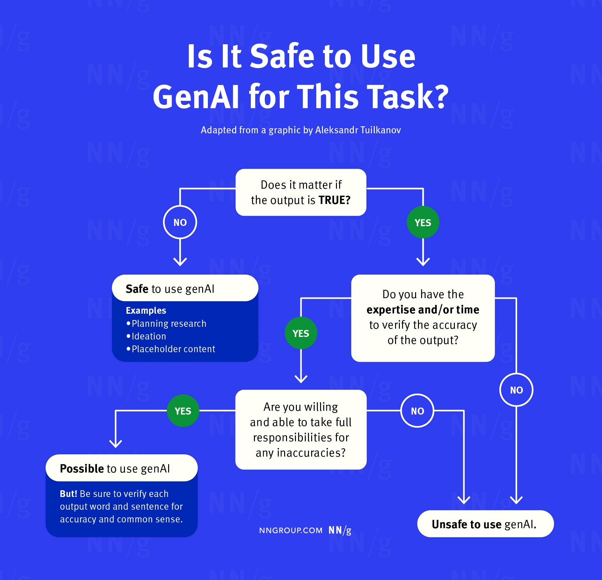

# AI-usage Course Policy

## Disclosure of AI Use

- Link to the [AI Use Disclosure Form](https://bit.ly/CMPT-276-AI-F24)

## Policy on the Use of AI Content Generators for Coursework.

As Chat Generative Pre-trained Transformer (ChatGPT) gains traction, its impact on post-secondary education is increasingly being debated. Some argue that it will make education more accessible, while others worry about its potential to replace human teachers. In this course policy, we will outline how we will tackle this challenge in CMPT 276 - Introduction to Software Engineering. Please note that this policy only applies to CMPT 276 D200 in Spring 2025.

In a nutshell, the use of AI tools is permitted for all course content such assignments, labs, project. Using tools such as ChatGPT will not be allowed during in-person midterm and final exams. As part of the course policy, students are required to disclose any use of AI tools for each submission. Failure to follow this policy will be considered a violation of the course/university's academic policy.

## General Guidelines

## We view AI tools as a powerful resource that you can learn to embrace.

The goal is to develop your resilience to automation, as these tools will become increasingly prevalent in the future. By incorporating these tools into your work process, you will be able to focus on skills that will remain relevant despite the rise of automation. Furthermore, we believe that these tools can be beneficial for students that consider English as their second and those who have been disadvantaged, allowing them to express their ideas in a more articulate and efficient manner.

## Using AI for learning 

We encourage you to use AI tools to help you learn and develop your understanding of the course material. For example, you can use AI tools to generate summaries of readings, create flashcards, or even generate questions to test your knowledge. Throughout the course, we will provide you with resources (e.g. prompts) and guidance on how to use these tools effectively. You can use these tools to test your understanding of the material, but you should not rely on them as the sole source of information.

## We are aware that there are risks involved in allowing the use of AI tools in your deliverables.

Therefore, we ask that you read this carefully and use the tools responsibly and ethically.

Firstly, it is important to note that AI tools are susceptible to errors and may incorporate discriminatory ideas in their output. As a student, **it is your responsibility to ensure the quality and appropriateness of the work you submit in this course**.

Secondly, please be mindful of the data you provide to these systems, as your assignments, activities, projects may contain private information, not just your own but also that of others. For example, you should never enter the names of your project team members or the individuals who are peer reviewing, into ChatGPT. 

Thirdly, there is a **risk of inadvertently plagiarizing** when using these tools. Many AI chatbots and image generators create content based on existing bodies of work without proper citation. In addition, other students may use these tools to generate content that is similar to yours. Therefore, it is important to **cite your sources** and **use the tools responsibly**. **Our plagiarism policy will apply to every course submissions, and "AI did it!" will not excuse any plagiarism**. 

Lastly, be aware of the dangers of becoming overly dependent on these tools. While they can be incredibly useful, relying on them too much can diminish your own critical thinking and writing skills.

## For every submission, you are required to complete a form called the "AI use disclosure." 

Submitting this disclosure will help us understand and mitigate the risks associated with the use of AI tools in the course. The form will ask about your use of AI tools for the assignment and the extent to which you used them. Failure to submit the disclosure will be considered a violation of the academic policy and a penalty of -25% will be applied to your grade if the disclosure is not submitted / attached to each of your submissions.

## AI Use for Project

Although the use of AI tools is permitted for the project, the teaching team will be more stringent in auditing the use of AI tools for the project. This is to ensure that students are not overly dependent on AI tools and that they are able to demonstrate their understanding of the course material. The teaching team will conduct interviews with students to discuss their use of AI tools for the project and assess their understanding of the project content. Students who are unable to demonstrate their understanding of the project will be penalized through grade deductions or other measures.

## Audits of AI Disclosure Forms and Student Work

To uphold the integrity of coursework, the teaching team will conduct regular audits of random students’ AI use disclosure forms throughout the semester. These audits will involve scheduled interviews where students will discuss their use of AI tools in assignments, activities, and projects. Additionally, the teaching team will cross-reference the submitted work with the details provided in the disclosure forms.

If any inconsistencies are found between the disclosed AI usage and the actual content of the work, the student may be asked to provide further clarification. Persistent discrepancies or failure to provide a satisfactory explanation could lead to a review for potential academic integrity violations. These audits will be conducted continuously to ensure transparency and adherence to the AI usage policy, fostering a fair academic environment for all students.

## If you do not wish to use these tools, that is a valid decision.

The use of AI tools in education can be messy and unpredictable due to the risks mentioned earlier. Some students may have moral confusion or concerns about the uncertainty associated with using AI tools in their coursework. **If you do not wish to use them, that is a valid decision.** This policy aims to anticipate and mitigate any potential harms associated with AI tool usage, rather than promoting their use.

## We will not mark you down for the use or non-use of AI tools.

Grading will be done based on the rubric on an absolute scale, the use of AI tools will not negatively impact your grade.

**Please note that this policy on the use of AI tools is up for change as the term progresses. Changes will be communicated in-class and via this page.**

Questions about this policy can be directed to the instructor via email with the following email header: _[CMPT 276 - AI Policy]_.

### Acknowledgements

This policy was originally developed by [Dongwook Yoon](https://dwyoon.com/) at UBC and refined through the feedback of students from multiple courses at UBC, SFU and Northeastern University. 