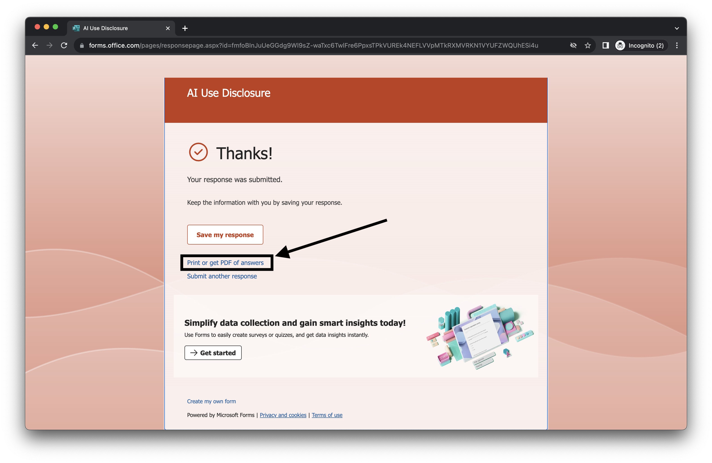

# Assignments & Labs

We are using GitHub Classroom to deliver the assignment and labs for this course. You will first need to create a GitHub account, and then you can accept each Class Activity. Once the assignment/lab is ready, the link will become active, and you will be able to accept the lab in your [GitHub.com](https://github.com/) account.

Once you click the link, a repository will automatically be created for you with instructions. You can then work on the assignments and labs, make commits, and push them to GitHub as often as you please. Once the deadline has passed, you will no longer be able to push any changes.

This the tentative schedule for all course assignments and labs, which is subject to change without notice. Please check on a regular basis for the most up-to-date schedule.

  ## Assignments

|  Assignment   | Due Date |                         Link to Accept                         |
| :-----------: | :------: | :------------------------------------------------------------: |
| A0 (Practice) |    -     | [Accept A0 on Github](https://classroom.github.com/a/XWNgOgqT) |
|      A1       |          |                                                                |

## Labs

| Labs  | Due Date |                              Link                              |
| :---: | :------: | :------------------------------------------------------------: |
| Lab 1 | Sept 23  | [Accept L1 on Github](https://classroom.github.com/a/fV8Qm2Nv) |
| Lab 2 |  Oct 1   | [Accept L2 on Github](https://classroom.github.com/a/-Ber8Osk) |

### AI Usage Disclosure

After you completed a class homework (e.g. lab/assignment/project milestone), make sure to submit the AI declaration form via MS Form and also upload a PDF copy of your responses to the homework repository and include the link to PDF in your README file. 

Instructions on how to download a PDF file of your MS Form submissions:

Option A:
1. Fill out the Microsoft Form as you normally would.
2. After filling in all necessary fields, and **BEFORE** clicking the "Submit" button, print and save your answers as a PDF
   - [MacOS instructions on how to print/save PDF](https://support.apple.com/en-ca/guide/safari/ibrw1060/mac)
   - [Windows instructions on how to print/save PDF](https://www.consumerfinance.gov/consumer-tools/save-as-pdf-instructions/)
3. Save your file as PDF as per file name format below
4. Upload PDF to github
5. Include link to PDF file on your README file using the following sytanx:

```markdown
[Link text](link to file)
```

Option B:
1. Fill out the Microsoft Form as you normally would.
2. After filling in all necessary fields, click the "Submit" button.
3. After submission, you should see a message indicating that your responses were submitted. There will also be an option saying **"Print or get PDF of answers"** (as shown below in the screenshot). Click on this button.

1. You will be taken back to your responses and be prompted to save the file as PDF via the print panel
2. Save your file as PDF as per file name format below
3. Upload PDF to github
5. Include link to PDF file on your README file using the following sytanx:
   
```markdown
[Link text](link to file)
```

***Note, you must submit this form regardless if you use AI or not. Failure to submit this form will be considered a violation of AI course policy. More details about the AI-usage course policy can be found [here](https://parsa-rajabi.github.io/CMPT-276/#/ai-policy).***

[Link to AI Usage Disclosure MS Form](https://bit.ly/CMPT-276-AI-F24)

- You will need to log in with your SFU email to access the form.

Name the file in the following format: 

- Assignmnet: `A#_AI_Declaration_FirstName_LastName_StudentID.pdf`
- Lab: `L#_AI_Declaration_FirstName_LastName_StudentID.pdf`
- Project: `P#_AI_Declaration_FirstName_LastName_StudentID.pdf`

Examples:

- Assignmnet 2: `A2_AI_Declaration_Parsa_Rajabi_301234567.pdf`
- Lab 4: `L4_AI_Declaration_Parsa_Rajabi_301234567.pdf`
- Project Milestone 1: `P1_AI_Declaration_Parsa_Rajabi_301234567.pdf`

### Canvas

All course content include assignments, labs etc. will need to be submitted on Canvas via the [assignment tab](https://canvas.sfu.ca/courses/85687/assignments). Not submitting on Canvas will be considered as a missed assignment/lab and the following penalties will be applied:

- 1st instance penalty = -5%
- 2nd instance penalty = -15%
- 3rd instance penalty (onwards) = -25%

Students who not submit on Canvas will be assigned a grade of 0 until they reach out to their TA with the correct submission, within 7 days of the deadline. No missed canvas submission will be accepted after 7 days of the deadline. This is not to be confused with the late submission policy, which is outlined in the course syllabus.

### Github Classroom

Here are some instructions on how to start working on assignments/labs that are available on Github classroom.

- Step 1: Accept assignment/lab with link above, and open a Terminal
- Step 2: Clone the repo on your local computer [View Tutorial / Common errors](https://docs.github.com/en/repositories/creating-and-managing-repositories/cloning-a-repository)
  - `git clone https://...`
- Step 3: Navigate to that directory 
  - `cd /path/to/where/you/cloned/repo/`
- Step 4: Try to navigate the files and folders (if any) in your repo using the Terminal
- Step 5: Making changes based on instructions 
- Step 6: Commit your changes to the repository 
  - `git add -A or git add .`
  - `git commit -m "Insert your commit message here i.e. Updated file X"`
  - You can commit changes to your repository **as many times as you like before the deadline** (any commits after the deadline will be ignored)
- Step 7: Pushing the changes above
  - `git push`
- Step 8: Copy your repository link and submit the link to [Canvas assignment](https://canvas.sfu.ca/courses/79650/assignments). After the deadline, we will begin marking submitted assignments.
  - The link will look something like this: `https://github.com/CMPT-276-FALL-2024/CMPT-276-assignment-#-[YOUR GITHUB USERNAME]` for example, for A1, it will be `https://github.com/CMPT-276-FALL-2024/CMPT-276-assignment-1-Parsa-Rajabi`

### Working with Git

1. Add file: `git add filename.format`
    - e.g. `git add example.txt` (to add a text file named example)
    1b. You can commit all files in your directory by using either:
     - `git add .`
     - `git add -A`
2. Commit changes with a message: `git commit -m "type commit message here"` (make sure the commit message is meaningful)
3. Push changes: `git push`