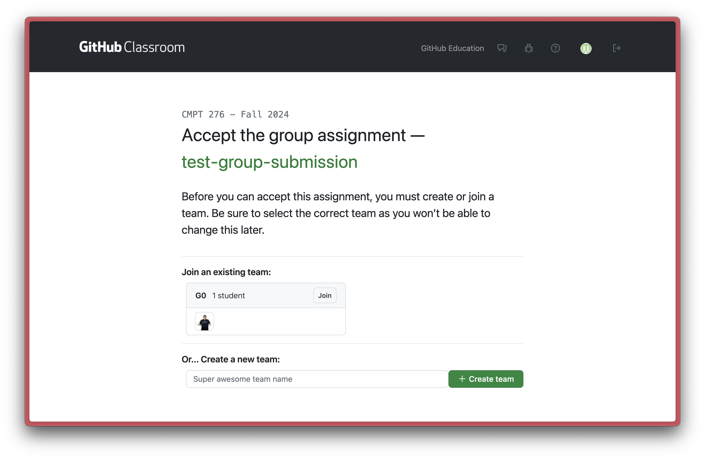

# Project

The goal of this project is to create a web application that demonstrates practical experience with API integrations and real-world software development practices.

## Changelog

|  Date  |            Changes            |
| :----: | :---------------------------: |
| Jan 6  | Project details released (v1) |

## Structure

This project is broken down into multiple milestones (click on each to learn more):

- [Project](#project)
  - [Changelog](#changelog)
  - [Structure](#structure)
    - [Schedule](#schedule)
  - [Details](#details)
  - [Above and Beyond 🚀🪐](#above-and-beyond-)
    - [🌟 Hall of Fame 🌟](#-hall-of-fame-)
  - [Milestone 0: Project Setup and Proposal](#milestone-0-project-setup-and-proposal)
    - [Accepting a Github Link as Group](#accepting-a-github-link-as-group)
    - [Repository Visibility](#repository-visibility)
  - [Milestone 1: Project Planning](#milestone-1-project-planning)
  - [Milestone 1.5: Project Check-in](#milestone-15-project-check-in)
  - [Milestone 2: Project Delivery](#milestone-2-project-delivery)

### Schedule 

The following schedule is tentative and may change based on the progress of the class. Changes will be communicated in class and via the page changelog.

Schedule to be released soon.

<!-- | Project Element |         Deliverable          | Due Dates (11:59pm PST) |
| :-------------: | :--------------------------: | :---------------------: |
| Groups Assigned |        Group Contract        |     Monday, Jan 21      |
|  M0 - Proposal  |            Report            |      Friday, Feb 7      |
|  M1 - Planning  |        Report + Video        |      Friday, Mar 7      |
| M1.5 - Check-in |      Report + Mtg w/ TA      |    Week of Mar 17-21    |
|  M2 - Delivery  | Report + Presentation + Code |      Tuesday, Apr 8      | -->

## Details

**Develop a web application** that integrates two (2) different [APIs](https://www.ibm.com/cloud/learn/api), with at least three (3) distinct features for each API (a total of six (6) features).

You may choose APIs from a [provided list](https://github.com/public-apis/public-apis) or other sources. It is recommended to select free, well-documented APIs with active user communities.

- An application "`feature`" is defined as:
  > a distinct functionality or component of the application that offers a specific value or service to the user. It should be a **self-contained** unit that, on its own, delivers a portion of the overall application's functionality. In other words, a feature should not rely on other features to function. 

When considering features, prioritize the user's perspective. A valuable feature enhances the user experience, fulfills a user need, or solves a particular problem for the user.

## Above and Beyond 🚀🪐

 

Bonus Marks?

Each semester, the teaching team selects a few standout projects that showcase exceptional effort, creativity, and innovation. In lieu of bonus marks, these projects are honored in the “Hall of Fame” and may have the opportunity to continue as research projects in future semester(s). Research projects usually lead to publications, presentations, and potential collaborations with industry partners.

While the core project requirements are essential, these projects are often well-polished, demonstrate a **strong attention to detail**, and solve **a unique societal problem**. In spirit of the rise of *AI-Education tools*, projects that incorporate AI-based learning platforms, simulations, teaching tools, or research tools will be given special consideration.

### 🌟 Hall of Fame 🌟

Spring 2025

- Coming soon...

Fall 2024

- WanderWise - [Video Presentation](https://youtu.be/WI8YdPw-tSo?si=bdsa13SOyyLZpcX-)
- MindstreamAI - [Video Presentation](https://www.youtube.com/watch?v=8oSEa6JYfmg&ab_channel=raghavahuja), [Website Link](https://mindstreamai.onrender.com/) 

Fall 2023

- Paletä - [Video Demo](https://youtu.be/yhZiRMkjtFk?si=oofHU95EsmevR1BD)
- ReactPedia - [Website Link](https://reactpedia.vercel.app/) 

Spring 2023

- Fluentify - [Website Link](https://fluent-ify.netlify.app/)
- GoodGame - [Website Link](https://andre-martin.github.io/boardgame-list) 
- EasyGrammar - [Video Demo](https://drive.google.com/file/d/1BGwYyWy6-Ay4LPMKNaLGZ9Xeqsm9he0E/view) 

## Milestone 0: Project Setup and Proposal

### Accepting a Github Link as Group 

- Joining a group repository is slightly different than individual lab/repo. You must join or create a group before accepting the project. 
- It is recommended for the group project manager to accept the link first, create the group and then the rest of the group members can join the group.
  - Make sure to do this correctly, as you will not be able to change your group once you have accepted the project.
  - **The group names should be identical to the group names in Canvas (including the number and name**)

Here is an example of how to accept a group project. You notice group `G0` has already been created, so joining it is as simple as clicking the join button to the top right of the group name.

### Repository Visibility

- By default, all project repositories will be set as `private`, however, should you wish to make your repository `public`, you may submit a request to your TA.

**Deliverables:**
- Project Repository ([Accept Github Classroom Link + Join Your Group - Link TBA]) 
  - You're encouraged to refer to [this template](https://github.com/CMPT-276-SPRING-2025/CMPT-276-Project-Template) as a starting point for your project repository
- Proposal Report

Milestone 0 details (click to expand):

- Complete and sign group contract with TA approval 
  - This should include your group members, communication tools, and meeting schedules
- Setup Project Repository 
  - Create a `docs`, `src` and `misc` folder
  - On the repo root, update `README.md` file with the project title, group members, and a brief description of the project
- Research and find `4 APIs` that you wish to use for your project
  - The first 2 APIs will be your primary choice, the other 2 will be backup options in case the primary APIs are not approved/do not work out

**Project proposal report:**
  - A cover page with the project title, group members and link to github repository
  - Include an overview of the project and the problem it aims to solve
    - You should explain where the idea came from and why it is important
    - This should include a list of potential users and their needs (how does this application fulfill those needs?)
  - Create 1 persona for each application user group 
  - List chosen APIs (4 total) and a brief description of each
  - A brief description of the features you plan to implement for each API (3 features per API, 12 features total) 
    - You will only implement 6 features in the final project, the other 6 are for backup 
  - Write 1 user story for each feature you plan to implement  
  - A low-fidelity storyboard of the application interface/features
    - This should include the user flow and how the user will interact with the application 
    - This can be hand-drawn or developed using software tools ([list of tools available here](resources.md?id=design-tools))
  - Choose a [front-end technology stack](resources.md?id=languages-and-frameworks) that this project will be based on
    - Briefly explain why you chose this stack
    - It is recommended to use a modern web application framework (e.g., React, Angular, Vue)
    - You will NOT be implementing a back-end (database) for this project
  

## Milestone 1: Project Planning

**Deliverables:**
- Project Planning Report
- Video Presentation

Milestone 1 details (click to expand):

 

**Project planning report:**
- With approval from the TA, finalize the 2 APIs you will be using for the project
  - Include a brief description of each API and how it will be used in the project
- Determine the features you will be implementing for each API (6 total)
  - This should include a detailed description of each feature and how it will benefit the user
  - Include any changes made to the features since the proposal
- Convert the low-fidelity storyboard to a mid-fidelity prototype
  - This should include a more detailed design of the application interface
  - The prototype should be interactive and demonstrate the user flow
  - It is expected that the prototype will be developed using a design tool ([list of tools available here](resources.md?id=design-tools))
- Choose a SDLC model that you will be following for the project
  - This SDLC must be based on one of the variations introduced in class
  - Briefly explain why you chose this model 
- Develop a work breakdown structure (WBS) of all the tasks associated with the project 
  - Prioritize tasks based on dependencies and importance
  - By the end of this milestone, these tasks should be written as tickets (Github Issues) and added to the github project 
- Project schedule with milestones and deadlines
  - This should provide a timeline for the project, including when each feature will be developed and tested
  - It is recommended to schedule internal deadlines and include buffer days between the internal and actual deadlines
- A risk assessment of potential issues that may arise during the project and how you plan on mitigating them
  - Include at least 5 low-risk, 5 medium-risk, and 5 high-risk issues (15 total) with mitigation strategies for each
- Use Data Flow Diagrams (level 0 and level 1) to outline how data flows within the application
  - Between the APIs and your application
- MVC model diagram for the application
  - This should include a high-level overview of how the application will be structured and a description of each component
- Appendix with any additional information that was not included in the main report
  - Provide a list of all group members and their detailed contributions to the project
  - Provide a changelog table that includes any revisions since the proposal 
  - Any additional diagrams, charts, or tables that were not included in the main report

**Video Presentation:**

Create a video presentation (with subtitles) intended for your classmates, TA and instructor (6 mins max)
- This will be reviewed by other groups and the teaching team to get a better understanding of your project. 
  - Your video will be peer reviewed and accessible by all students in the class
- Each group member should have at least a 1-2 minute(s) speaking role in the presentation
  - You do not need to necessarily show your faces in the video, but it is highly encouraged
  - Make sure to introduce yourselves at the beginning of the presentation
- Make sure to practice your presentation multiple times before the actual presentation
  - Ensure transitions between speakers are smooth and that the presentation flows well
- The audio should be clear and easy to understand
- The video should be engaging and informative
- A `10%` penalty will be applied to videos over the time limit
- The video should include:
- A brief overview of the project and the problem it aims to solve (~1 minute)
- A high-level overview of the chosen APIs and the features you plan to implement (~2 minutes)
  - Use personas and user stories to explain how these features will benefit the user
- A walkthrough of the mid-fidelity prototype (~2 minutes)
  - This doesn't need to be a detailed walkthrough, but should give a general idea of how the application will look and function
- A high-level overview of application data flow (DFD or MVC diagram) (~1 minute)
  - This should show how data flows between the APIs and the application
 

## Milestone 1.5: Project Check-in

**Deliverables:**
- Project check-in report
- Meeting with TA

Milestone 1.5 details (click to expand):

This project check-in is an opportunity for your group to receive feedback on the progress of your project and ensure that you are on track to complete the project successfully. 

The check-in will be a 15-minute meeting with your assigned TA. As we approach the check-in date, groups will be provided with a sign-up sheet to select a time slot for their meeting (on a first-come, first-serve basis).

To prepare for this check-in, your group should submit a 1-page report that includes the group's progress on the following items:

|         Item          |                          Expected Progress                          |
| :-------------------: | :-----------------------------------------------------------------: |
|    API 1 features     |           Features should be completed or near completion           |
|    API 2 features     |           Features details should be confirmed and planned           |
| Application Interface |  Interface should be developed and interactive with API 1 features  |
|         CI/CD         |              Pipeline should be set up and configured               |
|  Application Testing  | Automated tests should be set up and configured for API 1 features |

> **All group members are required to attend this check-in. Any member who fails to attend will receive a `10% deduction` from their individual project grade. Individuals who arrive late will also be subject to a penalty of `1%` per minute. No exceptions will be made.**

## Milestone 2: Project Delivery

**Deliverables:**
- Project Final Report
- Project source code
- Project website (deployed)
- Project demo video
- Project Video Presentation

Milestone 2 details (click to expand):

 

**Project final report:**

- Cover page with the project title, group members, links to github repository, video demo and deployed website 
- Analysis of the project's success in meeting the user needs and solving the problem
  - This should include feedback from real users (testing session with classmates)
- Analysis of the project's SDLC model and how it was used in the project
  - Include any changes made to the model during the project
- Detailed description of the features implemented for each API
  - Explain any changes made to the features since the planning stage
- Detailed description and overview of the CI/CD pipeline and how it was used in the project
  - Testing, deployment, and monitoring should be included in this description
- Description of the project's testing strategy and how it was implemented
- Detailed diagram of the project's architecture
  - An updated (since M1) level 1 DFD of the application's structure and how data flows within the application
  - An updated (since M1) MVC model of the application 
- List of known bugs and issues with the project and their severity (table format)
  - Any bug identified and missing from this list will impact the project grade
  - It is recommended to use a bug tracking tool (e.g., Github Issues) to track these bugs
  - Bug reports should include a description of the bug, steps to reproduce, and severity level and link to Github Issue
- Description of the project's future work and potential improvements
  - This should include any features that were not implemented and how they could be implemented in the future
- Lessons learned and project takeaways
  - Include challenges faced during the project and how they were overcome 
- Appendix with any additional information that was not included in the main report
  - Provide a list of all group members and their detailed contributions to the project
  - Provide a changelog table that includes any revisions since previous milestones 
  - Peer testing feedback form (survey questions) 
  - All the peer testing feedback received from classmates (survey results)
  - Any additional diagrams, charts, or tables that were not included in the main report

**Source Code:**

- The website should be fully functional and demonstrate the features implemented for each API
- At the minimum, the application should be tested using:
  - Unit tests for each feature (automated through CI/CD pipeline)
  - Integration tests for each feature (automated through CI/CD pipeline)
  - Real user testing for each feature (manual through in-class session)
    - This should be drawn from your classmates (peer testing session)
- Application interface should follow Jakob Nielsen's 10 Usability Heuristics
  - [Link to Heuristics](https://www.nngroup.com/articles/ten-usability-heuristics/)
  - [Link to Video Playlist on Heuristics](https://www.youtube.com/playlist?list=PLJOFJ3Ok_idtb2YeifXlG1-TYoMBLoG6I)
  - Application will be thoroughly tested by the teaching team
  - Attention to detail is key in this part of the project
- There should be no `errors`, `console.logs` or `warnings` in the project Console
- The root project `README` should include:
  - Step-by-step instructions for the project to be deployed locally, including instructions to install dependencies. The teaching team will be following these steps to deploy the application and if unsuccessful, the project will be subject to grade deductions
  - Link to all project website, reports and videos 
- All source code should be pushed to the project repository and organized in a clear and concise manner
  - The code should be well-documented and follow best practices for the chosen front-end technology stack
  - At the very least, the code should be linted and formatted correctly. There should be no "dead code" (e.g., code that is commented out and not used)
  - Code functions should be modular and reusable where possible. Functions should also have comments describing what they do, their input and output including data format/type.
  - Logic operations and loops should have comments describing their behaviour/logic in plain English

**Presentation:**

As part of this 8-10 minute **video** presentation (with subtitles), your group will present the following information to the class and teaching team:
- An overview of the project and the problem it aims to solve
- The chosen APIs and the features you implemented
  - Use personas and user stories to explain how these features benefit the user
- Overview of the CI/CD pipeline and how it was used in the project
- Project takeaways and lessons learned
- Project demo video (1-2 minutes)
  - The timing of this video does count towards the 8-10 minute limit (e.g. going above 10 minutes will result in a penalty)
  - This video should be a demonstration of the application's features on a live website (refer to Hall of Fame projects for examples)
  - It is recommended to have a voiceover explaining the features being demonstrated but not required
  - For future job applications, this video can be used as a portfolio piece (make it professional) 
- Future work and potential improvements

 

