<!-- markdownlint-disable -->

# Responsive Web Design

As part of this week's lesson, we will understand the importance of responsive web design and how to create a responsive web page using HTML and CSS techniques.

## Table of Contents

<!-- toc -->
- [Responsive Web Design](#responsive-web-design)
  - [Table of Contents](#table-of-contents)
  - [Responsiveness of Web Pages](#responsiveness-of-web-pages)
  - [Media Queries](#media-queries)
  - [Scaling Images](#scaling-images)
  - [Multi-Column Layouts](#multi-column-layouts)
  - [Flexbox Layout](#flexbox-layout)
    - [Flex Containers and Items](#flex-containers-and-items)
    - [Flexbox Properties](#flexbox-properties)
    - [Usecases for Flexbox](#usecases-for-flexbox)
  - [Grid Layout](#grid-layout)
    - [Grid Structure](#grid-structure)
    - [Grid Placement](#grid-placement)
    - [Cell Properties](#cell-properties)
    - [Nested Grids](#nested-grids)
  - [Grid and Flexbox Together](#grid-and-flexbox-together)

The videos below provide an overview of the topics for this week. You can watch the videos before or after reading the content for this week.

- [CSS Media Queries [6:53]](https://youtu.be/XAchqU1-PWI?si=UELf_3cspFWg5UTi)
- [CSS Flexboxes [26:52]](https://youtu.be/-DNLYk5uzl8?si=41O9UEsZlnTIHwws) 
- [CSS Grid [43:12]](https://youtu.be/RhUuMl3R1PE?si=T2sv6JcXtGKXUHo8)


Additional Resources:
- https://www.w3.org/TR/css-flexbox-1/
 

## Responsiveness of Web Pages

Responsive web design refers to enhancing a web page for different viewing contexts (such as smartphones and tablets) through the use of coding techniques including fluid layouts, flexible images, and media queries. Here is an example of a web page configured to display differently, depending on the viewport size detected by media queries.

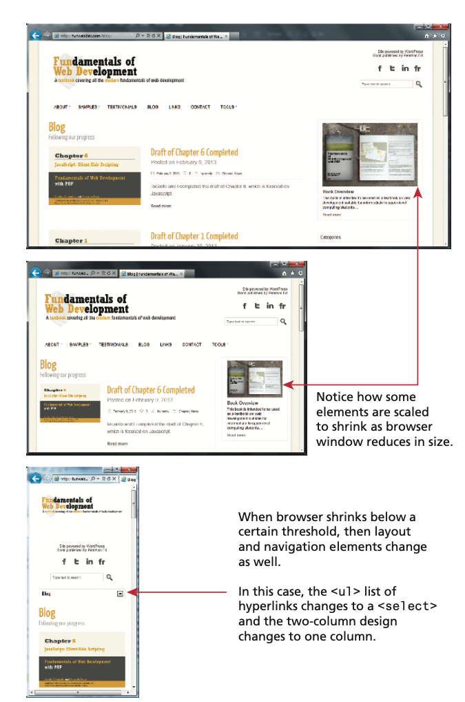

## Media Queries

Media queries are a CSS technique introduced in CSS3 that allow you to apply styles based on the device characteristics. Media queries are used to determine the width and height of a viewport to ensure that the content is displayed correctly on all devices. 

The diagram below illustrates the syntax of a typical media query. These queries are Boolean expressions and can be added to your CSS files or to the <link> element to conditionally use a different external CSS file based on the capabilities of the device.

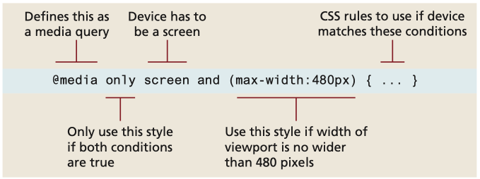

Here is a partial list of the browser features you can examine with media queries. Many of these features have min- and max- versions.

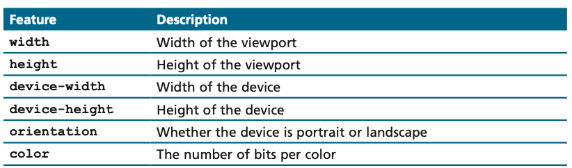

Contemporary responsive sites will typically provide CSS rules for phone dis- plays first, then tablets, then desktop monitors, an approach called **progressive enhancement**, in which a design is adapted to progressively more advanced devices, an approach you will also see in the JavaScript chapter. This example demonstrates how a responsive site might use media queries to provide progressive enhancement.

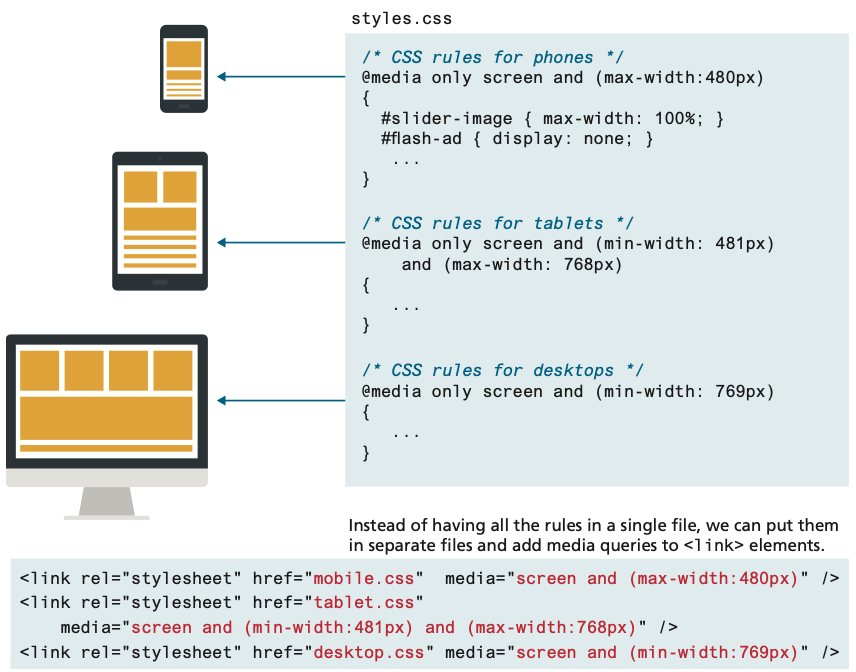

Notice that the smallest device is described first, while the largest device is described last. Since later rules in the source code override earlier rules, this provides progressive enhancement, meaning that as the display grows you can have CSS rules that take advantage of the larger space. Notice as well that these media queries can be within your CSS file or within the `<link>` element.

## Scaling Images

Making images scale in size is actually quite straightforward, in that you simply need to specify the following rule:

```css
img {
  max-width: 100%;
}
```

Of course this does not change the downloaded size of the image; it only shrinks or expands its visual display to fit the size of the containing parent element (or the browser window if no parent), never expanding beyond its actual dimensions. Students are often tempted to define a height, which usually changes the aspect ratio distorting the image. Using `height:auto`, though not necessary, satisfies the inclination to add height. 

HTML5.1 defines the new `<picture>` element as an elegant way to do this task via markup. The `<picture>` element is a container that lets the designer specify multiple `` elements; the browser will determine which `` to use based on the viewport size. The diargram below outlines how the `<picture>` element can be used to serve an appropriate-sized image for different device sizes. Notice that each `<source>` child element uses a media query.

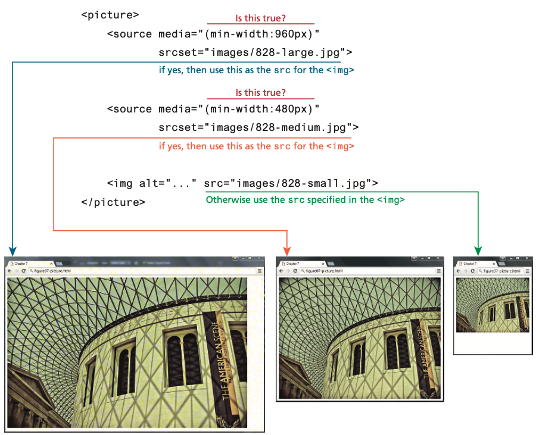

## Multi-Column Layouts

In our previous lessons, you learned that complex multi-column layouts could be created with floats and/or positioning, but it was a bit of a hack in the sense that neither the `float` nor `position` property were designed to achieve that outcome.

To address this, W3C CSS introduced two new display properties:

- `flex`
- `grid`

Flexbox layout, which was implemented by all the major contemporary browsers by 2015, was designed for layout in one dimension (a row or a column). Grid layout, which was supported by the major browsers by mid-2017, was designed for layout in two dimensions. Because they are display properties, these two layout modes can be assigned to any element.

## Flexbox Layout

Flexbox layout is a CSS layout mode that provides a more efficient way to lay out, align, and distribute space among items in a container, even when their size is unknown and/or dynamic. The main idea behind the flex layout is to give the container the ability to alter its items' width/height (and order) to best fill the available space (mostly to accommodate all kinds of display devices and screen sizes).

This example illustrates how flexbox solves a very common design problem: placing two elements within two columns within a container.


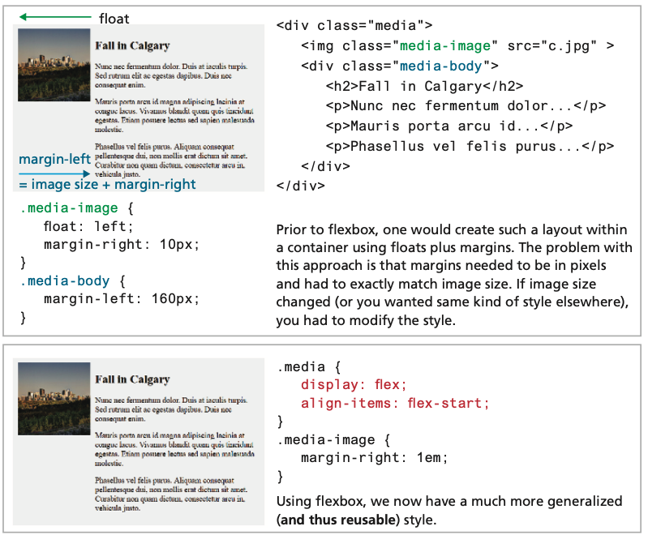


The older approach using `floats` requires margin settings using pixels based on the size of the image. While this does work, it doesn’t scale very well. That is, what if we wanted the same display but with larger or smaller images? Flexbox provides a simpler way to construct a layout that is more maintainable and far less brittle (although flexboxes are not without their own quirks).

### Flex Containers and Items

The first step in learning flexbox is recognizing that there are two places in which you will be assigning flexbox properties: the flex `container` and the flex `items` within the container. 

This example illustrates how a flex container contains flex items:

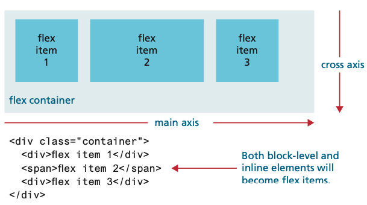

Notice as well that the flex items are positioned in source order along a single main axis. So what would happen if we added a fourth item to this container? You can control this behavior via the `flex-wrap` property, but by default the new item would wrap to a new line in the direction of the cross axis.

As seen below, the **parent container** must have its `display` property set to `flex`. You can change the main axis from being a row to being a column, as well as the wrap behavior. This example also demonstrates the `align-items` and `justify-content` properties, that control how items are aligned within a container.

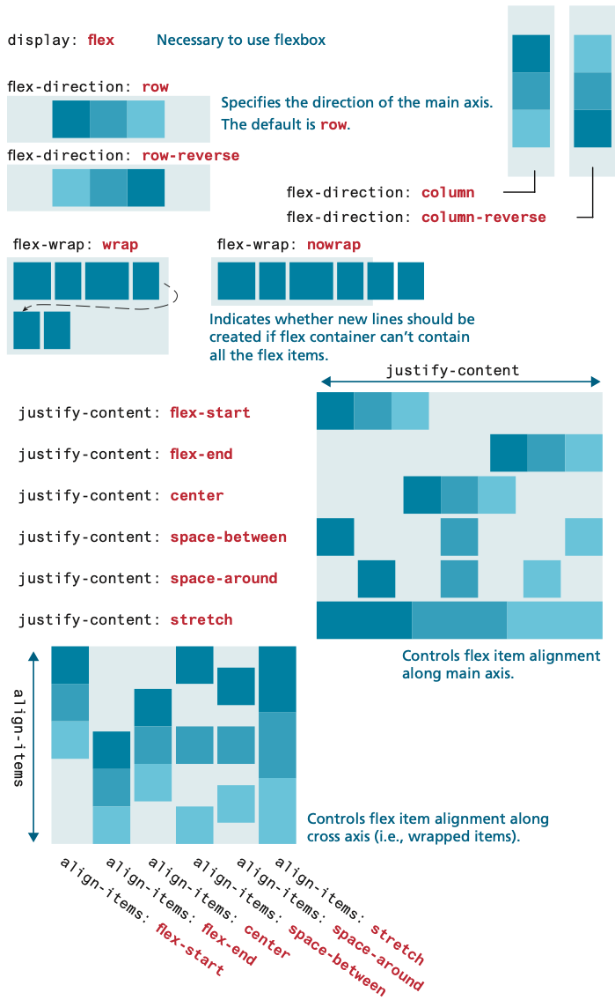

Individual flex items within the container also have their own flexbox properties; the most important of these are shown below:

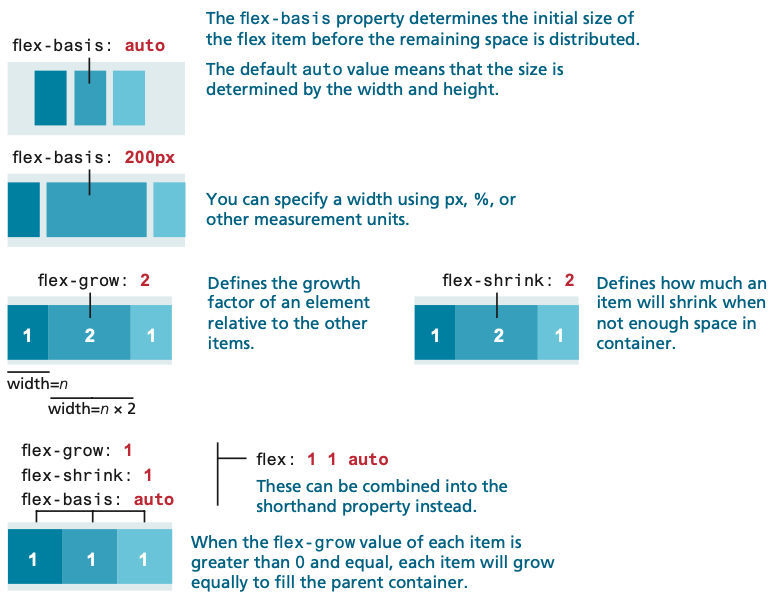

### Flexbox Properties

Configure the direction of the flex items with the `flex-direction` property. The value row configures a horizontal direction. The value column configures a vertical direction. For example, to configure an id named `row-flex` as a flexible block container with a horizontal flexible flow, code the following CSS:

```css
#row-flex { 
  display: flex;
  flex-direction: row; 
}
```

The `flex-wrap` property configures whether flex items are displayed on multiple lines. The default value is nowrap, which configures single-line display. The value wrap will allow the flex items to display on multiple lines, which could be useful for navigation or for an image gallery.


The `justify-content` property configures how the browser should display any extra space that may exist in the flex container. The value center will center the flex items with equal amounts of empty space before and after. The value space between evenly distributes the flex items and allocates empty space between them.


### Usecases for Flexbox

Aligning an item horizontally and vertically within a container has always been a tricky problem with CSS; flexbox makes this process much easier. This example illustrates how to center a child within a parent container using flexbox. It also illustrates that flexbox works from the content out. That is, with flexbox, the content decides how much space it needs and its parent decides how to fit it based on space available on that line (or column):

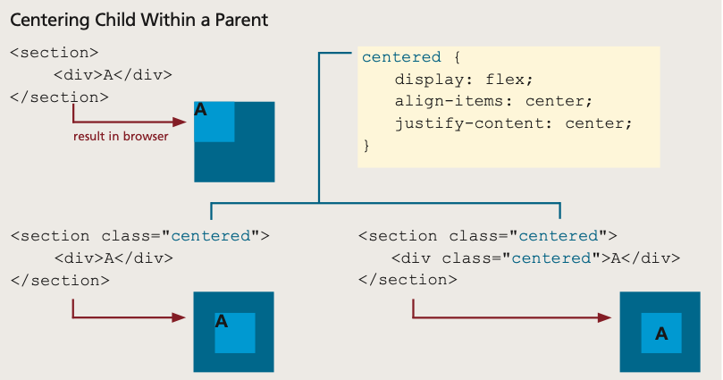

Flexbox is often used to construct a horizontal navigation bar, since flex can distribute items evenly along a row. Similarly, flex is very helpful within data entry forms, especially for aligning labels, input controls, and buttons. The example below shows how one can simply construct an adaptable horizontal menu using flexbox:

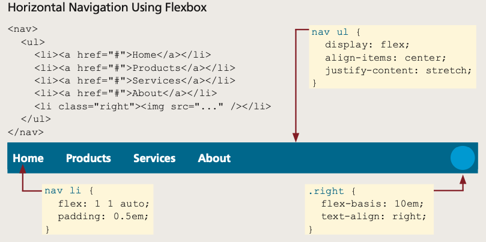

Flexbox is also used for so-called **card layout**. In a card component, you typically have a footer that has to sit at the bottom of the card after the rest of the card content. If the card content is of variable height, without flex, the footer would move to be just below the content; flex can make the card content area grow, as shown below:

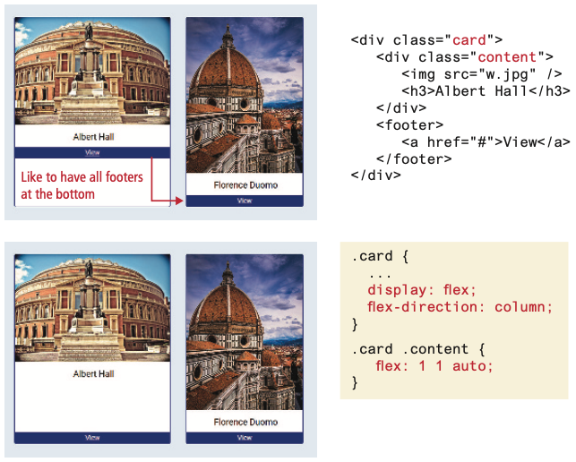

## Grid Layout

Grid layout is adjustable, powerful, and, compared to floats, positioning, and even flexbox, is relatively easy to learn and use. It allows you to divide any container into a series of cells within rows and columns. Block-level child content will by default be automatically placed into available cells; you can also instead manually indicate which content will appear in which cells.

### Grid Structure

The example below illustrates how grid layout works with block-level elements. Each block-level child in a parent container whose display property is set to grid will be automatically placed into a grid cell (this automatic placement into cells is often referred to as an implicit grid). If no grid-template-columns property is set, then the grid will only contain a single column, and thus the output will be more or less similar to normal block layout flow. Notice that rows will automatically be added to the grid based on the content.

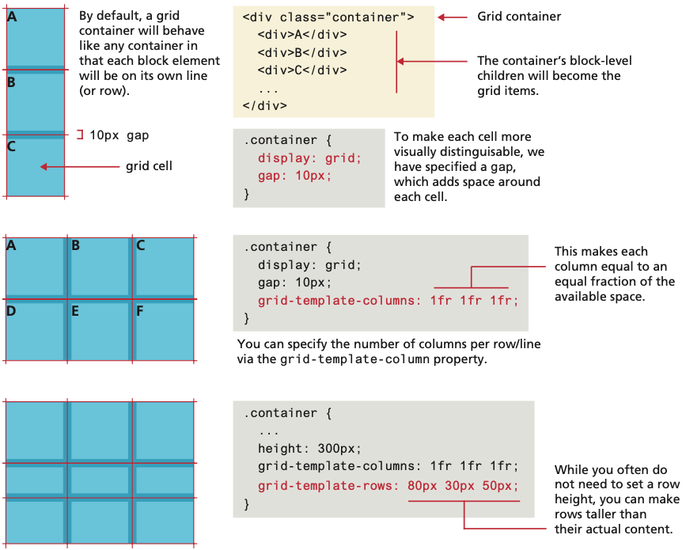

The `grid-template-columns` is used for **adding columns** to the parent container by specifying each column’s width. There are a lot of possible options for this property. This also illustrates that you can specify row heights via the `grid-template-rows` property. 

In the middle example above, column widths are specified using the `fr` unit. This unit provides a way to flexibly size a column based on available space. It indicates a width that is a **fraction** of the available space in the grid container. So, for instance, imagine the following two examples:

```css
grid-template-columns: 1fr 1fr;
grid-template-columns: 3fr 1fr;
```

In the first example, each of the two columns will be equal in size (1fr). But in the second example, the first column will take up 3⁄4 of the available space and the sec- ond will take up 1⁄4.


The example below illustrates some of the additional sizing flexibility available with grids. Column widths (or row heights, since the same techniques can be used with `grid-template-rows` as well) can be specified in a wide range of sizing units, including `px` and `%`. The CSS `repeat()` function provides a way to specify repeating patterns of columns. In conjunction with the CSS `minmax()` function, you can easily lay out a repeated pattern of objects (for instance, images or cards) into rows and columns. 

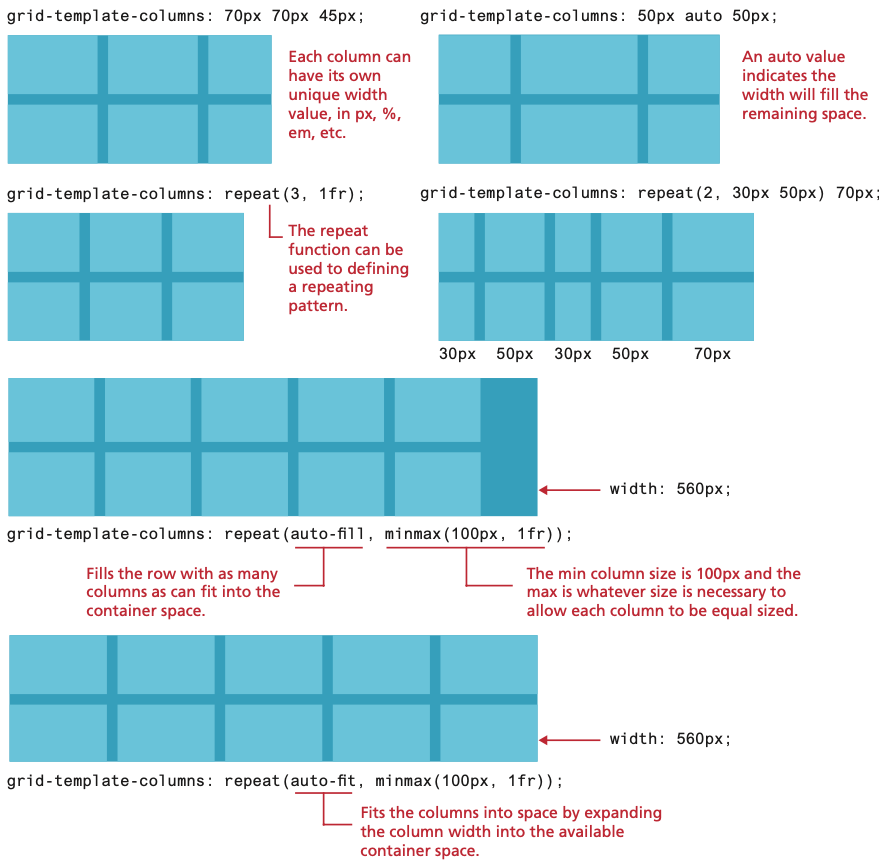


### Grid Placement

By default, child block-level elements are placed into grid cells automatically, or implicitly. It is possible however to populate grid cells explicitly. The example below demonstrates one of the ways this can be achieved: by setting grid row and column properties within individual cells. 

In the first example notice that the first child element within the grid container has explicit `grid-column-start` and `grid-column-end` properties (set using line numbers), which makes the content **span two cells**. 

In the second example, the “B” child element is pulled out of its `normal` position, and explicitly placed into the second row and second column, while in the third example, the “C” child element **spans two rows**. 

Notice that in the third example, a new row is added to the grid using its auto-placement algorithm, in which the height of a new row is determined by its content if there isn’t a `grid-template-row` setting already set for it.

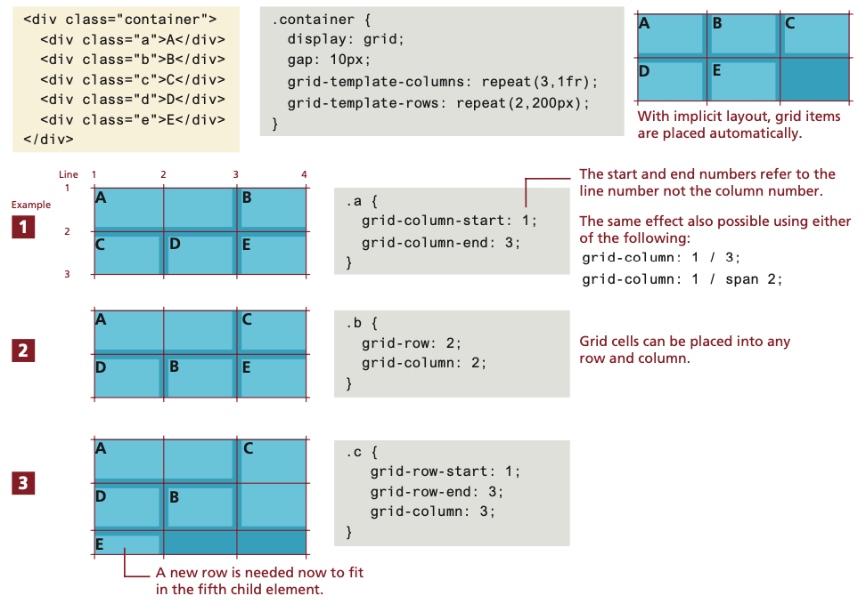

### Cell Properties

Just as flexbox introduced new layout properties to elements within a flex container, so too does grid have properties for child elements. The diagram below illustrates two of the main cell properties: `align-self` and `justify-self`, which control the cell content’s horizontal and vertical alignment within its grid container:

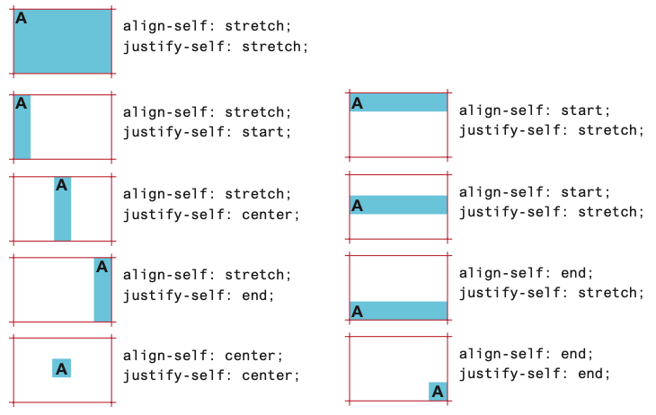

You can also control cell alignment within a grid container using `align-items` and `justify-items`, as shown below:

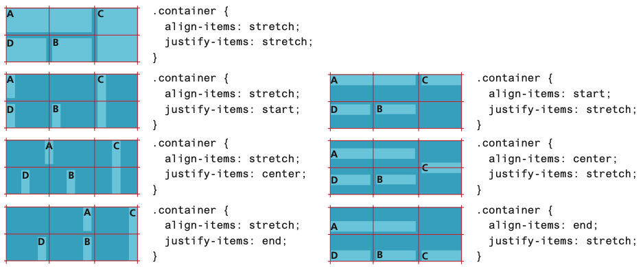


### Nested Grids

Any container element can have its display property set to `grid`. This means that grids can be nested within one another. Indeed, this is quite common. 

The diagram below illustrates just how easy and flexible grid layout can be:
- The `<main>` container uses grid and contains just two columns, one for the filters and one for the cards. 
- The `<section>` contain uses grid to layout the painting cards. 

As can be seen, it only takes a few lines of CSS to create a flexible nested grid. Using the CSS `repeat()` function with `auto-fit` means the number of card grid items will grow or shrink depending on the space available. If the browser window is wide, then five or six or more cards will be shown; if the window is mobile width, only one or two cards will be visible.

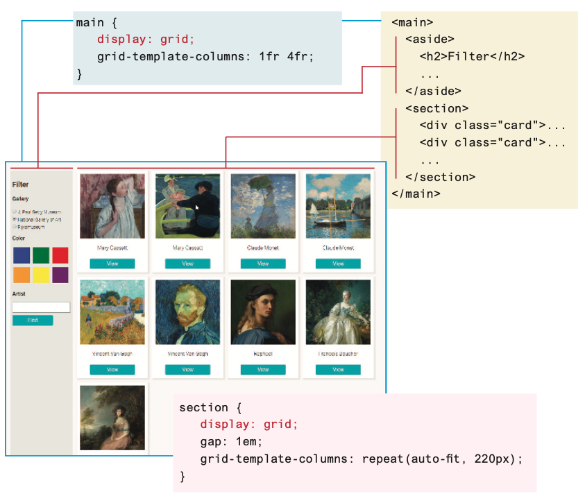


## Grid and Flexbox Together

While both flexbox and grid layout modes share some styling properties, it is important to understand how they differ:

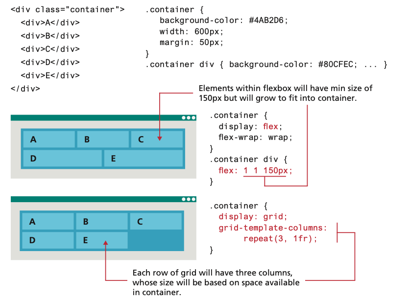

Sometimes grid and flexbox layout are considered as competing solutions to implementing a layout. A more helpful way to thinking about these two layout modes is that they each have their strengths and these strengths can be combined. Most web page layouts are focused on two axes, on both rows and columns. 

As such, grid layout is ideal for constructing the layout structure of your page (or your container’s layout). Flexbox is ideal for layout along a single axis, either a row or a column. Flexboxes shine when it comes to centering elements within a container or making a container’s content stretch to fill its available space. Thus, flexbox is often ideal for laying out the contents of a grid cell.

The diagram below illustrates an example of combining the two layout modes. Grid is used to create the four column by two row layout (though with different browser widths the number of rows and columns will vary) shown in the first screen capture. Notice that in the first screen, the cells vary in their height. In the second screen, Flexbox is used to ensure that each grid cell has the same height along with center alignment.

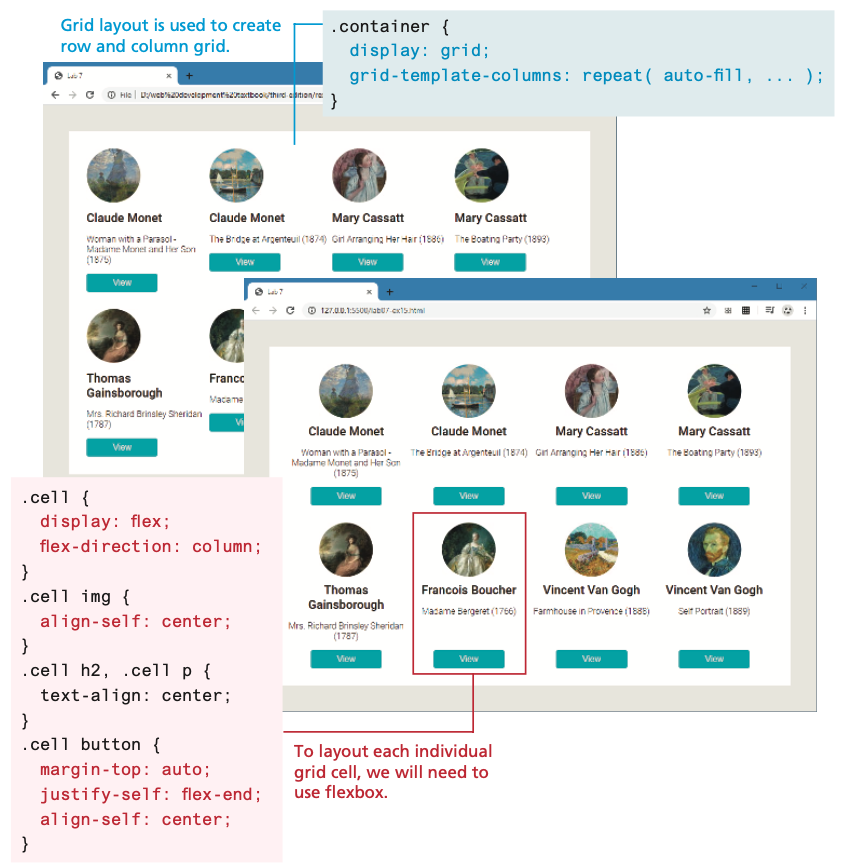