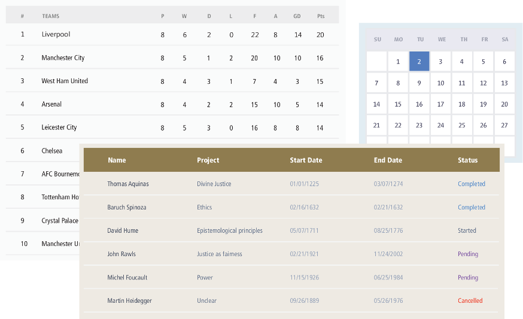
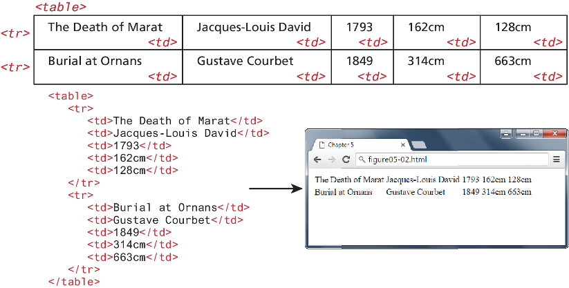
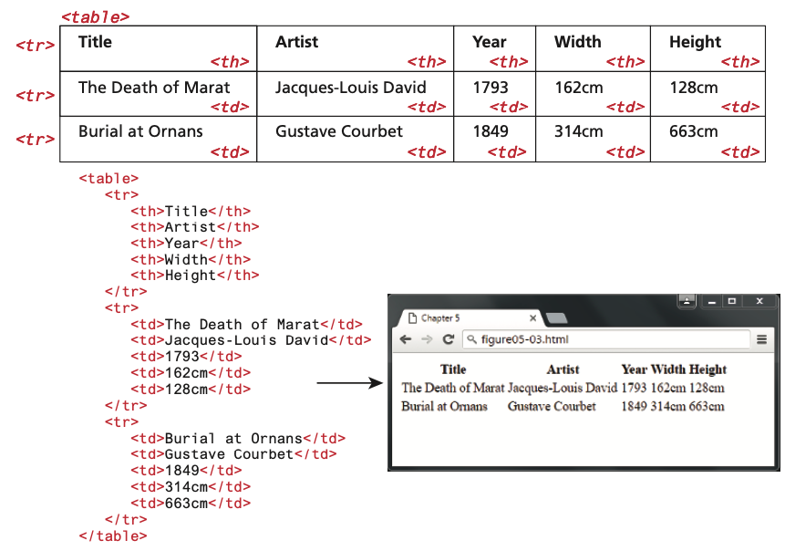
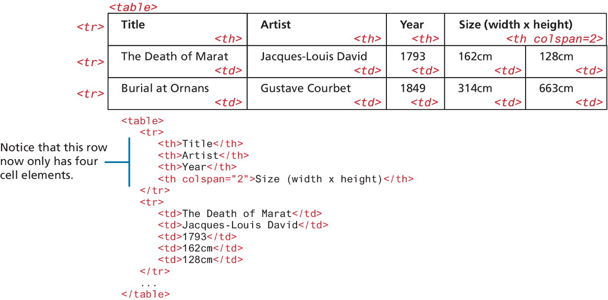
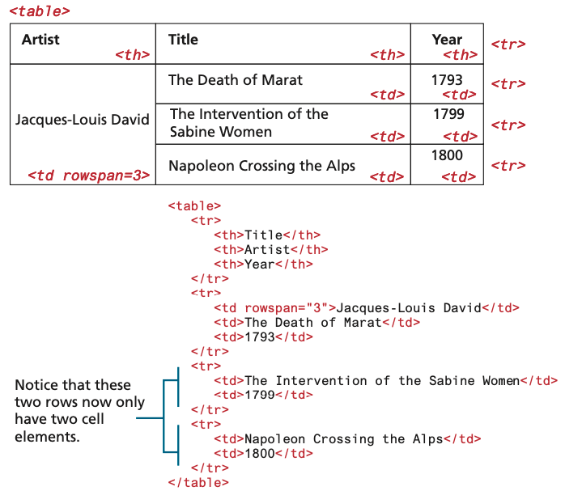
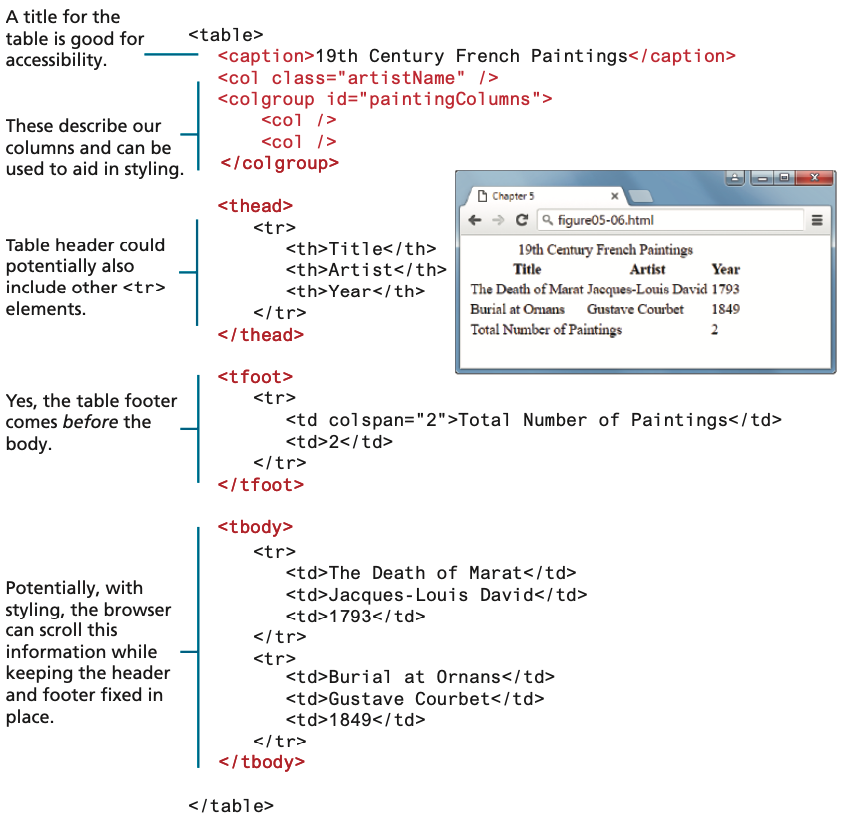
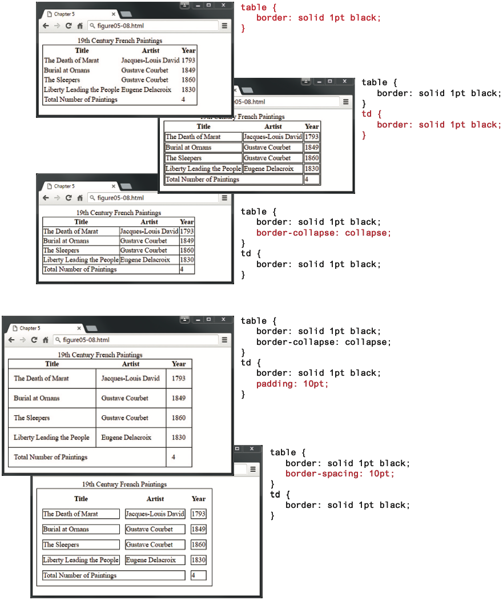

<!-- markdownlint-disable -->
# HTML Tables

As part of this lesson, we'll continue our lesson on CSS and discuss advance ways to apply CSS to our web pages.

## Table of Contents

- [HTML Tables](#html-tables)
  - [Table of Contents](#table-of-contents)
  - [Tables](#tables)
    - [Spanning Rows and Columns](#spanning-rows-and-columns)
    - [Additional Table Elements](#additional-table-elements)
  - [Styling Tables](#styling-tables)
    - [Table Borders](#table-borders)
    - [Boxes](#boxes)

The videos below provide an overview of the topics for this week. You can watch the videos before or after reading the content for this week.

- [HTML Tables [8:10]](https://youtu.be/x7AAFwX6UOY?si=TiyKnJEDHhAWCMmD)
- [Table row & col spans [3:08]](https://youtu.be/XtDnmZ8lfbs?si=yEWlkIzsqZNOcoMC)

## Tables

- A table in HTML is created using the `<table>` element and can be used to represent information that exists in a two-dimensional grid. 
- Just like a real-world table, an HTML table can contain any type of data: not just numbers, but text, images, forms, even other tables
- `<table>` contains any number of `t`able `r`ows `<tr>`; each row contains any number of `t`able `d`ata cells `<td>`

Many tables will contain some type of headings in the first row. In HTML, you indicate header data by using the `<th>` instead of the `<td>` element, as shown below. Browsers tend to make the content within a `<th>` element bold, but you could style it anyway you would like via CSS.

The main reason you should use the `<th>` element is not, however, due to presentation reasons. Rather, you should also use the `<th>` element for accessibility reasons (it helps those using screen readers) and for search engine optimization reasons.

### Spanning Rows and Columns

So far, we've learned two key concepts about tables:
1) All content must appear within the `<td>` or `<th>` container. 
2) Each row must have the same number of `<td>` or `<th>` containers. 

However, for #2, there is a way to change this second behavior. If you want a given cell to cover **several columns** or rows, then you can do so by using the `colspan` or `rowspan` attributes (as shown below).

Spanning rows is a little less common and perhaps a little more complicated because the rowspan affects the cell content in **multiple rows**:

### Additional Table Elements

The `<caption>` element is used to provide a brief title or description of the table, which improves the accessibility of the table, and is strongly recommended. You can use the `caption-side` CSS property to change the position of the caption below the table.

The `<thead>`, `<tfoot>`, and `<tbody>` elements tend in practice to be used quite infrequently. However, they do make some sense for tables with a large number of rows. With CSS, one could set the height and overflow properties of the `<tbody>` element so that its content scrolls, while the header and footer of the table remain always on screen.

The `<col>` and `<colgroup>` elements are also mainly used to aid in the eventual styling of the table. Rather than styling each column, you can style all columns within a `<colgroup>` with just a single style. Unfortunately, the only properties you can set via these two elements are `borders`, `backgrounds`, `width`, and `visibility`, and only if they are not overridden in a `<td>`, `<th>`, or `<tr>` element (which, because they are more specific, will override any style settings for `<col>` or `<colgroup>`). As a consequence, they tend to not be used very often.

## Styling Tables

There is certainly no limit to the way one can style a table. While most of the styling that one can do within a table is simply a matter of using the CSS properties, there are a few properties unique to styling tables that you have not yet seen

### Table Borders

As shown below, borders can be assigned to both the `<table>` and the `<td>` element (they can also be assigned to the `<th>` element as well). Interestingly, borders cannot be assigned to the `<tr>`, `<thead>`, `<tfoot>`, and `<tbody>` elements.

Notice as well the `border-collapse` property. This property selects the table’s border model. The default, shown in the second section of the example, is the separated model or value. In this approach, each cell has its own unique borders. You can adjust the space between these adjacent borders via the `border-spacing` property, as shown in the final section of the example. In the last section, the `collapsed border` model is being used; in this model adjacent cells share a single border.

### Boxes

While there is almost no end to the different ways one can style a table, there is a number of pretty common approaches. We will look at two of them here. The first of these is a box format, in which we simply apply background colors and borders in various ways, as shown below.

