<!-- markdownlint-disable -->
# HTML Forms

As part of this lesson, we'll continue our lesson on CSS and discuss advance ways to apply CSS to our web pages.
## Table of Contents

- [HTML Forms](#html-forms)
  - [Table of Contents](#table-of-contents)
  - [Forms](#forms)
- [How Forms Work](#how-forms-work)
  - [Form Structure](#form-structure)
    - [method="GET"](#methodget)
    - [method="POST"](#methodpost)
  - [Query Strings](#query-strings)
  - [Form Control Elements](#form-control-elements)
  - [Text Input Controls](#text-input-controls)
  - [Choice Controls](#choice-controls)
    - [Select Lists](#select-lists)
    - [Radio Buttons](#radio-buttons)
    - [Checkboxes](#checkboxes)
  - [Button Controls](#button-controls)
  - [Range Input](#range-input)
  - [Colour Input](#colour-input)
  - [Date \& Time](#date--time)
  - [Form Accessibility](#form-accessibility)
  - [Styling Forms](#styling-forms)
    - [Working with Labels](#working-with-labels)
    - [Form Design](#form-design)
  - [Validating User Input](#validating-user-input)
    - [Types of Validation](#types-of-validation)
    - [Notifying the User](#notifying-the-user)
    - [How to Reduce Validation Errors](#how-to-reduce-validation-errors)

The videos below provide an overview of the topics for this week. You can watch the videos before or after reading the content for this week.

- [HTML Forms - Part 1 [23:15]](https://youtu.be/xzoW4P6VZ20?si=JXAvOsS4SDNXW3NU)
- [HTML Forms - Part 2 [15:32]](https://youtu.be/k-QncEsANp8?si=jFrt5WmMpZuvc1Yk) 

## Forms
- Forms provide the user with an alternative way to interact with a web server.
- Up to now, clicking hyperlinks was the only mechanism available to the user
- Using a form, the user can enter text, choose items from lists, and click buttons
- Typically, programs running on the server will take the input from HTML forms and do something with it, 
  - such as save it in a database, 
  - interact with an external web service, or 
  - customize subsequent HTML based on that input.

# How Forms Work

While forms are constructed with HTML elements, a form also requires some type of server-side resource that processes the user’s form input, as shown below.

- The process begins with a request for an HTML page that contains some type of form on it.
  - This could be something as complex as a user registration form or as simple as a search box.
- After the user fills out the form, there needs to be some mechanism for submitting the form data back to the server.
  - This is typically achieved via a submit button
- Because interaction between the browser and the web server is governed by the `HTTP` protocol, the form data must be sent to the server via a standard HTTP request. 
  - This request is typically some type of server-side program that will process the form data in some way; this could include checking it for validity, storing it in a database, or sending it in an email. 

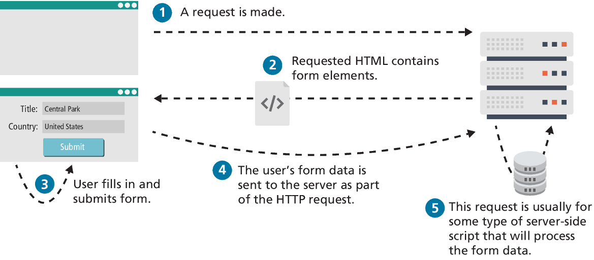

## Form Structure

- Two important attributes that are essential features of any form are the **action** and the **method** attributes.
- The **action attribute** specifies the URL of the server-side resource that will process the form data.
- The **method attribute** specifies how the query string data will be transmitted from the browser to the server. There are two possibilities: 
  - GET  
  - POST

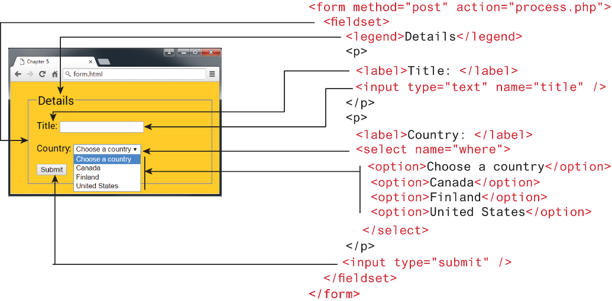

### method="GET"

- Data can be clearly seen in the address bar. This may be an advantage during development but a disadvantage in production. 
- Data remains in browser history and cache. Again this may be beneficial to some users, but it is a security risk on public computers.
- Data can be bookmarked (also an advantage and a disadvantage).
- There is a limit on the number of characters in the returned form data.

> [!NOTE]
> Generally, form data is sent using the `POST` method. However, the `GET` method is useful when you are testing or developing a system, since you can examine the query string directly in the browser’s address bar. Since the `GET` method uses the URL to transmit the query string, form data will be saved when the user bookmarks a page, which may be desirable, but is generally a potential security risk for shared use computers. And needless to say, any time passwords are being transmitted, they should be transmitted via the `POST` method.

### method="POST"

- Data can contain binary data.
- Data is hidden from user.
- Submitted data is not stored in cache, history, or bookmarks.

> [!NOTE]
> It should be noted that while the POST method “hides” form data, any user could easily inspect the HTTP header. As a result, the POST method is NOT sufficient from a security standpoint.

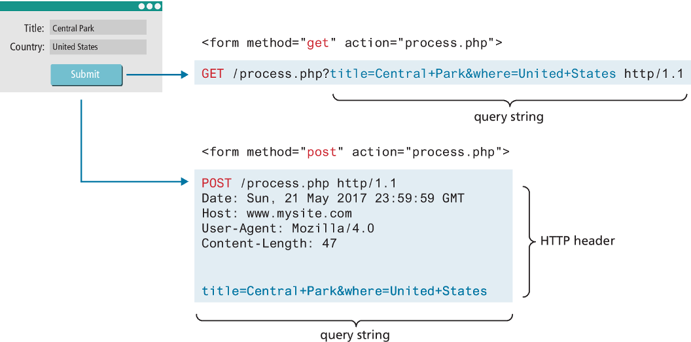

## Query Strings

The browser packages the user’s data input into something called a **query string**. 

> A query string is a series of **name=value** pairs separated by ampersands (the `&` character). 
 
In the example shown below, the names in the query string were defined by the HTML form; each form element (i.e., the first `<input>` elements and the `<select>` element) contains a name attribute, which is used to define the name for the form data in the query string. The values in the query string are the data entered by the user.

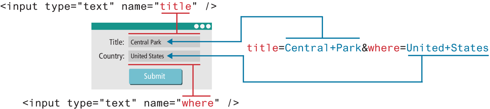

## Form Control Elements

- `<button>` Defines a clickable button.
- `<datalist>` An HTML5 element that defines lists of pre-defined values to use with input fields.
- `<fieldset>` Groups related elements in a form together.
- `<form>` Defines the form container.
- `<input>` Defines an input field. HTML5 defines over 20 different types of input.
- `<label>` Defines a label for a form input element.
- `<legend>` Defines the label for a fieldset group.
- `<optgroup>` Defines a group of related options in a multi-item list.
- `<option>` Defines an option in a multi-item list.
- `<output>` Defines the result of a calculation.
- `<select>` Defines a multi-item list.
- `<textarea>` Defines a multiline text entry box.

| Type     | Description | Code
|----------|-------------|------------| 
| email    | Creates a single-line text entry box suitable for entering an email address. Some browsers will perform validation when form is submitted. | `<input type="email"../>` |
| password | Creates a single-line text entry box for a password (which masks the user entry as bullets or some other character) | `<input type="password"../>` |
| search   | Creates a single-line text entry box suitable for a search string. | `<input type="search"../>` |
| tel      | Creates a single-line text entry box suitable for entering a phone number. | `<input type="tel"../>` |
| text     | Creates a single-line text entry box. | `<input type="text" name="title" />` |
| textarea | Creates a multiline text entry box. You can add placeholder text (which disappears once user begins typing into the field). | `<textarea rows="3"../>` | 
| url      | Creates a single-line text entry box suitable for entering a URL                                                       | `<input type="url"../>` | 

## Text Input Controls

- Most forms need to gather text information from the user. Whether it is a search box or a login form or a user registration form, some type of text input is usually necessary.

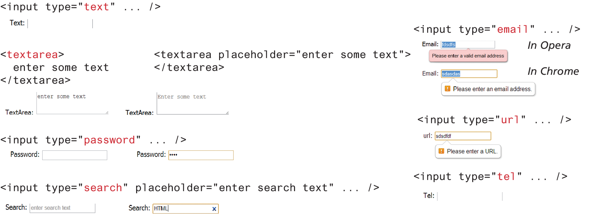

## Choice Controls

- Forms often need the user to select an option from a group of choices. HTML provides several ways to do this.
  - Select Lists
  - Radio Buttons
  - Checkboxes

### Select Lists

- The `<select>` element is used to create a multiline box for selecting one or more items. The options (defined using the `<option>` element) can be hidden in a dropdown list or multiple rows of the list can be visible.
- The selected attribute in the `<option>` makes it a default value.
- The `value` attribute is optional; if it is not specified, then the text within the container is sent instead

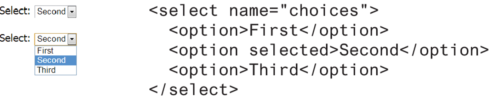

- Option items can be grouped together via the `<optgroup>` element. 

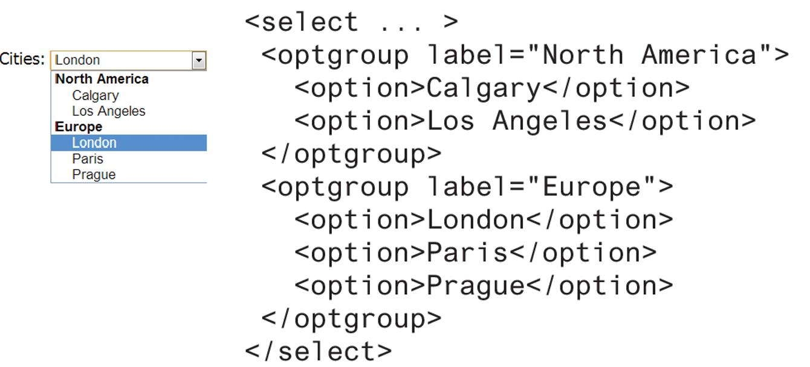

### Radio Buttons

- Radio buttons are useful when you want the user to select a single item from a small list of choices and you want all the choices to be visible.
- radio buttons are added via the `<input type="radio">` element
- The checked attribute is used to indicate the default choice, while the value attribute works in the same manner as with the `<option>` element.

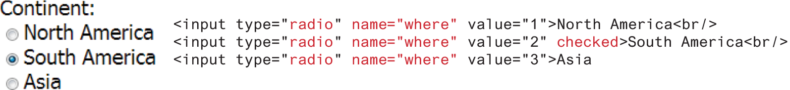

### Checkboxes

- A checkbox is used for obtaining a yes/no or on/off response from the user.
- Checkboxes are added via the `<input type="checkbox">`
- The checked attribute can be used to set the default value of a checkbox.
- Each checked checkbox will have its value sent to the server.

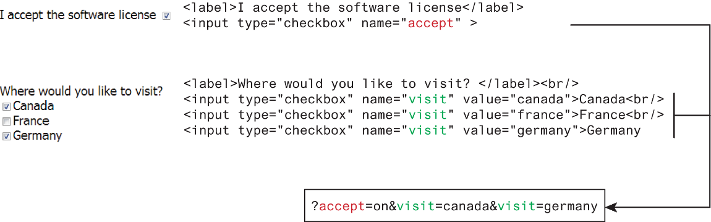

## Button Controls

- `<input type="submit">` Creates a button that submits the form data to the server.
- `<input type="reset">` Creates a button that clears any of the user’s already entered form data.
- `<input type="button">` Creates a custom button. This button may require JavaScript for it to actually perform any action.
- `<input type="image">` Creates a custom submit button that uses an image for its display.
- `<button>` Creates a custom button.

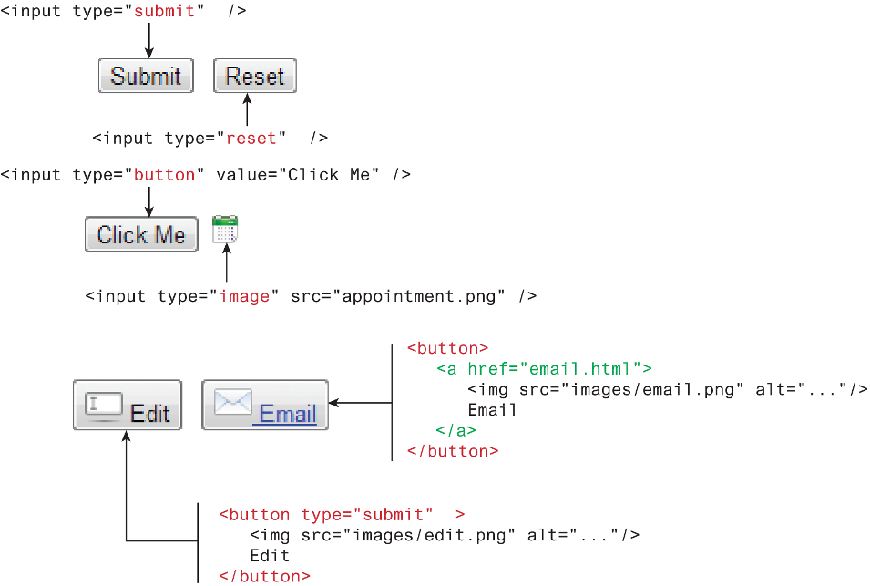

## Range Input

- HTML5 introduced the number and range controls provide a way to input numeric values that eliminates the need for client-side numeric validation 

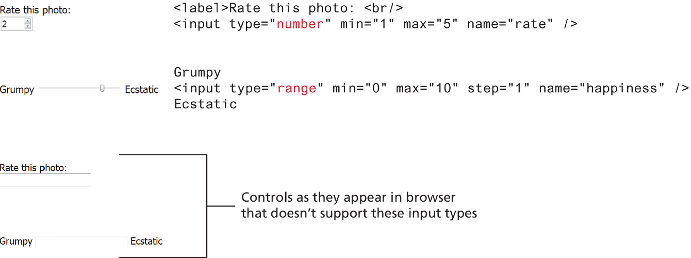

## Colour Input

When it is necessary, the HTML5 color control provides a convenient interface for the user

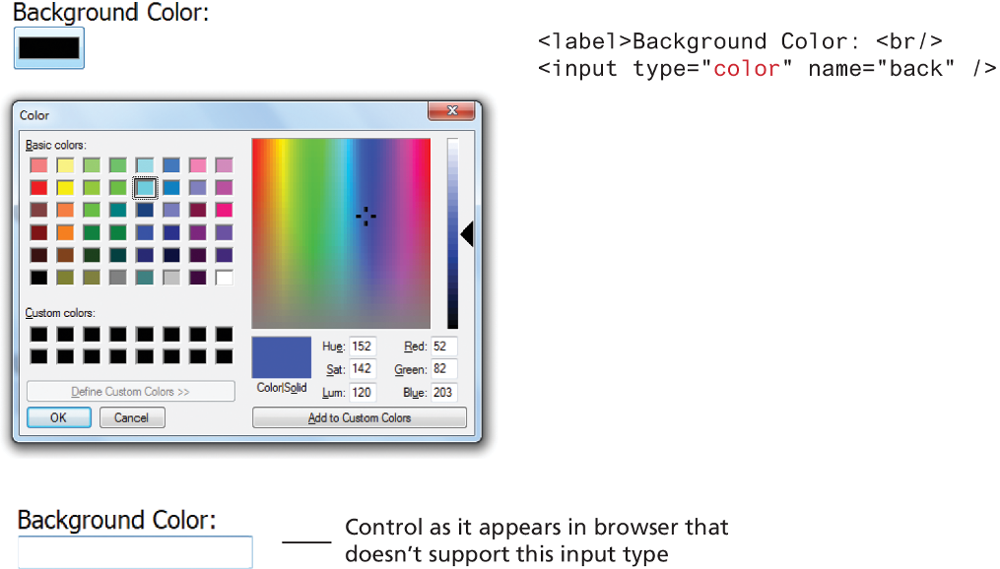

## Date & Time

Asking the user to enter a date or time is a relatively common web development task. Like with numbers, dates and times often need validation when gathering this information from a regular text input control. From a user’s perspective, entering dates can be tricky as well; you probably have wondered at some point in time when entering a date into a web form what format to enter it in, whether the day comes before the month, whether the month should be entered as an abbreviation or a number, and so on. The date and time controls in HTML try to make it easier for users to input these tricky date and time values.

Input type:
- `date` Creates a general date input control. The format for the date is “yyyy-mm-dd.”
- `time` Creates a time input control. The format for the time is “HH:MM:SS,” for hours:minutes:seconds.
- `datetime` Creates a control in which the user can enter a date and time.
- `datetime-local` Creates a control in which the user can enter a date and time without specifying a time zone.
- `month` Creates a control in which the user can enter a month in a year. The format is “yyyy-mm.” 
- `week` Creates a control in which the user can specify a week in a year. The format is “yyyy-W##.”

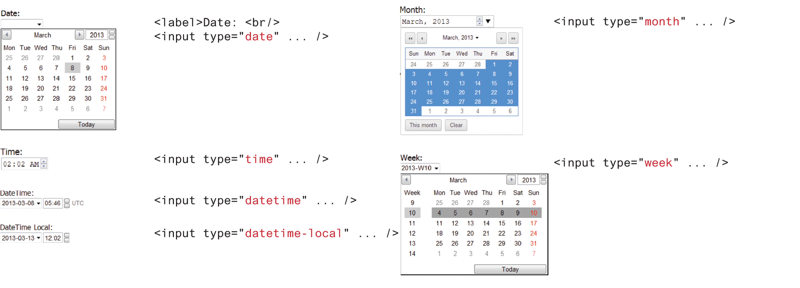

## Form Accessibility

- We already made use of the `<fieldset>`, `<legend>`, and `<label>` elements.
  - Their main purpose is to logically group related form input elements together with the `<legend>` providing a type of caption for those elements.
- Each `<label>` element should be associated with a single input element.
- You can make this association explicit by using the for attribute so means that if the user clicks on or taps the `<label>` text the control will receive the focus

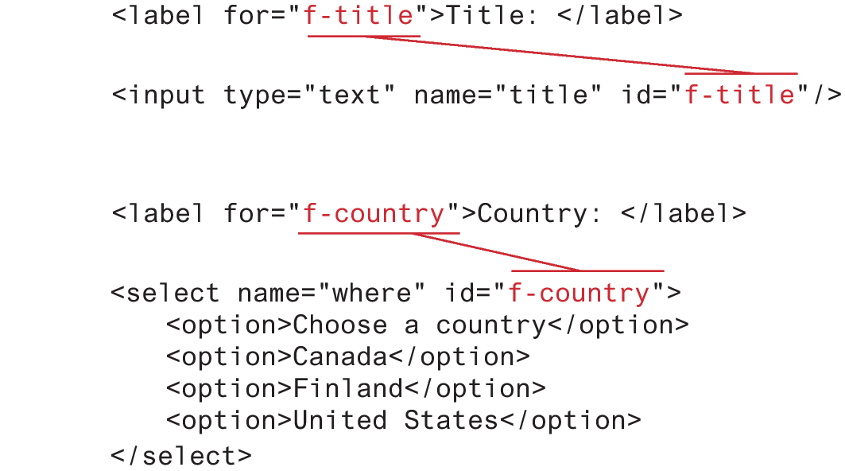

## Styling Forms

A common styling change is to eliminate the borders and add in rounded corners and padding. Why padding? It adds some space between the user’s input values and the borders of the control. The illustration below outlines some common styles approaches for these controls. Notice that in the customized text input control, there is space around the placeholder (and input text had we shown that) and the outside edge of the control, while with the default control, there is no space between the border and the placeholder.

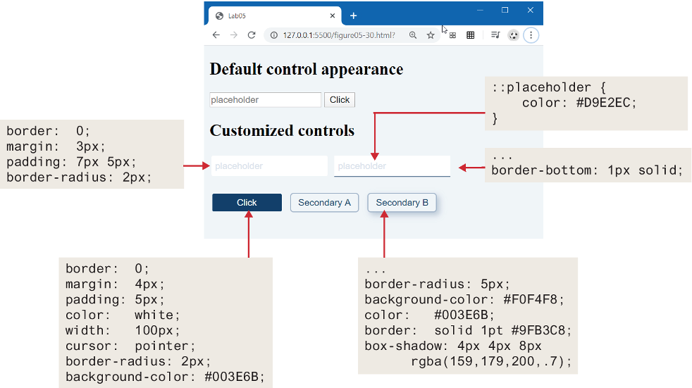

### Working with Labels

Input elements within forms are often associated with labels. These are typically to the left or above the input element. By default, form elements are inline-block elements, which means they have padding and margin but sit on the same line. Labels, however, are inline, so they need to be changed to block or inline-block if you wish to add padding or margins. The example below illustrates several approaches to combining labels with form elements.

Which one is preferable? It depends. The version that doesn’t use labels works best when there is a lack of design space; however, once the user enters content into the field, she loses information about what content is supposed to be in it because the helpful placeholder text is gone. The labels to the left of the field create a helpful visual separation between labels and input elements; however, such a design rarely is possible for mobile browsers in portrait orientation. The labels above the field work equally well for mobile and desktop clients; however, they use more vertical space (which is at a premium with the typical landscape-orientation desktop and laptop monitors), thus will likely require the user to scroll in order to see all the fields.

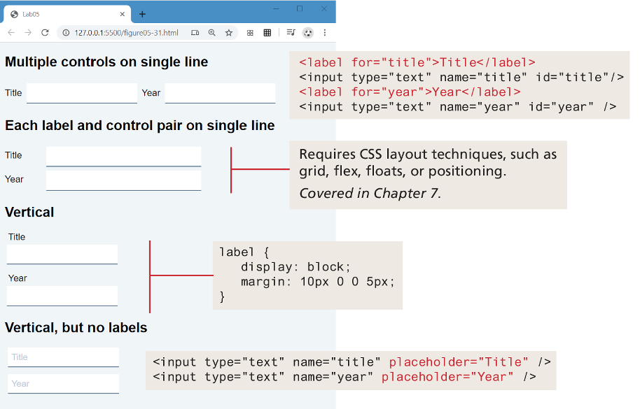

### Form Design

- A well-designed form communicates to a user that the site values their time and data.
- Perhaps the first and most important rule is to style your form elements so they look different from the default settings.
- The example belwo describes and illustrates a small set of straightforward additional precepts

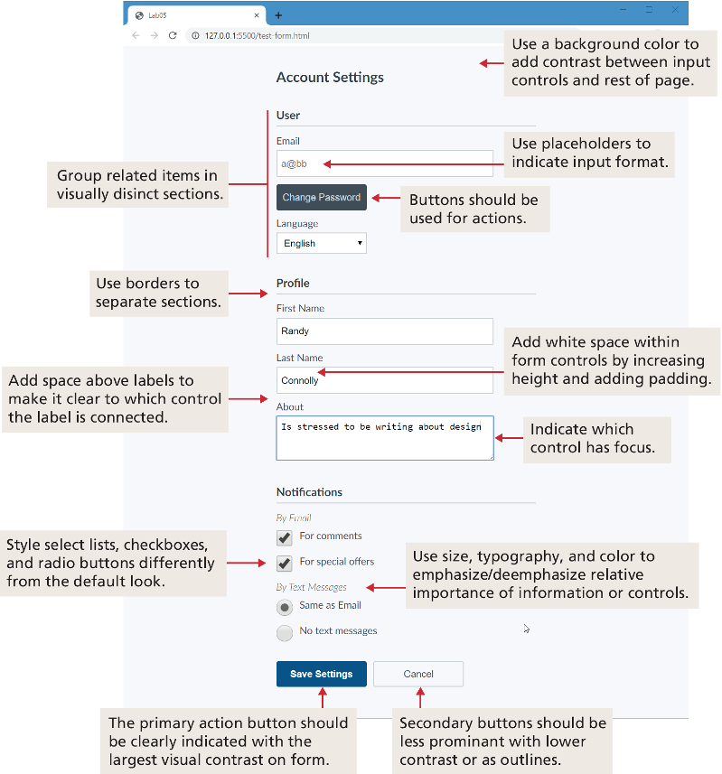

## Validating User Input

User input must never be trusted. It could be missing. It might be in the wrong format. It might even contain JavaScript or other code as a means to causing some type of havoc. Thus, almost always user input must be tested for validity.

### Types of Validation

- **Required information**: Some data fields just cannot be left empty.
- **Correct data type**: Some fields such as numbers or dates, must follow the rules for its data type in order to be considered valid.
- **Correct format**: Some information, such as postal codes, credit card numbers, and social security numbers have to follow certain pattern rules.
- **Comparison**: Some user-entered fields are considered correct or not in relation to an already inputted value (password confirm)
- **Range check**: Information such as numbers and dates have infinite possible values. However, most systems need numbers and dates to fall within realistic ranges. 

### Notifying the User

What should your pages do when a validation check fails? Clearly, the user needs to be notified, but how? Most user validation problems need to answer the following questions:

- **What is the problem?** Users do not want to read lengthy messages to determine what needs to be changed.
- **Where is the problem?** Some type of error indication should be located near the field that generated the problem.
- **If appropriate, how do I fix it?** For instance, don’t just tell the user that a date is in the wrong format; tell him or her what format you are expecting

### How to Reduce Validation Errors

Users dislike having to do things again, so if possible, we should construct user input forms in a way that minimizes user validation errors. The basic technique for doing so is to provide the user with helpful information about the expected data before she enters it. Some of the most common ways of doing so include:

- Provide textual hints to the user on the form itself
- Using tool tips or pop-overs to display context-sensitive help about the expected input
- Providing sensible default values for text fields can reduce validation errors
- Finally, many user input errors can be eliminated by choosing a **better** data entry type than the standard `<input type="text">`
