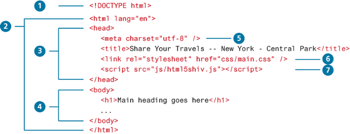
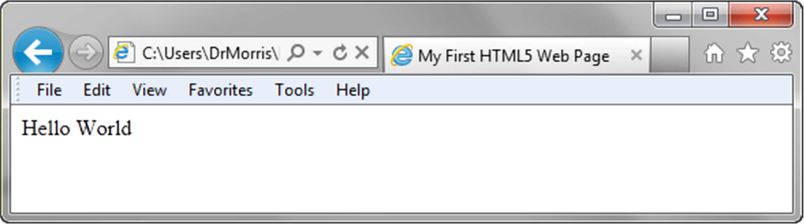
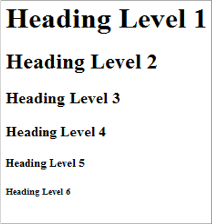
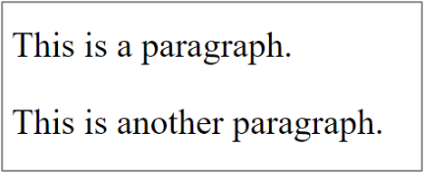
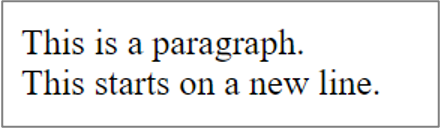
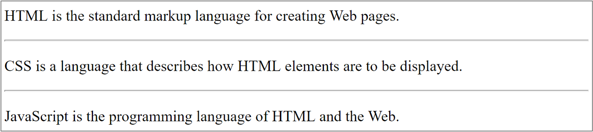
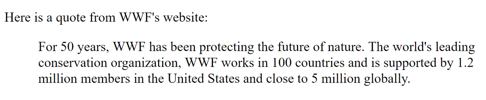
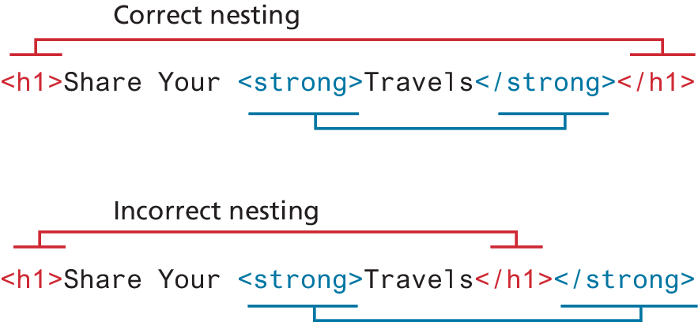

# Introduction to HTML

As part of this section, we'll learn more about what HTML is and how to write our first Hello World program.

## Table of Contents

- [Introduction to HTML](#introduction-to-html)
  - [Table of Contents](#table-of-contents)
  - [What is HTML?](#what-is-html)
  - [What is a Web Page?](#what-is-a-web-page)
  - [What are HTML Tags/Elements?](#what-are-html-tagselements)
  - [What are HTML Attributes?](#what-are-html-attributes)
  - [Anatomy of an HTML element](#anatomy-of-an-html-element)
  - [Structure of HTML Document](#structure-of-html-document)
    - [HTML DOCTYPE](#html-doctype)
    - [`<html>` Element](#html-element)
    - [HTML Head and Body](#html-head-and-body)
      - [`<meta>`](#meta)
    - [Viewport Meta](#viewport-meta)
    - [More `<meta>` examples:](#more-meta-examples)
    - [`<title>`](#title)
  - [HTML Headings](#html-headings)
  - [HTML Paragraphs](#html-paragraphs)
  - [HTML Comments](#html-comments)
  - [HTML Line Break](#html-line-break)
  - [HTML Horizontal Rule](#html-horizontal-rule)
  - [HTML Blockquote](#html-blockquote)
  - [Summary of HTML Tags:](#summary-of-html-tags)
  - [Nesting elements](#nesting-elements)
  - [Empty/Void Element](#emptyvoid-element)


Here are 2 videos that provide an overview:

- **This video provides a high level overview of what we'll learn in this course. For this module, please focus on the first ~2 minutes of this video.**

<iframe width="560" height="315" src="https://www.youtube.com/embed/salY_Sm6mv4?si=wdXe1k93M13YR4Aj" title="YouTube video player" frameborder="0" allow="accelerometer; autoplay; clipboard-write; encrypted-media; gyroscope; picture-in-picture; web-share" referrerpolicy="strict-origin-when-cross-origin" allowfullscreen></iframe>

- **This video provides a hands-on guide on how to develop your first HTML webpage.**
  
<iframe width="560" height="315" src="https://www.youtube.com/embed/-USAeFpVf_A?si=k1pcXhJRO6X4JuuZ" title="YouTube video player" frameborder="0" allow="accelerometer; autoplay; clipboard-write; encrypted-media; gyroscope; picture-in-picture; web-share" referrerpolicy="strict-origin-when-cross-origin" allowfullscreen></iframe>

## What is HTML?

HTML is the **markup language** that forms the backbone of the internet. In this course, you will learn how to build a clean, stunning webpage using HTML which you can set as your browser's default start page. This is only the first step in your journey, but it will form an important foundation in your journey as a new developer.

HTML stands for **Hyper Text Markup Language**. HTML is NOT a programming language. It is simply a way to describe the structure of your website. Your web browser reads the HTML document and displays it in the window.

When someone enters your web address, the web standards will automatically look for a file called `index.html` and display it in your browser. Most people call this your home page.

## What is a Web Page?

A web page is an HTML file that:
- consists of a series of elements that tell the browser how to display the content
- is written in a text editor and saved as .htm or .html
- is displayed on a browser based on the browser's default settings
- is interpreted sequentially, top to bottom, by the browser

The first web page, or home page, of any website is by convention named `index.html`.

## What are HTML Tags/Elements?

HTML tags are special **keywords** that specify how the data will be displayed or how to format the data by the web browsers. With tags, the web browser can make out in the document that what is HTML content and what is the normal plain content. 

Most elements are coded as a pair of tags (an opening tag and a closing tag) and some content
- Tags are enclosed in angle brackets, `<` and `>` symbols 
- There is no space between the angle bracket and tag
- The content of the element goes between the tags
- Some tags do not have any content or a closing tag; e.g., `<br>`

HTML elements can be nested (elements can contain other elements)
- Proper nesting and indentation is important

HTML consists of a series of elements, which you use to enclose, wrap, or mark up different parts of content to make it appear or act in a certain way. The enclosing tags can make content into a hyperlink to connect to another page, italicize words, and so on. For example, consider the following line of text:

```
My cat is very grumpy
```

If we wanted the text to stand by itself, we could specify that it is a paragraph by enclosing it in a paragraph (`<p>`) element:

```html
<p> My cat is very grumpy. </p>
```

*Note: Tags in HTML are not case-sensitive. This means they can be written in uppercase or lowercase. For example, a `<title>` tag could be written as `<title>`, `<TITLE>`, `<Title>`, `<TiTlE>`, etc., and it will work. **However, it is best practice to write all tags in lowercase for consistency and readability.***

## What are HTML Attributes?
HTML attributes provide additional information about HTML elements.

Example - in this code, href is an attribute for a (hyperlink):
```html
<a href="contacts.html">Contact us!</a>
```

- Attributes usually written in name/value pairs: name="value"
- Attributes are always specified in the start tag
- There is a space between the tag and attribute name
- All HTML elements can have attributes
- An element may have more than one attribute

## Anatomy of an HTML element


The anatomy of our element is:

- The **opening tag**: This consists of the name of the element (in this example, p for paragraph), wrapped in opening and closing angle brackets. This opening tag marks where the element begins or starts to take effect. In this example, it precedes the start of the paragraph text.
- The **content**: This is the content of the element. In this example, it is the paragraph text.
- The **closing tag**: This is the same as the opening tag, except that it includes a forward slash before the element name. This marks where the element ends. Failing to include a closing tag is a common beginner error that can produce peculiar results.
- The element is the opening tag, followed by content, followed by the closing tag.

## Structure of HTML Document

The following code illustrates one of the simpliest valid HTML5 document you can create:



Let's breakdown this code into bite size pieces:

### HTML DOCTYPE
All HTML documents **must start** with a `<!DOCTYPE>` declaration. The DOCTYPE declaration tells the browser (or any other client software that is reading this HTML document) what type of document it is about to process:

```html
<!DOCTYPE html>
```

Notice that it does not indicate what version of HTML is contained within the document; it only specifies that it contains HTML. The HTML5 doctype is quite short in comparison to one of the older doctype specifica-tions for XHTML.

### `<html>` Element
The `<html>` element is sometimes called the root element as it contains all the other HTML elements in the document. It also has a `lang` [attribute](#what-are-html-attributes). This *optional* attribute tells the browser the natural language that is being used for textual content in the HTML document, which is **English (en)** in this example. This doesn’t change how the document is **rendered** in the browser; rather, screen reader software can use this information to determine the correct language to use when speaking the content.

### HTML Head and Body
HTML pages are divided into two sections: the head and the body, which correspond to the `<head>` and `<body>` elements. The head contains descriptive elements about the document, such as its title, any style sheets (CSS) or JavaScript files it uses, and other types of meta information used by search engines and other programs. 

```html
<head>
   … head section info goes here
</head>
```
#### `<meta>`
HTML metadata is data about the HTML document that defines the document title, character set, styles, scripts, and other meta information. Metadata is not displayed. You will notice that the `<head>` element in the figure above contains a variety of additional elements. The first of these is the `<meta>` element (item #5). The example shown in the figure declares that the character encoding for the document is `UTF-8`:

```html
<meta charset="UTF-8">
```
Notice that `<meta>` does NOT have a closing tag `</meta>`

To display an HTML page correctly, a web browser must know which character set to use. The default character set for HTML5 is UTF-8, which covers almost all of the characters and symbols in the world!

### Viewport Meta

The viewport is the user's visible area of a web page. It varies with the device - it will be smaller on a mobile phone than on a computer screen.

You should include the following <meta> element in all your web pages:
```html
<meta name="viewport" content="width=device-width, initial-scale=1.0">
```

This gives the browser instructions on how to control the page's dimensions and scaling.

The `width=device-width` part sets the width of the page to follow the screen-width of the device (which will vary depending on the device).

The `initial-scale=1.0` part sets the initial zoom level when the page is first loaded by the browser. It is based on a 100 scale. Therefore 1.0 = 100%, 0.95 = 95%, etc.

Examples without (left) and with (right) viewport meta tag


### More `<meta>` examples:

- Define keywords for search engines:

```html
<meta name="keywords" content="HTML, CSS, JavaScript">
```

- Define a description of your web page:
```html
<meta name="description" content="We're learning HTML together">
```

- Define the author of a page:
```html
<meta name="author" content="James Bond">
```

- Refresh document every `30 seconds` (this can be chagned to a different number):
```html
<meta http-equiv="refresh" content="30">
```

### `<title>`

The `<title>` tag defines the title of the document and is used as the title of the page:
- in a browser
- when it is added to favorites
- in search-engine results

```html
[1] <!DOCTYPE html>
[2] <html lang="en">
[3]    <head> 
[4]      <title>My First HTML Page</title>
[5]    </head>
[6]   <body>
[7]      <h1>My First Heading</h1>
[8]     <p>My first paragraph.</p>
[9]    </body>
[10]  </html>
```
Note: the numbers in brackets represent the line number for the purpose of these notes. They should NOT be present when writing code in the editor.



The contents of a page title is very important for Search Engine Optimization (SEO) and determines the position of a page in a search-engine results page (More on this in Chapter 13).


The `<body>` contains content (both HTML elements and regular text) that will be displayed by the browser. 
```html
<body>
   … body section info goes here
</body>
```


## HTML Headings

HTML headings `<h1`> to `<h6>` are used for the titles and subtitles of a web page. `<h1>` is the most important (biggest) and `<h6>` is the least important (smallest).


```
<h1>Heading 1</h1>
<h2>Heading 2</h2>
<h3>Heading 3</h3>
<h4>Heading 4</h4>
<h5>Heading 5</h5>
<h6>Heading 6</h6>
```




Search engines use the headings to index the structure and content of web pages, so the headings must convey the semantics of the content.


## HTML Paragraphs
Paragraph elements are used to group sentences and sections of text together. Text that is contained by `<p>` and `</p>` tags display as a block of text that starts on a new line.

```html
<p>This is a paragraph.</p>
<p>This is another paragraph.</p>
```

- Extra space or line break in `<p>` content will be ignored by the browser.
- The `<pre>` element is used to display preformatted text. 
- It preserves space and line break.





## HTML Comments
HTML comments are not displayed in the browser, but they can help document your HTML source code.

```html
<!-- This is a comment -->
<p>This is a paragraph.</p>
```
Comments are also great for debugging HTML.

Example - comment out HTML lines of code, one at a time, to search for errors:

```html
<!-- 
   Do not display this image at the moment
   
-->
```

## HTML Line Break

The `<br>` element causes the following element or text displays on a new line.

```html
<p>This is a paragraph. <br> This starts on a new line.</p>
```




It is preferable to use additional paragraph elements (`<p>`) rather than forcing a line break with `<br>`.

`<br>` has no content.
- HTML elements with no content are called empty elements or void tags
- Empty elements do not have an end tag!

## HTML Horizontal Rule
The `<hr>` element configures a horizontal line that is used to separate content (or define a change) in an HTML page.

```html
<p>HTML is the standard markup language for creating Web pages.</p>
<hr><p>CSS is a language that describes how HTML elements are to be displayed.</p>
<hr> 
<p>JavaScript is the programming language of HTML and the Web.</p>
```



## HTML Blockquote 
Sometimes you need to add a quote to a web page and to so, you can use the **blockquote element**. The `<blockquote>` element is used to display a quote from another source. Browsers usually indent a block quote.

```html
<blockquote cite="www.source-of-text.ca">
   ...text goes here
</blockquote>
```

A block of indented text begins with a `<blockquote>` tag and ends with a `</blockquote>` tag. 

```html
<p>Here is a quote from WWF's website:</p>
<blockquote cite="http://www.worldwildlife.org/who/index.html">Live as if you were to die tomorrow. Learn as if you were to live forever.</blockquote>
```



## Summary of HTML Tags:
- `<!DOCTYPE html>` declaration defines that this document is an HTML5 document
- `<html>` element is the root element of an HTML page
- `lang` attribute specifies the language of the element's content
- `<head>` element contains meta information about the HTML page
- `<title>` element specifies a title for the HTML page (shown in the browser's title bar)
- `<body>` element defines the document's body, a container for the visible contents
- `<h1>` element defines a large heading
- `<p>` element defines a paragraph
- `<!-- comment -->` element defines a comment
- `<br>` element defines a line break
- `<hr>` element defines a horizontal rule
- `<blockquote>` element defines a quote


## Nesting elements
Elements can be placed within other elements. This is called **nesting**. If we wanted to state that our cat is very grumpy, we could wrap the word very in a `<strong>` element, which means that the word is to have strong(er) text formatting:

```html
<p>My cat is <strong>very</strong> grumpy.</p>
```

There is a right and wrong way to do nesting. In the example above, we opened the p element first, then opened the strong element. For proper nesting, we should close the strong element first, before closing the p.

The following is an example of the **wrong way** to do nesting:

```html
<p>My cat is <strong>very grumpy.</p></strong> 
```

**The tags have to open and close in a way that they are inside or outside one another.** With the kind of overlap in the example above, the browser has to guess at your intent. This kind of guessing can result in unexpected results.

Here is another example:



## Empty/Void Element

Not all elements follow the pattern of an opening tag, content, and a closing tag. Some elements consist of a single tag, which is typically used to insert/embed something in the document. Such elements are called void elements. For example, the `` element embeds an image file onto a page:

```html

```


