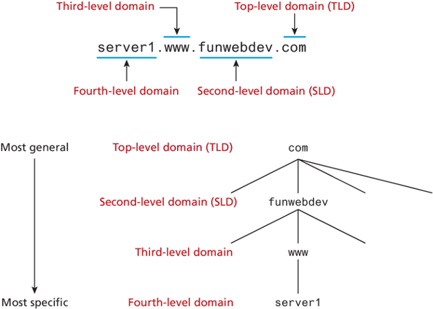

# Introduction to the Internet and World Wide Web

This week, we'll learn more about the background of how internet came to be and the various protocals associated with it.

## Table of Contents

- [Introduction to the Internet and World Wide Web](#introduction-to-the-internet-and-world-wide-web)
  - [Table of Contents](#table-of-contents)
  - [The Internet](#the-internet)
  - [Web Standards and Accessibility](#web-standards-and-accessibility)
    - [W3C Recommendations](#w3c-recommendations)
  - [Network Overview](#network-overview)
  - [Client/Server Model](#clientserver-model)
  - [Internet Protocols](#internet-protocols)
    - [Hypertext Transfer Protocol (HTTP)](#hypertext-transfer-protocol-http)
    - [File Transfer Protocol (FTP)](#file-transfer-protocol-ftp)
    - [E-mail Protocols](#e-mail-protocols)
    - [Transmission Control Protocol/Internet Protocol (TCP/IP)](#transmission-control-protocolinternet-protocol-tcpip)
      - [TCP](#tcp)
      - [IP](#ip)
  - [Domain Name System (DNS)](#domain-name-system-dns)
  - [Uniform Resource Identifiers and Domain Names](#uniform-resource-identifiers-and-domain-names)
    - [URIs and URLs](#uris-and-urls)
    - [Top-Level Domain Name (TLD)](#top-level-domain-name-tld)
      - [Generic top-level domain (gTLD)](#generic-top-level-domain-gtld)
      - [Country code top-level domain](#country-code-top-level-domain)
    - [Markup Languages](#markup-languages)
      - [Standard Generalized Markup Language (SGML)](#standard-generalized-markup-language-sgml)
      - [Hypertext Markup Language (HTML)](#hypertext-markup-language-html)
      - [XHMTML (eXtensible Hypertext Markup Language)](#xhmtml-extensible-hypertext-markup-language)
      - [HTML5](#html5)

Here is a video that provides an overview:

<iframe width="560" height="315" src="https://www.youtube.com/embed/guvsH5OFizE?si=czfM5UtarVW-9C6y" title="YouTube video player" frameborder="0" allow="accelerometer; autoplay; clipboard-write; encrypted-media; gyroscope; picture-in-picture; web-share" referrerpolicy="strict-origin-when-cross-origin" allowfullscreen></iframe>

## The Internet
The Internet is an interconnected network of computer networks that spans the world. It has become an integral part of our daily lives. You can’t watch a video or listen to music without being urged to visit a website or an app. Even newspapers and magazines have a place on the Internet.

## Web Standards and Accessibility
Just as with the Internet, no single person or group runs the World Wide Web. However, the World Wide Web Consortium (http://www.w3.org), referred to as the W3C, takes a proactive role in developing recommendations and prototype technologies related to the Web. Topics that the W3C addresses include web architecture, standards for web design, and accessibility. In an effort to standardize web technologies, the W3C produces specifications called recommendations.

### W3C Recommendations
The W3C Recommendations are created in working groups with input from many major corporations involved in building web technologies. These recommendations are not rules; they are guidelines. Major software companies that build web browsers, such as Microsoft, do not always follow the W3C Recommendations. This makes life challenging for web developers because not all browsers will display a web page in exactly the same way. The good news is that there is a convergence toward the W3C Recommendations in new versions of major browsers. You’ll follow W3C Recommendations as you code throughout this course. ​Following the W3C Recommendations is the first step toward creating a website that is accessible.

## Network Overview

A network consists of two or more computers connected for the purpose of communicating and sharing resources Common components of a network are shown in Figure below and include the following:

The clients are the computer workstations used by individuals, such as a personal computer (PC) on a desk. The server receives requests from client computers for resources such as files. Computers used as servers are usually kept in a protected, secure area and are accessed only by network administrators. Networking devices, such as hubs and switches, provide network connections for computers, and routers direct information from one network to another. The media connecting the clients, servers, peripherals, and networking devices may consist of copper cables, fiber optic cables, or wireless technologies.

> A **local area network (LAN)** is usually confined to a single building or group of connected buildings. Our school computer lab uses a LAN. If you work in an office, you probably use a computer connected to a LAN. 

> A **wide area network (WAN)** is geographically dispersed and usually uses some form of public or commercial communications network. For example, an organization with offices on both the East and West coasts of Canada probably uses a WAN to provide a link between the LANs at each of the offices.

A backbone is a high-capacity communication link that carries data gathered from smaller links that interconnect with it. On the Internet, a backbone is a set of paths that local or regional networks connect to for long-distance interconnection. *The Internet is a group of interconnected networks with very high-speed connectivity provided by the Internet backbones.*

## Client/Server Model

The term client/server dates from the 1980s and refers to personal computers joined by a network. “Client/server” can also describe a relationship between two computer programs—the client and the server. 

> The client **requests some type of service** (such as a file or database access) from the server. 

> The server **fulfills the request** and transmits the results to the client over a network. 

While both the client and the server programs can reside on the same computer, typically they run on different computers (Figure below). It is common for a server to handle requests from multiple clients.

The Internet is a great example of client/server architecture at work. Consider the following scenario: An individual is at a computer using a web browser client to access the Internet. The individual uses the web browser to visit a website, let’s say `https://www.youtube.com`. The server is the web server program running on the computer with an IP address that corresponds to `youtube.com`. It is contacted, locates the web page and related resources that were requested, and responds by sending them to the individual.

Here's how we can compare web clients and server:

| Feature          | Web Client                                                 | Web Server                                                |
|:------------------:|:------------------------------------------------------------:|:-----------------------------------------------------------:|
| **Connection**   | Connected to the Internet when needed                      | Continually connected to the Internet                     |
| **Software**     | Usually runs web browser (client) software such as Chrome, Edge, Safari, etc. | Runs web server software such as Apache or Internet Information Server |
| **Protocol Used**| Uses HTTP(S)                                                  | Uses HTTP(S)                                                 |
| **Primary Function (important)** | Requests web pages from a server Receives web pages and files from a server | Receives a request for the web page Responds to the request and transmits the status code, web page, and associated files |

## Internet Protocols
Protocols are rules that describe how clients and servers communicate with each other over a network. There is no single protocol that makes the Internet and Web work; a number of protocols with specific functions are needed.

### Hypertext Transfer Protocol (HTTP)

> **HTTP** is a set of rules for exchanging files such as text, images, audio, video, and other multimedia on the Web. 

Web browsers and web servers usually use this protocol. When the user of a web browser requests a file by typing a website address or clicking on a hyperlink, the browser builds an HTTP(S) request and sends it to the server. The web server in the destination machine receives the request, does any necessary processing, and responds with the requested file and any associated files (such as image files, media files, and other related files).

### File Transfer Protocol (FTP)

> **File Transfer Protocol (FTP)** is a set of rules that allow files to be exchanged between computers on the Internet. 

Unlike HTTP, which is used by web browsers to request web pages and their associated files in order to display a web page, FTP is used simply to move files from one computer to another. Web developers commonly use FTP to transfer web page files from their computers to web servers. FTP is also commonly used to download programs and files from other servers to individual computers.

### E-mail Protocols

Most of us take e-mail for granted, but there are two servers involved in its smooth functioning: an incoming mail server and an outgoing mail server. When you send e-mail to others, Simple Mail Transfer Protocol (SMTP) is used. When you receive e-mail, Post Office Protocol (POP; currently POP3) and Internet Message Access Protocol (IMAP) can be used.

### Transmission Control Protocol/Internet Protocol (TCP/IP)

> Transmission Control Protocol/Internet Protocol (TCP/IP) has been adopted as the official communication protocol of the Internet. 

TCP and IP have different functions that work together to ensure reliable communication over the Internet.

#### TCP 

The purpose of TCP is to ensure the integrity of network communication. TCP starts by breaking files and messages into individual units called packets. These packets (see Figure below) contain information such as the destination, source, sequence number, and checksum values used to verify the integrity of the data.

TCP is used together with IP to transmit files efficiently over the Internet. IP takes over after TCP creates the packets, using IP addressing to send each packet over the Internet via the best path at the particular time. When the destination address is reached, TCP verifies the integrity of each packet by using the checksum, requests a resend if a packet is damaged, and reassembles the file or message from the multiple packets.

#### IP

> Working in harmony with TCP, IP is a set of rules that controls how data is sent between computers on the Internet. 

IP routes a packet to the correct destination address. Once sent, the packet gets successively forwarded to the next closest router (a hardware device designed to move network traffic) until it reaches its destination.
Each device connected to the Internet has a unique numeric IP address. These addresses consist of a set of four groups of numbers, called octets. The current version of IP, Internet Protocol Version 4 (IPv4), uses 32-bit (binary digit) addressing. This results in a decimal number in the format of xxx.xxx.xxx.xxx, where each xxx is a value from 0 to 255. Theoretically, this system allows for at most 4 billion possible IP addresses (although many potential addresses are reserved for special uses). However, even this many addresses will not be enough to meet the needs of all of the devices expected to be connected to the Internet in upcoming years.

## Domain Name System (DNS)
The IP address of a device may correspond to a domain name. 

> **The Domain Name System (DNS)** associates these IP addresses with the text-based URLs and domain names you type into a web browser address box. 

For example, at the time this book was written, an IP address for Google was `142.250.176.14`. You can enter this number in the address text box in a web browser, press Enter, and the Google home page will display. Of course, it’s much easier to type “google.com,” which is why domain names such as google.com were created in the first place! Since long strings of numbers are difficult for humans to remember, the Domain Name System was introduced as a way to associate text-based names with numeric IP addresses.

## Uniform Resource Identifiers and Domain Names

### URIs and URLs

> **Uniform Resource Identifier (URI)** identifies a resource on the Internet. 

> **Uniform Resource Locator (URL)** is a type of URI which represents the network location of a resource such as a web page, a graphic file, or an MP3 file. The URL consists of the protocol, the domain name, and the hierarchical location of the file on the web server.

Uniform Resource Locators (URL) allow clients to request particular resources (files) from the server. 

URL’s consist of two required components: 
- the protocol used to connect and 
- the domain (or IP address) to connect to.

Optional components of the URL are: 
- the path (which identifies a file or directory to access on that server), 
- the port to connect to, 
- a query string, and 
- a fragment identifier

### Top-Level Domain Name (TLD)

A domain name can be broken down into several parts, which describe a hierarchy. All domain names have at least a top-level domain (TLD) name and a second-level domain (SLD) name.

The rightmost portion of the domain name (to the right of the rightmost period) is called the top-level domain. For the top level of a domain, we are limited to two broad categories, plus a third reserved for other use.
- Generic top-level domain (gTLD)
- Country code top-level domain (ccTLD)
- `.arpa` (used for reverse DNS lookups)

#### Generic top-level domain (gTLD)
Generic top-level domains (gTLD) include the famous .com and ,org. There are 3 subtypes of gTLD.
- Unrestricted. TLDs include `.com`, `.net`, `.org`, and `.info`.
- Sponsored. TLDs including `.gov`, `.mil`, `.edu`, and others

#### Country code top-level domain
Country code top-level domain (ccTLD) are under the control of the countries which they represent, which is why each is administered differently. 
- In the United Kingdom, for example, businesses must register subdomains to co.uk rather than second-level domains directly whereas in Canada, .ca domains can be obtained by any person, company, or organization living or doing business in Canada.
- Other countries have peculiar extensions with commercial viability (such as .tv for Tuvalu) and have begun allowing unrestricted use to generate revenue.
- **Internationalized top-level domain name (IDN)** allows domains to use non-ascii characters and has been deployed since 2009. There are over 9 million IDN domains

### Markup Languages

Markup languages consist of sets of directions that tell the browser software (and other user agents such as mobile phones) how to display and manage a web document. These directions are usually called tags and perform functions such as displaying graphics, formatting text, and referencing hyperlinks.

#### Standard Generalized Markup Language (SGML)
SGML is a standard for specifying a markup language or tag set. SGML in itself is not a document language, but a description of how to specify one and create a document type definition (DTD). When Tim Berners-Lee created HTML, he used SGML to create the specification.

#### Hypertext Markup Language (HTML)
HTML is the set of markup symbols or codes placed in a file intended for display on a web browser. The web browser renders the code in the HTML file and displays the web page document and associated files. The W3C (http://www.w3.org) sets the standards for HTML.

#### XHMTML (eXtensible Hypertext Markup Language)
- In the late 1990s the W3C developed o a new specification called XHTML 1.0, which was a version of HTML that used stricter XML. 
- The goal of XHTML with its strict rules was to make page rendering more predictable by forcing web authors to create web pages without syntax errors.
- To help web authors, two versions of XHTML were created: 
  - XHTML 1.0 Strict and 
  - XHTML 1.0 Transitional.
- Development on the XHTML 2.0 specification dragged on for many years

#### HTML5
HTML5 is the successor to HTML4 and replaces XHTML. HTML5 incorporates features of both HTML and XHTML, adds new elements, provides new features such as form edits and native video, and is intended to be backward compatible. The W3C approved HTML5 for final Recommendation status in late 2014. The W3C continued its development of HTML and added more new elements, attribute.

<!-- ## Summaries and Questions  
[May 9th Class One-minute Summaries](https://sso.canvaslms.com/courses/1924881/assignments/14377751)

## Presented Slides  

<iframe src="https://docs.google.com/presentation/d/e/2PACX-1vRnnRFelgw1ksq_p8Eryg3dnyLCRRLPf5fBgdwdv9p-tCIwcxqWvzDGrGbjxGHL7HqEJVpmV26ntk3a/embed?start=false&loop=false&delayms=3000" frameborder="0" width=780" height="585" allowfullscreen="true" mozallowfullscreen="true" webkitallowfullscreen="true"></iframe>

## Supplemental Materials  
[Elements of User Experience by Jesse James Garrett](https://qofr.files.wordpress.com/2016/11/q-of-r-presentation-11.pdf)

<iframe src="https://docs.google.com/viewer?url=https://qofr.files.wordpress.com/2016/11/q-of-r-presentation-11.pdf&embedded=true" style="width:780px; height:585px;" frameborder="0"></iframe>

## Downloads
[Course Overview](https://sso.canvaslms.com/courses/1924881/files/folder/Downloads/Course%20Overview)  

## Recommended Reading  
<a class="embedly-card" data-card-controls="0" data-card-align="left" href="https://www.nngroup.com/articles/usability-101-introduction-to-usability/">Usability 101: Introduction to Usability</a> -->
