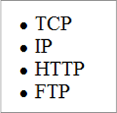

# HTML Basics 1

As part of this section, we'll learn more HTML tags and how we can apply them to our websites.:

## Table of Contents

- [HTML Basics 1](#html-basics-1)
  - [Table of Contents](#table-of-contents)
  - [Phrase Elements](#phrase-elements)
    - [Nesting Elements](#nesting-elements)
  - [Special Characters](#special-characters)
  - [HTML Lists](#html-lists)
    - [Ordered Lists](#ordered-lists)
      - [Type Attribute](#type-attribute)
    - [Unordered Lists](#unordered-lists)
    - [Description List](#description-list)
    - [Nested List](#nested-list)
  - [HTML Links (hyperlinks)](#html-links-hyperlinks)
  - [Absolute and Relative Hyperlinks](#absolute-and-relative-hyperlinks)
    - [Relative Links](#relative-links)
    - [Absolute Links](#absolute-links)
    - [Other Links](#other-links)
      - [Email Hyperlink](#email-hyperlink)
      - [Phone Number Hyperlink](#phone-number-hyperlink)
  - [HTML Images](#html-images)
  - [HTML Figures](#html-figures)
  - [HTML5 Structural Elements](#html5-structural-elements)
    - [HTML `<div>` (division)](#html-div-division)

The video(s) below provide an overview of the topics for this week. Please watch the video(s) before proceeding with the content for this week.

- **This video provides a high level overview of what we'll learn in this course. For this module, please focus on the first ~2 minutes of this video.**

<iframe width="560" height="315" src="https://www.youtube.com/embed/mbeT8mpmtHA?si=Ju2oUeHTtNQ5bwBa" title="YouTube video player" frameborder="0" allow="accelerometer; autoplay; clipboard-write; encrypted-media; gyroscope; picture-in-picture; web-share" referrerpolicy="strict-origin-when-cross-origin" allowfullscreen></iframe>

<iframe width="560" height="315" src="https://www.youtube.com/embed/D9I_dJDiIu0?si=kHeqNzCiBwfJII8w" title="YouTube video player" frameborder="0" allow="accelerometer; autoplay; clipboard-write; encrypted-media; gyroscope; picture-in-picture; web-share" referrerpolicy="strict-origin-when-cross-origin" allowfullscreen></iframe>

<iframe width="560" height="315" src="https://www.youtube.com/embed/rPblWCqOgWs?si=AwOk-BeP1n9Ctkop" title="YouTube video player" frameborder="0" allow="accelerometer; autoplay; clipboard-write; encrypted-media; gyroscope; picture-in-picture; web-share" referrerpolicy="strict-origin-when-cross-origin" allowfullscreen></iframe>

<iframe width="560" height="315" src="https://www.youtube.com/embed/AxC1yzzPm5Q?si=zsvaKvEEoXt5u8TR" title="YouTube video player" frameborder="0" allow="accelerometer; autoplay; clipboard-write; encrypted-media; gyroscope; picture-in-picture; web-share" referrerpolicy="strict-origin-when-cross-origin" allowfullscreen></iframe>

## Phrase Elements

**Phrase elements** indicate the context and meaning of the text between the container tags. It is up to each browser to interpret that style. Phrase elements are displayed in line with the text and can apply to a section of text or even just a single character of text. For example, the `<strong>` element indicates that the text associated with it has strong importance and should be displayed in a “strong” manner in relation to normal text on the page. 

Here are some common phrase elements and examples of their use:

|   Purpose   |  Element   |                                            Usage                                             |
| :---------: | :--------: | :------------------------------------------------------------------------------------------: |
|    Bold     |   `<b>`    |    Text that has no extra importance, but is styled in bold font by usage and convention     |
|  Citation   |  `<cite>`  |               Identifies a citation or reference; usually displayed in italics               |
| Definition  |  `<dfn>`   |           Identifies a definition of a word or term; usually displayed in italics            |
| Emphasized  |   `<em>`   |     Causes text to be emphasized in relation to other text; usually displayed in italics     |
| Italicized  |   `<i>`    |     Text that has no extra importance, but is styled in italics by usage and convention      |
|    Small    | `<small>`  |          Legal disclaimers and notices (“fine print”) displayed in small font size           |
|   Strong    | `<strong>` | Strong importance; causes text to stand out from surrounding text; usually displayed in bold |
|  Subscript  |  `<sub>`   |                    Displays a subscript as small text below the baseline                     |
| Superscript |  `<sub>`   |                   Displays a superscript as small text above the baseline                    |

Each phrase element is a container element, so an opening and a closing tag must be used. Although some elements have similar appearance (e.g. `<b>` and `<strong>`), screen readers (accessibility software) do interpret them differently. 

Here is an example:

```html
<p>Call for a free quote for your web development needs:
<strong>888.555.5555</strong></p>
```


Notice that the opening `<strong>` and closing `</strong>` tags are contained within the paragraph tags (`<p>` and `</p>`). This code is **properly nested** and is considered to be **well formed**. When improperly nested, the `<p>` and `<strong>` tag pairs overlap each other instead of being nested within each other. Improperly nested code will not pass validation testing and may cause display issues.

### Nesting Elements

Recall: Elements can be placed within other elements. This is called **nesting**. If we wanted to state that our cat is very grumpy, we could wrap the word very in a `<strong>` element, which means that the word is to have strong(er) text formatting:

```html
<p>My cat is <strong>very</strong> grumpy.</p>
```

There is a right and wrong way to do nesting. In the example above, we opened the p element first, then opened the strong element. For proper nesting, we should close the strong element first, before closing the p.

The following is an example of the **wrong way** to do nesting:

```html
<p>My cat is <strong>very grumpy.</p></strong> 
```

**The tags have to open and close in a way that they are inside or outside one another.** With the kind of overlap in the example above, the browser has to guess at your intent. This kind of guessing can result in unexpected results.

Here is another example:


## Special Characters

In order to use special symbols such as quotation marks, the greater-than sign `>`, the less-than sign `<`, and the copyright symbol `©` in your web page document, you need to use **special characters**, sometimes called *entity characters*.

Common special characters include:

|          Name           |   Character   |   Code    |
| :---------------------: | :-----------: | :-------: |
|    `Quot`ation mark     |      `"`      | `&quot;`  |
|       Apostrophe        |      `’`      |  `&#39;`  |
|   `Copy`right symbol    |      `©`      | `&copy;`  |
|       `Amp`ersand       |      `&`      |  `&amp;`  |
| `N`on`b`reaking `sp`ace | (Empty space) | `&nbsp;`  |
|       Long `dash`       |      `—`      | `&mdash;` |
|      `L`ess `t`han      |      `<`      |  `&lt;`   |
|    `G`reater `t`han     |      `>`      |  `&gt;`   |
|      Vertical Bar       |     `\|`      | `&#124;`  |
|       Trade Mark        |      `™`      | `&#8482;` |

Here is an example:

```html
&copy; Copyright 2020 My Company. All rights reserved.
```


## HTML Lists

Lists are used on web pages to organize information. When writing for the Web, headings, short paragraphs, and lists can make your page more clear and easy to read. HTML can be used to create three types of lists— description lists, ordered lists, and unordered lists. All lists are rendered as **block display** with an empty space above and below.

### Ordered Lists

> Collections of items that have a set order.

This type of list displays a numbering or lettering system to itemize the information contained in the list. 

- The `<ol>` tag displays an ordered list
- The [type attribute](#type-attribute) within `<ol>` defines the type of the list item marker 
- The `<li>` tag contains a list item starting with a number (by default)

Example:

```html
<ol>
    <li>Apply to school</li>
    <li>Register for course</li>
    <li>Pay tuition</li>
    <li>Attend course</li>
</ol>
```


#### Type Attribute

More information about [HTML attributes here](week-2-2.md/#what-are-html-attributes). 

The `type` attribute for `<ol>` can hold various values, depending on the intended list symbol.

| Value |          Symbol          |
| :---: | :----------------------: |
|  `1`  |  Numerals (the default)  |
|  `A`  |    Uppercase letters     |
|  `a`  |    Lowercase letters     |
|  `I`  |      Roman numerals      |
|  `i`  | Lowercase Roman numerals |

For example, to create an ordered list organized by uppercase letters, use `<ol type="A">`. 

### Unordered Lists

> Collections of items that do NOT have a set order.

An unordered list displays a bullet, or list marker, before each entry in the list. This bullet can be one of several types: disc (the default), square, and circle. 

- The `<ul>` tag displays an unordered list
- The `<li>` tag contains a list item starting with a bullet  

Example:

```html
<ul>
    <li>TCP</li>
    <li>IP</li>
    <li>HTTP</li>
    <li>FTP</li>
</ul>
```



### Description List

> Collections of items that come as a pair (e.g. term/definition).

A description list can be used to organize terms and their descriptions. The terms stand out, and their descriptions can be as long as needed to convey your message. 

- The `<dl>` tag displays a description list
- The `<dt>` tag contains a term
- The `<dd>` tag describes each term

Example:
```html
<dl>
    <dt>IP</dt>
        <dd>Internet Protocol</dd>
    <dt>TCP</dt>
        <dd>Transmission Control Protocol</dd>
</dl>
```


### Nested List

Here's how we can place a list within another list:

```html
[1]  <ol>
[2]      <li>Coffee</li>
[3]      <li>Tea
[4]          <ol>
[5]              <li>Black tea</li>
[6]              <li>Green tea</li>
[7]          </ol>
[8]      </li>
[9]      <li>Milk</li>
[10] </ol>
```


Note: the numbers in brackets represent the line number for the purpose of these notes. They should NOT be present when writing code in the editor.

Notice the `<li>` tag on line #3 is left open until line #8 where it is closed. This is intentional as it allows another list (lines #4-7) be [nested](#nesting-elements), within the list (lines #1-10).

## HTML Links (hyperlinks)
HTML links are hyperlinks and allow users to click their way from one page to another.

- The `<a>` tag (commonly called the anchor element) defines a hyperlink
- The link text is the visible part for the user
- `href` attribute indicates the link's destination
- A link can be a URL, text, image, or any other element within the same page.

A link has two main parts:

1) destination
2) label
  


## Absolute and Relative Hyperlinks

### Relative Links

When you need to link to web pages within your site, use a **relative hyperlink**. The `href` value for a relative hyperlink does not begin with `https://` and does not include a domain name. For a relative hyperlink, the `href` value will contain only the **file name** or **file name and folder of the web page you want to display**. The hyperlink location is **relative** to the page currently being displayed. 

Here is a diagram to explain this:


1. `Same Directory` To link to a file within the same folder, simply use the file name.
2. `Child Directory` To link to a file within a subdirectory, use the name of the subdirectory and a slash before the file name.
3. `Grandchild/Descendant Directory` To link to a file that is multiple subdirectories below the current one, construct the full path by including each subdirectory name (separated by slashes) before the file name.
4. `Parent/Ancestor Directory` Use `../` to reference a folder above the current one. If trying to reference a file several levels above the current one, simply string together multiple `../`.
5. `Sibling Directory` Use `../` to move up to the appropriate level, and then use the same technique as for child or grandchild directories.
6. `Root Reference` In this approach, begin the reference with the root reference (the `/`), and then use the same technique as for child or grandchild directories.

**Example of relative links**

Link to a page in the **same folder** as the current page. Only the word `Home` is displayed to the user.

```html
<a href="index.html">Home</a>
```

Link to a page in the **parent folder** of the current page

```html
<a href="../index.html">Home</a>
```

Link to a page in the **grandparent folder** of the current page

```html
<a href="../../index.html">Home</a>
```

Link to a page in the **subfolder (child folder)** of the current page

```html
<a href="pages/index.html">Home</a>	
```

Link to a page in the **grandchild folder** of the current page

```html
<a href="main/pages/index.html">Home</a>
```

Link to a page **anywhere on the same website** (a combination of the above may be used)

```html
<a href="../pages/index.html">Home</a>
```

### Absolute Links

An absolute hyperlink indicates the **absolute location** of a resource on the Web. Use absolute hyperlinks when you need to link to **resources on other websites**. The `href` value for an absolute hyperlink to the page of a website includes the `https://` protocol and the domain name.

**Example of absolute links**

Link to apple website

```html
<a href="https://www.apple.com">Apple</a>
```

Link to a file called `ex.html` located within the folder `def` which is located in a folder called `abc` in the domain `example.com`.

```html
<a href="https://www.example.com/abc/def/ex1.html">Example 1</a>
```

The file strucutre for the link above is as the following:

- `www.example.com` (domain)
  - abc (folder)
    - def (folder)
      - `ex1.html` (file)

Notice how `def` folder is nested within the `abc` folder.

### Other Links

#### Email Hyperlink

Link to the **default email program** configured for the browser and let the user send an email

```html
<a href="mailto:me@gmail.com">me@gmail.com</a>
```

#### Phone Number Hyperlink

Link to a **phone number** will initiate a phone call in a Mobile browser

```html
<a href="tel:123-456-7890">Call 123-456-7890</a>
```

<!-- #### Specific Portion of a webpage
Link to a specific portion of a webpage (e.g., to Top of the page). Two parts needed: 
1) The tag that identifies the named fragment of a web page (must be assigned an id)
```html
<div id="top"> … </div>
```
2) The href attribute of an anchor tag that links to the named fragment of a web page
```html
<a href="#top">Back to Top</a> 
```

By default, links open in the same browser window
The target attribute of an anchor tag is used to open links in a new browser window or tab
  <a href="http://google.ca" target="_blank">Google</a> -->

## HTML Images

The `` element (often referred to as the image element) configures graphics on a web page.

The `` tag is [empty/void](week-2-2.md/#emptyvoid-element) and has two required attributes:

- `src` – specifies the path to the image
  - The path for src should be [relative](#relative-links) if the images are saved locally on the computer. The path can be [absolute](#absolute-links) if it a URL to an image hosted on a remote computer (e.g. on the internet).
- `alt` – specifies an alternative text for the image
  - Use the `alt` attribute to provide accessibility. The alt attribute configures an alternative text description of the image. This alt text is used by the browser in two ways:
  1) The browser will display the alt text in the image area before the graphic is downloaded and displayed. Some browsers will also display the alt text as a tool tip whenever a visitor to the web page places the mouse cursor over the image area. 
  2) Applications such as screen readers will read the text in the alt attribute out loud. A mobile browser may display the alt text instead of the image.
- width and height attributes specifies the size of the image in pixels (this should ideally be done using CSS, which will learn in the coming weeks, however, for the time being, it will work.)

Examples:


```html

```


  
Other considerations:
The W3C recommends that alt text be no longer than `100 characters`. **Avoid using the file name or words like picture, image, and graphic as the value of the alt attribute**. Instead, use a brief phrase that describes the image. If the purpose of an image, such as a logo, is to display text, then configure the text as the value of the alt attribute.

## HTML Figures

The `<figure>` element can be used not just for images but for any type of essential content that could be moved to a different location in the page or document, and the rest of the document would still make sense.


## HTML5 Structural Elements

HTML5 structural elements can be used to define different parts of a web page. They clearly describe their meaning to both the browser and the developer (semantic elements).


Some semantic elements include:

- `<header>`...`</header>`  
  - specifies a header for a document or section
- `<nav>`...`</nav>`  
  - defines the navigation links
- `<main>`...`</main>`  
  - specifies the main content of a document
- `<article>`...`</article>`  
  - defines independent, self-contained content
- `<section>`...`</section>`  
  - defines a section in a document
- `<aside>`...`</aside>`  
  - defines content aside from the page content
- `<footer>`...`<footer>`
  - specifies a footer for a document or section


### HTML `<div>` (division)

The `<div>` element has been used for many years to configure a generic structural area or “division” on a web page as a block display with empty space above and below.

- A div element begins with a `<div>` tag and ends with a `</div>` tag
