<!-- markdownlint-disable MD032 -->
<!-- markdownlint-disable MD033 -->
<!-- markdownlint-disable MD045 -->
# CSS Basics 1

As part of this lesson, we'll start our journey into CSS (Cascading Style Sheets), a language used to style web pages. CSS allows you to control the layout, colors, fonts, and other visual aspects of your web pages.

## Table of Contents

- [CSS Basics 1](#css-basics-1)
  - [Table of Contents](#table-of-contents)
  - [What is CSS?](#what-is-css)
  - [Benefits of CSS](#benefits-of-css)
  - [CSS Syntax](#css-syntax)
    - [CSS Syntax: Selectors](#css-syntax-selectors)
    - [CSS Syntax: Properties](#css-syntax-properties)
    - [CSS Syntax: Values](#css-syntax-values)
  - [CSS Comments](#css-comments)
  - [How to apply CSS](#how-to-apply-css)
    - [Inline CSS](#inline-css)
    - [Internal/Embedded CSS](#internalembedded-css)
    - [External CSS](#external-css)
  - [CSS Colours](#css-colours)
    - [Name of colours](#name-of-colours)
    - [RGB and RGBa values](#rgb-and-rgba-values)
      - [RGBa](#rgba)
    - [HSL values](#hsl-values)
    - [Hexadecimal](#hexadecimal)
  - [CSS Text Styling](#css-text-styling)
    - [Font Family](#font-family)
    - [Font Size](#font-size)
    - [Measurenment Units](#measurenment-units)
    - [Font Weight](#font-weight)
    - [Font Style](#font-style)
  - [CSS Validation](#css-validation)


The videos below provide an overview of the topics for this week. You can watch the videos before or after reading the content for this week.

<!-- Inline CSS -->
<iframe width="560" height="315" src="https://www.youtube.com/embed/TZTaGTQKl2I?si=hpIpHAJxFQg1kLBz" title="YouTube video player" frameborder="0" allow="accelerometer; autoplay; clipboard-write; encrypted-media; gyroscope; picture-in-picture; web-share" referrerpolicy="strict-origin-when-cross-origin" allowfullscreen></iframe>

<!-- All 3 ways of adding CSS -->
<iframe width="560" height="315" src="https://www.youtube.com/embed/WF8Ai6-JsNI?si=fz5Dsu_tivSYTFM-" title="YouTube video player" frameborder="0" allow="accelerometer; autoplay; clipboard-write; encrypted-media; gyroscope; picture-in-picture; web-share" referrerpolicy="strict-origin-when-cross-origin" allowfullscreen></iframe>

<!-- External CSS -->
<iframe width="560" height="315" src="https://www.youtube.com/embed/4OMdzHnys9o?si=p4uqupI0eRTqK2-K" title="YouTube video player" frameborder="0" allow="accelerometer; autoplay; clipboard-write; encrypted-media; gyroscope; picture-in-picture; web-share" referrerpolicy="strict-origin-when-cross-origin" allowfullscreen></iframe>

<!-- CSS Colors -->
<iframe width="560" height="315" src="https://www.youtube.com/embed/_2LLXnUdUIc?si=lrRKl4IH_ZI0dZ9Q" title="YouTube video player" frameborder="0" allow="accelerometer; autoplay; clipboard-write; encrypted-media; gyroscope; picture-in-picture; web-share" referrerpolicy="strict-origin-when-cross-origin" allowfullscreen></iframe>

<!-- CSS Validation -->
<iframe width="560" height="315" src="https://www.youtube.com/embed/5tzE2Je3Y10?si=4rpndp3NUMJezgNf" title="YouTube video player" frameborder="0" allow="accelerometer; autoplay; clipboard-write; encrypted-media; gyroscope; picture-in-picture; web-share" referrerpolicy="strict-origin-when-cross-origin" allowfullscreen></iframe>

## What is CSS?

CSS is a flexible, cross-platform, standards-based language developed by W3C used to define styles for a web page, including the design, layout and variations in display for different devices and screen sizes. Imagine CSS as the interior design of your web page, applying colors, layouts, and fonts.

- stands for Cascading Style Sheets
- describes how HTML elements should be displayed on screen, paper, or in other media
- provides greater typography and page layout control than was possible through HTML attributes 
- separates presentation from content/structure
- can be shared among webpages
- provides easier site management
- creates smaller files

## Benefits of CSS

Before digging into the syntax of CSS, we should review some of the benefits of using CSS:

- **Improved control over formatting**: The degree of formatting control in CSS is significantly better than that provided in HTML. CSS gives us full control over the layout, typography, color, and other visual aspects of a web page.
- **Improved site maintainability**: Websites become significantly more maintain-able because all formatting can be centralized into one CSS file, or a small handful of them. This allows you to make site-wide visual modifications by changing a single file.
- **Improved accessibility**: CSS-driven sites are more accessible. By keeping presentation out of the HTML, screen readers and other accessibility tools work better, thereby providing a significantly enriched experience for those reliant on accessibility tools.
- **Improved page-download speed**: A site built using a centralized set of CSS files for all visuals will also be quicker to download because each individual HTML file will contain less style information and markup, and thus be smaller.
- **Improved output flexibility**: CSS can be used to adopt a page for different output media. This approach to CSS page design is often referred to as  responsive design. We'll review this in more detail in the coming weeks.

## CSS Syntax

A CSS document consists of one or more **style rules**. A rule consists of a selector that identifies the HTML element or elements that will be affected, followed by a series of `property: value` pairs (each pair is also called a **declaration**).

```css
selector {
  property: value;
}
```

- Each Rule contains a **Selector** and a **Declaration**
- The selector points to the HTML element you want to style
- The declaration block contains one or more declarations separated by semicolons
- Each declaration includes a CSS property name and a value, separated by a colon
- Multiple CSS declarations are separated with semicolons, and declaration blocks are surrounded by curly braces

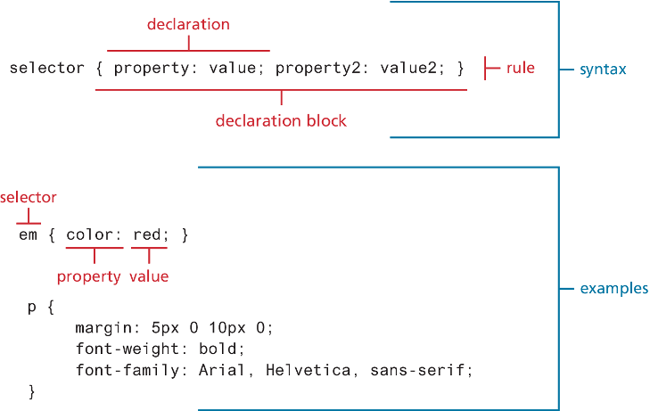

### CSS Syntax: Selectors

Every CSS rule begins with a **selector**. The selector identifies which element or ele-ments in the HTML document will be affected by the declarations in the rule. Another way of thinking of selectors is that they are a pattern that is used by the browser to select the HTML elements that will receive the style. 

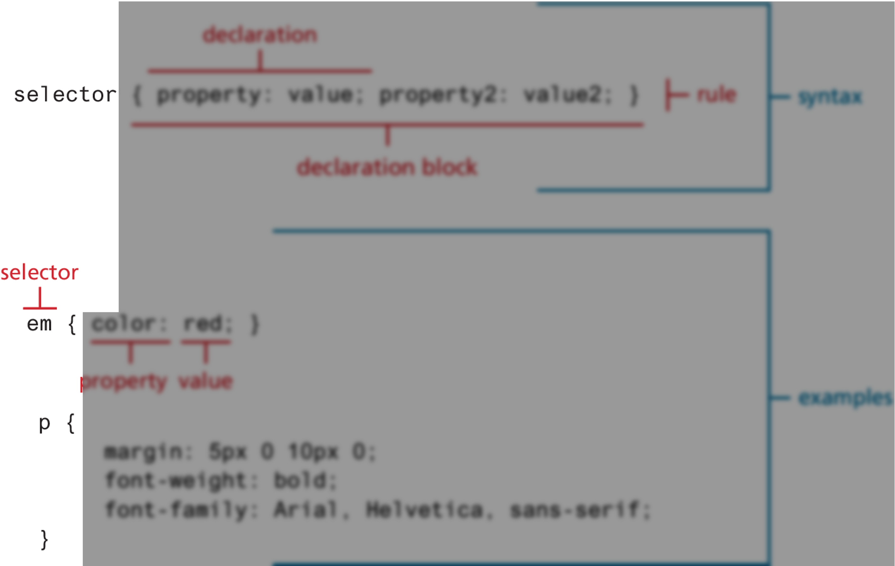

### CSS Syntax: Properties

Each individual CSS declaration must contain a **property**. These property names are predefined by the CSS standard. There are hundreds different property names (e.g. font-size, color, background-color, etc.), so some type of reference guide such as W3School can can be helpful:

[Link to W3Schools CSS Reference](https://www.w3schools.com/cssref/index.php)

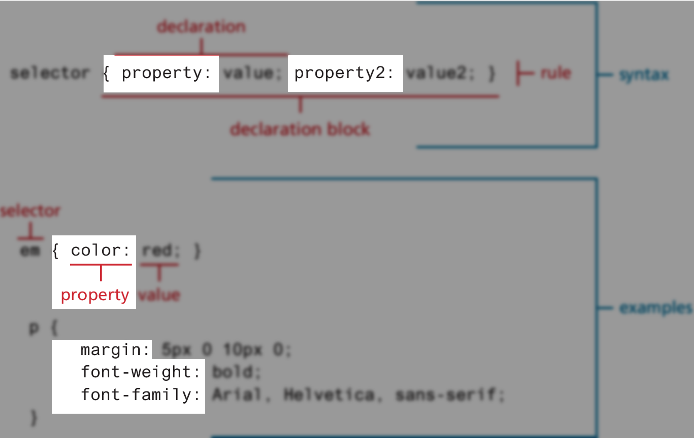

### CSS Syntax: Values

Each CSS declaration also contains a **value** for a property. The unit of any given value is dependent upon the property. Some property values are from a predefined list of keywords. Others are values such as length measurements, percentages, num-bers without units, color values, and URLs.

Colours and specifying unit of measurement may seem at first glance to be the clearest of these units. But in reality, the concept of colour and measuremnets can be a complicated concept to describe. More on this later.

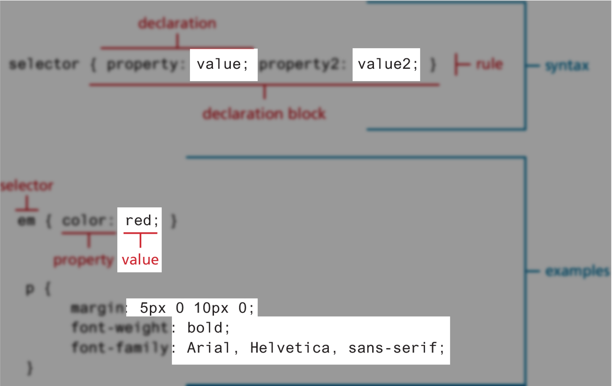

## CSS Comments

Comments are used to explain code and may help when you edit the source code at a later date. Comments are ignored by browsers and are not displayed on the web page.

A comment is placed inside the `<style>` element and starts with `/*` and ends with `*/`.

```css
/* This is a single-line comment */
p {
  color: red;
}
```

## How to apply CSS

CSS style rules can be located in three different locations. These three are not mutually exclusive, in that you could place your style rules in all three. In practice, however, developers place all their style definitions in one (or more) external style sheet file:

1. **Inline CSS**: Written directly in the HTML element's style attribute.
2. **Internal CSS**: Written within the `<style>` tag in the HTML document's `<head>`.
3. **External CSS**: Written in a separate CSS file (`.css` file extension) and linked to the HTML document.

We'll cover each of these methods in more detail below:

### Inline CSS

- Written directly in the HTML element's `style` attribute.
- Only affects the element it is defined within
- Overrides any other style definitions for properties used in the inline style (more about later).
- A selector is not necessary with inline styles and that semicolons are only required for separating multiple CSS rules.
- Using inline styles is generally discouraged since they increase bandwidth and decrease maintainability because:
  - presentation and content are intermixed
  - it can be difficult to make consistent inline style changes across multiple files
  
- The example below shows how inline CSS is applied to a paragraph element:

> [!TIP]
> Click on the `Result` tab to see the output and edit the code using the `Edit in JSFiddle` button.

<iframe width="100%" height="300" src="//jsfiddle.net/parsar/y52eau6p/1/embedded/html,result/dark/" allowfullscreen="allowfullscreen" allowpaymentrequest frameborder="0"></iframe>

This is like writing specific instructions directly on an item, which can be useful for one-off changes. Still, it's not recommended for large-scale styling as the styling is only applied to that specific element. Developers often use this approach to apply exceptional styling to a single element or to test styles quickly.

### Internal/Embedded CSS

- Written within the `<style>` element in the HTML document's `<head>`
- While better than inline styles, using embedded styles is also by and large discouraged
- Just as with inline styles, embedded styles can be helpful when quickly testing out a style that is used in multiple places within a single HTML document

- The example below shows how internal/embedded CSS is applied to a paragraph element:

> [!TIP]
> Click on the `Result` tab to see the output and edit the code using the `Edit in JSFiddle` button.

<iframe width="100%" height="350" src="//jsfiddle.net/parsar/7mazj2x1/9/embedded/html,result/dark/" allowfullscreen="allowfullscreen" allowpaymentrequest frameborder="0"></iframe>

This is like including a style guide at the top of a document.

### External CSS

- Written in a separate CSS file (`.css` file extension) and linked to the HTML document
- This is by far the most common place to locate style rules because it provides the best maintainability
  - When you make a change to an external stylesheet, all HTML documents that reference that style sheet will automatically use the updated version
  - The browser is able to cache the external style sheet, which can improve the performance of the site as well
- To reference an external style sheet, you must use a `<link>` element within the `<head>` element, as shown in the example below
- You can link to several style sheets at a time; each linked style sheet will require its own `<link>` element

- The example below shows how external CSS is applied to a paragraph element:

> [!TIP]
> The `CSS` tab shows the external CSS file that is linked to the HTML document

<iframe width="100%" height="300" src="//jsfiddle.net/parsar/wjc0k8po/8/embedded/html,css,result/dark/" allowfullscreen="allowfullscreen" allowpaymentrequest frameborder="0"></iframe>

This is like having a separate manual for styling that can be referenced by multiple documents.

- **Cascade**: Rules cascade from the top of the stylesheet to the bottom, like a waterfall, with later rules potentially overriding earlier ones.

## CSS Colours

Colours are an essential part of web design, adding visual appeal and conveying information. CSS provides several ways to define colours, including hexadecimal, RGB, and HSL values.

There are several ways to define colours in CSS:

1. Name of colours
2. RGB values
   - RGBa values
3. HSL values
4. Hexadecimal values

### Name of colours

- CSS provides a set of predefined colour names that you can use to specify colours
- For example, `red`, `blue`, `green`, etc.
- These names are easy to remember and use, but they offer limited options compared to other methods

Code example:

```css
p {
  color: pink;
}
```

This sets the text color of all `<p>` elements to pink.

### RGB and RGBa values

The RGB color model (Red Green Blue) relies on the fact that human visible color spectrum can be displayed using a combination of red, green, and blue lights. Each pixel is composed of tiny red, green, and blue subpixels. Because he RGB colors combine to create white, they are also called additive colors.

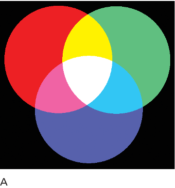

- Uses a combination of red, green, and blue values to create colours
- Each value can range from 0 to 255 and represents the intensity of the colour
- For example:
  - `rgb(255, 0, 0)` represents red
  - `rgb(0, 255, 0)` represents green
  - `rgb(0, 0, 255)` represents blue
- RGB values can be used to create a wide range of colours including transparent colours using the RGBa format

Code example:
  
```css
p {
  color: rgb(255, 255, 0);
}
```

This sets the text color of all `<p>` elements to yellow (since it's a combination of red and green).

#### RGBa

- The `a` stands for alpha transparency, which is the opacity of the colour
- The RGBa format includes an additional value for the opacity of the colour, which ranges from 0 to 1
  - 0 means that the element is fully transparent
  - 100 means that the element is fully opaque—that is, it has no transparency
- For example, `rgba(255, 0, 0, 0.5)` represents a semi-transparent red colour

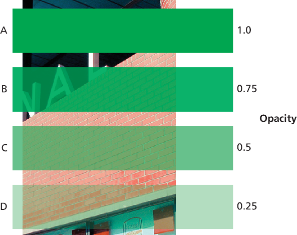


### HSL values

- Uses a combination of hue, saturation, and lightness to create colours
- Hue represents the type of colour (e.g., red, blue, green)
- Saturation represents the intensity of the colour (e.g., how vivid the colour is)
- Lightness represents the brightness of the colour (e.g., how light or dark the colour is)


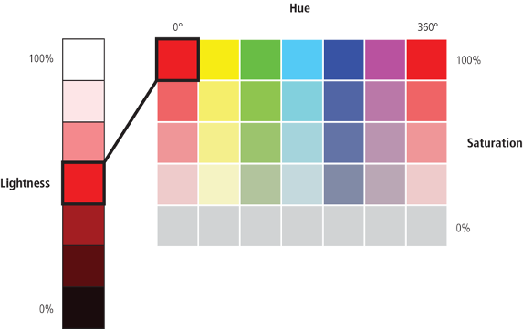

- For example:
  - `hsl(0, 100%, 50%)` represents red
  - `hsl(120, 100%, 50%)` represents green
  - `hsl(240, 100%, 50%)` represents blue

Code example:

```css
p {
  color: hsl(0, 100%, 50%);
}
```

This sets the text color of all `<p>` elements to red.

### Hexadecimal

- Typically a popular way to define colours in CSS
- Uses a six-digit code to represent colours
- Each pair of characters represents the red, green, and blue values
- The first pair represents the red value, the second pair represents the green value, and the third pair represents the blue value
- For example
  - `#ff0000` represents red
  - `#00ff00` represents green
  - `#0000ff` represents blue

Code example:

```css
p {
  color: #4C0099;
}
```

This sets the text color of all `<p>` elements to purple (a combination of red and blue) using a hexadecimal code.

## CSS Text Styling

CSS provides two types of properties that affect text:

1. The first we call font properties because they affect the font and its appearance
2. The second type of CSS text properties are referred to here as paragraph properties since they affect the text in a similar way no matter which font is being used

Some of the most common font properties are shown in the table below. We'll also go over each of these properties in more detail.

|   Property   |                                                                            Description                                                                            |
| -------------- | --------------------------------------------------------------------------------------------------------------------------------------------------------------- |
| font-family  |                                    Specifies the typeface/font (or generic font family) to use. More than one can be specified                                    |
|  font-size   |                                                       The size of the font in one of the measurement units.                                                       |
|  font-style  |                               Specifies whether italic, oblique (i.e., skewed by the browser rather than a true italic), or normal.                               |
| font-variant |                                                   Specifies either small-caps text or none (i.e., regular text)                                                   |
| font-weight  | Specifies either normal, bold, bolder, lighter, or a value between 100 and 900 in multiples of 100, where larger number represents weightier (i.e., bolder) text. |

### Font Family

- `font-family` specifies a prioritized list of one or more font family names and/or generic family names for the selected element(s)
  - Generic family: a group of font families with a similar look (e.g., `serif`, `sans-serif`, `monospace`, `cursive`, `fantasy`)
  - Font family: a specifc font name (e.g., `Arial`, `Times New Roman`, `Courier New`)
- The `font-family` property should hold several font names as a "fallback" system, to ensure maximum compatibility between browsers/operating systems
- While there is no real limit to the number of fonts that one can specify with the font-family property, in practice, most developers will typically choose three or four stylistically similar fonts

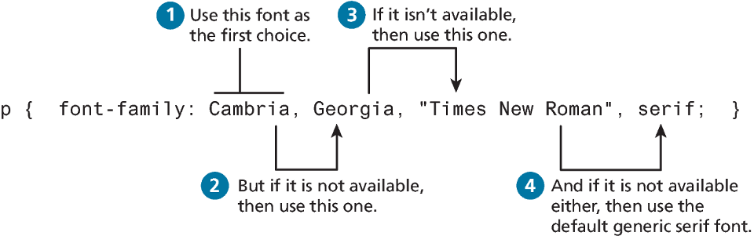

- The example below shows how a font family is applied to a paragraph element:

<iframe width="100%" height="300" src="//jsfiddle.net/parsar/zt80qoyg/embedded/html,css,result/dark/" allowfullscreen="allowfullscreen" allowpaymentrequest frameborder="0"></iframe>

Note: Place the font-family name in "quotation marks" if it is more than one word, like "Times New Roman"

Below is a list of some common font families and their categories:

| Font Family Category |             Font Typefaces              |
| :------------------: | :-------------------------------------: |
|        Serif         |   Times New Roman, Georgia, Garamond    |
|      Sans-Serif      |        Arial, Verdana, Helvetica        |
|      Monospace       |   Courier New, Lucida Console, Monaco   |
|       Cursive        | Comic Sans MS, Brush Script MT, Lobster |
|       Fantasy        |    Impact, Haettenschweiler, Papyrus    |

Fonts have various unique elements such as serifs, which are the small lines at the end of a stroke in a letter or symbol. Serif fonts are often used in print media, while sans-serif fonts are more common in digital media. Monospace fonts have equal spacing between characters, making them ideal for code snippets. Cursive and fantasy fonts are more decorative and less common in web design.

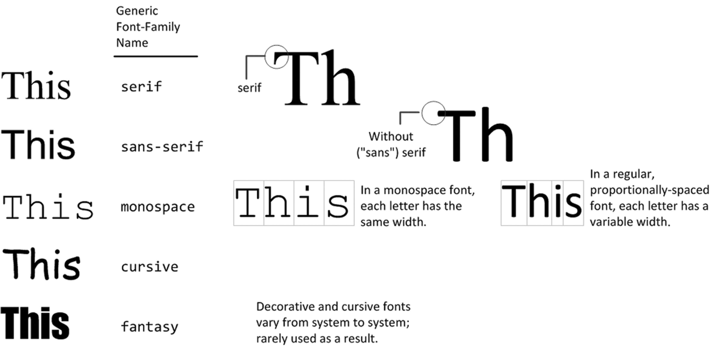

### Font Size

- `font-size` sets the size of text in one of the following ways:
  1. As one of the absolute units (e.g., `px`, `pt`, `cm`, `mm`, `in`) or relative units (e.g., `em`, `%`)
  2. As a `length` value (e.g., `12px`, `1.5em`, `150%`)
- The default font size is usually `16px`, which is equivalent to `1em`
- The best practice that works in all browsers is to set a default font-size in percentages or em units in the body selector and then use em units for all other font sizes

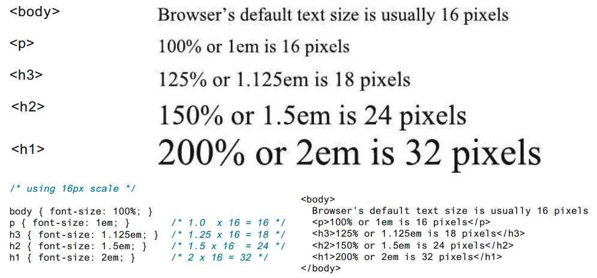

### Measurenment Units

Units of measure in CSS are either:
- **relative units**, in that they are based on the value of something else, or
- **absolute units**, in that they have a real-world size.

Relative units:
- `px` (pixels): `font-size: 16px;`
- `em` (relative to the font-size of the element): `font-size: 1.5em;`
- `%` (percentage of the font-size of the parent element): `font-size: 150%;`
- `rem` (relative to the font-size of the root element): `font-size: 1.5rem;`

Absolute units:
- `in` (inches): `width: 2in;`
- `cm` (centimeters): `width: 5cm;`
- `mm` (millimeters): `width: 50mm;`
- `pt` (points): `font-size: 12pt;`

Absolute units such as points and inches do not translate very well to pixel-based devices. Somewhat surprisingly, pixels are also a problematic unit. Newer mobile devices in recent years have been increasing pixel densities so that a given CSS pixel does not correlate to a single device pixel. So while sizing with pixels provides precise control, if we wish to create web layouts that work well on different devices, we should learn to use relative units such as em units or percentages for our font sizes (and indeed for other sizes in CSS as well).

### Font Weight

- `font-weight` configures the boldness (thickness) of the font.
- For instance, the `Open Sans` font has five different weights:
  - light, regular, semi-bold, bold, and extra bold
- Within your CSS you specify which of these weights by using their numeric value, which typically ranges from 100 and 900, with larger numbers bolder than lower numbers

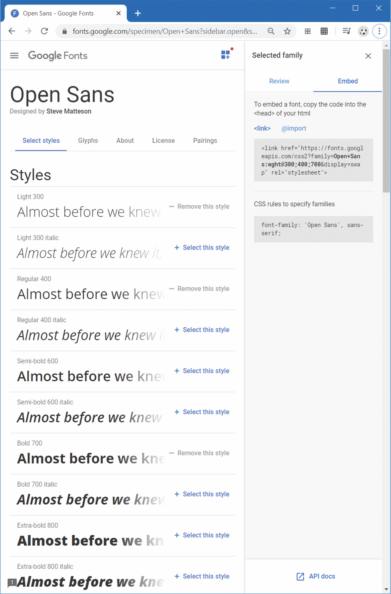

<iframe width="100%" height="300" src="//jsfiddle.net/parsar/wfd3ko8y/14/embedded/html,css,result/dark/" allowfullscreen="allowfullscreen" allowpaymentrequest frameborder="0"></iframe>

This makes the text within `<p>` elements "bolder", like emphasizing words in a document.

### Font Style

- `font-style` is mostly used to configure font as italic.

- The example below shows how font style is applied to a paragraph element:

<iframe width="100%" height="300" src="//jsfiddle.net/parsar/1j4d3z0L/embedded/html,css,result/dark/" allowfullscreen="allowfullscreen" allowpaymentrequest frameborder="0"></iframe>

This makes the text in all `<p>` elements italic, like *slanting text* for emphasis.

## CSS Validation

- Just like HTML, CSS can also be validated to ensure that it is error-free and follows the correct syntax.
- Similar to HTML validation, CSS validation checks your code against web standards to ensure it is well-structured and compatible with different browsers.
- W3C provides a CSS Validator tool that you can use to validate your CSS code: [https://jigsaw.w3.org/css-validator/](https://jigsaw.w3.org/css-validator/)

> [!WARNING]
> You'll be required to submit a validation report for your quizzes. Make sure you're familiar with the validation process.
