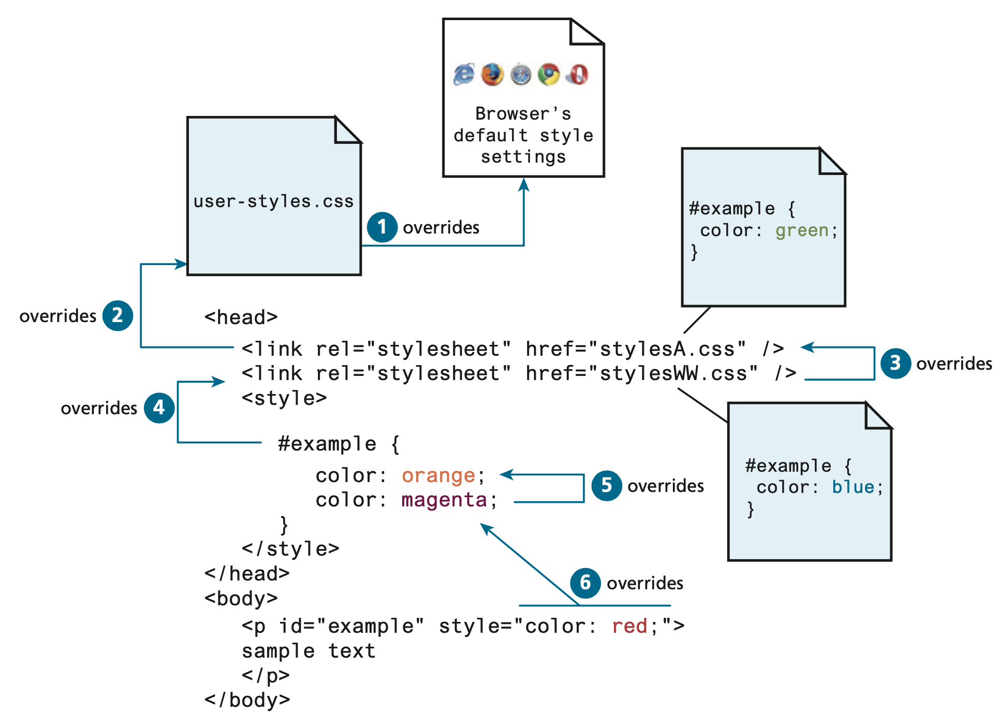

<!-- markdownlint-disable -->
# CSS Basics 2

As part of this lesson, we'll continue our lesson on CSS and discuss advance ways to apply CSS to our web pages.
## Table of Contents

- [CSS Basics 2](#css-basics-2)
  - [Table of Contents](#table-of-contents)
  - [CSS Selectors](#css-selectors)
    - [Element selector](#element-selector)
    - [Descendant Selector](#descendant-selector)
    - [Class Selector](#class-selector)
    - [ID Selector](#id-selector)
    - [Class and ID in Action](#class-and-id-in-action)
  - [Cascade in CSS](#cascade-in-css)
    - [Inheritance](#inheritance)
    - [Specificity](#specificity)
    - [Location](#location)
  - [Background CSS](#background-css)
    - [Background colors](#background-colors)
    - [Background Properties: Explained](#background-properties-explained)
    - [Multiple Background Images](#multiple-background-images)
  - [Borders and Box Shadows](#borders-and-box-shadows)
    - [CSS Border](#css-border)
    - [CSS Border-style](#css-border-style)
    - [CSS Border-radius](#css-border-radius)
    - [Border Width Measurements](#border-width-measurements)
  - [CSS Text Properties](#css-text-properties)
  - [CSS Opacity](#css-opacity)


The videos below provide an overview of the topics for this week. You can watch the videos before or after reading the content for this week.

<!-- CSS Selectors (element, Class and ID) -->
<iframe width="560" height="315" src="https://www.youtube.com/embed/1h5StQJ8hww?si=MqooYD2F6RBHgR5k" title="YouTube video player" frameborder="0" allow="accelerometer; autoplay; clipboard-write; encrypted-media; gyroscope; picture-in-picture; web-share" referrerpolicy="strict-origin-when-cross-origin" allowfullscreen></iframe>

<!-- CSS Class -->
<iframe width="560" height="315" src="https://www.youtube.com/embed/spBEVamNIbU?si=JbwyBuOFc4wiiWYH" title="YouTube video player" frameborder="0" allow="accelerometer; autoplay; clipboard-write; encrypted-media; gyroscope; picture-in-picture; web-share" referrerpolicy="strict-origin-when-cross-origin" allowfullscreen></iframe>

<!-- CSS Cascade -->
<iframe width="560" height="315" src="https://www.youtube.com/embed/4oPvurjpcNw?si=I4pdV5mTUr5ubCuS" title="YouTube video player" frameborder="0" allow="accelerometer; autoplay; clipboard-write; encrypted-media; gyroscope; picture-in-picture; web-share" referrerpolicy="strict-origin-when-cross-origin" allowfullscreen></iframe>

<!-- Inspector tool -->
<iframe width="560" height="315" src="https://www.youtube.com/embed/s53lPzBjLcU?si=lCZarFOVLebQadF3" title="YouTube video player" frameborder="0" allow="accelerometer; autoplay; clipboard-write; encrypted-media; gyroscope; picture-in-picture; web-share" referrerpolicy="strict-origin-when-cross-origin" allowfullscreen></iframe>

<!-- CSS Background -->
<iframe width="560" height="315" src="https://www.youtube.com/embed/zHZRFwWQt2w?si=Jsdf7vPHQKN8a4Fu" title="YouTube video player" frameborder="0" allow="accelerometer; autoplay; clipboard-write; encrypted-media; gyroscope; picture-in-picture; web-share" referrerpolicy="strict-origin-when-cross-origin" allowfullscreen></iframe>

<!-- CSS Borders -->
<iframe width="560" height="315" src="https://www.youtube.com/embed/sdn5p4kf91c?si=0sg7Z_czh2NHyHug" title="YouTube video player" frameborder="0" allow="accelerometer; autoplay; clipboard-write; encrypted-media; gyroscope; picture-in-picture; web-share" referrerpolicy="strict-origin-when-cross-origin" allowfullscreen></iframe>

- Another great [Youtube video on CSS borders](https://youtu.be/d_3fKSHwq_g?si=YowyT8jGkZ3NyBM8)

<!-- CSS Opacity -->
<iframe width="560" height="315" src="https://www.youtube.com/embed/QdkgbodF71k?si=yZQEO5hfGYCq2UeM" title="YouTube video player" frameborder="0" allow="accelerometer; autoplay; clipboard-write; encrypted-media; gyroscope; picture-in-picture; web-share" referrerpolicy="strict-origin-when-cross-origin" allowfullscreen></iframe>


## CSS Selectors

- When defining CSS rules, you will need to use a selector.
- Selectors tell the browser which elements will be affected by the property values
- Selectors allow you to select individual or multiple HTML elements.
- Three basic selector types have been around since the earliest CSS2 specification.    
  - [Element Selectors](#element-selector)
  - [Class Selectors](#class-selector)
  - [ID Selectors](#id-selector)

### Element selector
- Element selectors select all instances of a given HTML element.
- You can also select all elements by using the universal element selector `*`
- You can select a group of elements by separating the different element names with commas.

<iframe width="100%" height="400" src="//jsfiddle.net/parsar/8veu679w/3/embedded/html,css,result/dark/" allowfullscreen="allowfullscreen" allowpaymentrequest frameborder="0"></iframe>

### Descendant Selector

- A descendant selector targets elements that are nested within specific elements in the HTML document tree.
- It is used to apply styles to elements that are descendants of another specified element, not just direct children.
- The syntax for a descendant selector involves placing a space between two or more selectors. The styles defined will only affect the second selector if it exists within the first.
- This method of selecting allows for a more refined and structured styling approach in complex HTML documents.


<iframe width="100%" height="560" src="//jsfiddle.net/parsar/u1y9ehnw/9/embedded/html,css,result/dark/" allowfullscreen="allowfullscreen" allowpaymentrequest frameborder="0"></iframe>

### Class Selector

- A class selector allows you to simultaneously target different HTML elements regardless of their position in the document tree.
- HTML elements labeled with the same class attribute value, can be targeted for styling by using a class selector, which takes the form: 
  - period `.` followed by the class name: `.blue-circle`
- Class selectors should not have any spaces, instead, you can use the following to concatenate 2 words together:
  - Dash: `.blue-circle`
  - Underscore: `.blue_cricle`
  - Camelcase: `.blueCircle` 

<iframe width="100%" height="400" src="//jsfiddle.net/parsar/qmon9j21/2/embedded/html,css,result/dark/" allowfullscreen="allowfullscreen" allowpaymentrequest frameborder="0"></iframe>


### ID Selector
- An ID selector allows you to target a specific element by its id attribute regardless of its type or position in the document tree.
- HTML elements labeled with an id attribute, can be targeted for styling by using an id selector, which takes the form: 
  - pound/hashtag `#` followed by the id name: `#orange-box`
  - Similar to classes, ID selectors should not have any spaces, instead, you can use the following to concactinate 2 words together:
  - Dash: `#orange-box`
  - Underscore: `#orange_box`
  - Camelcase: `.orangeBox` 

<iframe width="100%" height="400" src="//jsfiddle.net/parsar/sywam4ej/embedded/html,css,result/dark/" allowfullscreen="allowfullscreen" allowpaymentrequest frameborder="0"></iframe>

### Class and ID in Action

Example: The original HTML can be modified to add class and id values, which are then styled in CSS.
  - Id selector `#first` matches the `div` with id `first`
  - Class selectors `.orange` and `.circle`, match all `div`s with those class values
  - Notice that an element can be tagged with multiple classes. 


## Cascade in CSS 

The “Cascade” in CSS refers to how conflicting rules are handled. You can think of cascade as a mountain stream that progresses its way from the top of the mountain goes over various rocks along its way. 

- CSS uses the following cascade principles to help it deal with conflicts: 
  - Inheritance
  - Specificity
  - Location


### Inheritance

- Inheritance is the principle that many CSS properties affect their descendants as well as themselves.
  - Font, color, list, and text properties  are inheritable; 
  - Layout, sizing, border, background, and spacing properties are not.
  - it is also possible to inherit properties that are normally not inheritable using inherit

<iframe width="100%" height="400" src="//jsfiddle.net/parsar/50zhnjbd/3/embedded/html,css,result/dark/" allowfullscreen="allowfullscreen" allowpaymentrequest frameborder="0"></iframe>

The examples below demonstrates this relationship. 


### Specificity

- Specificity is how the browser determines which style rule takes precedence when more than one style rule could be applied.
  - The more specific selector takes precedence i.e., overrides the previous definition.
  - Class selectors take precedence over element selectors, and id selectors take precedence over class selectors

<iframe width="100%" height="350" src="//jsfiddle.net/parsar/nzr9y8pu/9/embedded/html,css,result/dark/" allowfullscreen="allowfullscreen" allowpaymentrequest frameborder="0"></iframe>

Example: `<body>` color and font-weight properties are overridden by the more specific `<div>` and `<p>` selectors. 


### Location

- When inheritance and specificity cannot determine style precedence, the principle of location will be used.
- When rules have the same specificity, then the latest are given more weight.
- For instance, an [inline style](week-5-2.md#inline-css) will override one defined in an [external style](week-5-2.md#external-css) or an [internal/embedded style](week-5-2.md#internalembedded-css).

<iframe width="100%" height="300" src="//jsfiddle.net/parsar/ky957g4z/1/embedded/html,css,result/dark/" allowfullscreen="allowfullscreen" allowpaymentrequest frameborder="0"></iframe>

> [!NOTE]
> In case the same [style property](week-5-2.md#css-syntax-properties) is defined multiple times within a single declaration block, the last one will take precedence. 



## Background CSS

- the background of an element fills an element out to its border (if it has one, that is)
 
- Common background properties (reference links to W3Schools) include:
  - [background](https://www.w3schools.com/cssref/css3_pr_background.php)
  - [background-attachment](https://www.w3schools.com/cssref/pr_background-attachment.php)
  - [background-color](https://www.w3schools.com/cssref/pr_background-color.php)
  - [background-image](https://www.w3schools.com/cssref/pr_background-image.php)
  - [background-origin](https://www.w3schools.com/cssref/css3_pr_background-origin.php)
  - [background-position](https://www.w3schools.com/cssref/pr_background-position.php)
  - [background-repeat](https://www.w3schools.com/cssref/pr_background-repeat.php)
  - [background-size](https://www.w3schools.com/cssref/css3_pr_background-size.php)


### Background colors

- Sets the background color of the element

<iframe width="100%" height="300" src="//jsfiddle.net/parsar/mtvL2sjh/3/embedded/html,css,result/dark/" allowfullscreen="allowfullscreen" allowpaymentrequest frameborder="0"></iframe>


### Background Properties: Explained

- The `background` property sets different background properties in one declaration. For example:

```css
background: lightblue url("ocean-view.jpeg") no-repeat fixed center;
```

- The `background-image` property specifies the background image (which is generally a jpeg, gif, or png file) for the element. **Note that the URL is relative to the CSS file and not the HTML**
- By default, a `background-image` is placed at the top-left corner of an element and repeated both vertically and horizontally.

```css
background-image: url("skyBackground.png");
```

- The `background-repeat` property sets if/how a background image will be repeated. 
- By default, a `background-image` is repeated both vertically and horizontally.

```css
body  {
  background-image: url("zig-zag-pattern.gif");
  background-repeat: no-repeat;
}
```

<iframe width="100%" height="300" src="//jsfiddle.net/parsar/65byn3dx/11/embedded/html,css,result/dark/" allowfullscreen="allowfullscreen" allowpaymentrequest frameborder="0"></iframe>


### Multiple Background Images

- CSS allows you to add multiple background images for an element, through the background property. 
- The images are layered on top of each other, where the first image is closest to the viewer.

```css
body {
  background-color: #f4ffe4; 
  color: #333333; 
  background: url("green-forst.gif") no-repeat bottom right, url("forst-gradient.png"); 

}
```

<iframe width="100%" height="300" src="//jsfiddle.net/parsar/mtqs6avu/3/embedded/html,css,result/dark/" allowfullscreen="allowfullscreen" allowpaymentrequest frameborder="0"></iframe>

## Borders and Box Shadows

Borders and shadows provide a way to visually separate elements. You can put borders around all 4 sides of an element, or just 1, 2, or 3 of the sides. The CSS `border` properties allow you to specify the `border-width`, `border-style`, and `border-color` of an element. 

<iframe width="100%" height="300" src="//jsfiddle.net/parsar/orywe5q0/4/embedded/html,css,result/dark/" allowfullscreen="allowfullscreen" allowpaymentrequest frameborder="0"></iframe>

> [!TIP]
> You may also specify the border properties individually. But `border-width` and `border-color` do not work without `border-style`.

The `box-shadow` property provides a way to add shadow effects around an element’s box. To set the shadow, you specify x and y offsets, along with optional blur, spread, inset, and color settings.


Here are some various border and shadow properties:

- [border](https://www.w3schools.com/css/css_border.asp)
- [border-style](https://www.w3schools.com/css/css_border.asp)
- [border-width](https://www.w3schools.com/css/css_border_width.asp)
- [border-color](https://www.w3schools.com/css/css_border_color.asp)
- [border-sides](https://www.w3schools.com/css/css_border_sides.asp)
- [border-shorthand](https://www.w3schools.com/css/css_border_shorthand.asp)
- [border-radius](https://www.w3schools.com/css/css_border_rounded.asp)
- [border-image](https://www.w3schools.com/cssref/css3_pr_border-image.php)
- [box-shadow](https://www.w3schools.com/cssref/css3_pr_box-shadow.php)


### CSS Border

You may use `border-bottom`, `border-left`, `border-right`, `border-top` to configure a border on one or more sides of an element. 

<iframe width="100%" height="350" src="//jsfiddle.net/parsar/4h7s3qkd/1/embedded/html,css,result/dark/" allowfullscreen="allowfullscreen" allowpaymentrequest frameborder="0"></iframe>

### CSS Border-style

The border-style property specifies the type of border to display. It may have from one to four values for each side.

### CSS Border-radius

- The CSS border-radius property defines the radius of an element's corners. 
- It takes numeric value(s) with unit (pixel or em) or percentage
  - Can use one value to 4 values 
  - 4 values configure each corner separately – ordered by top left, top right, bottom right, bottom left (clockwise)


> [!TIP]
> Recall from the previous lesson that [block-level elements](week-5-1.md#block-elements) have a width of 100% by default. This means that the border will extend the full width of the parent element. Similarly, [inline elements](week-5-1.md#inline-elements) have a width that is determined by the content, so the border will only be as wide as the content.


Here is an example of border properties in action:
<iframe width="100%" height="300" src="//jsfiddle.net/parsar/ngbqsah3/3/embedded/html,css,result/dark/" allowfullscreen="allowfullscreen" allowpaymentrequest frameborder="0"></iframe>


Border radius can also have different values for each corner. Here is an example of a rounded rectangle with different corner radii:

<iframe width="100%" height="300" src="//jsfiddle.net/parsar/aqum8efd/6/embedded/html,css,result/dark/" allowfullscreen="allowfullscreen" allowpaymentrequest frameborder="0"></iframe>

 
### Border Width Measurements

Border widths are perhaps the one exception to the general advice against using the pixel measure. Using em units or percentages for border widths can result in unpredictable widths as the different browsers use different algorithms (some round up, some round down) as the zoom level increases or decreases. For this reason, border widths are almost always set to pixel units.


<!-- FUTURE TODO: Introduce this in earlier lessons -->
## CSS Text Properties

Similar to fonts, text properties can be set using CSS. Here are some common text properties:

- [letter-spacing](https://www.w3schools.com/cssref/pr_text_letter-spacing.php)
- [line-height](https://www.w3schools.com/cssref/pr_dim_line-height.php)
- [text-align](https://www.w3schools.com/cssref/pr_text_text-align.php)
- [text-decoration](https://www.w3schools.com/cssref/pr_text_text-decoration.php)
- [text-indent](https://www.w3schools.com/cssref/pr_text_text-indent.php)

<!-- TODO add more context -->

## CSS Opacity

- The opacity property can take a value from 0.0 - 1.0. The lower value, the more transparent.
- When using the opacity property to add transparency to the background of an element, all of its child elements inherit the same transparency. 

