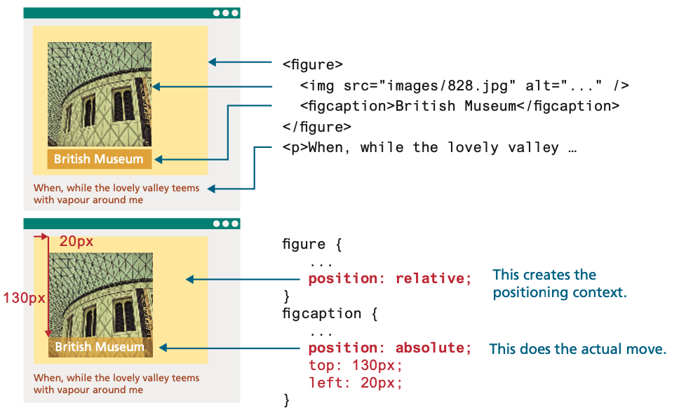

<!-- markdownlint-disable -->
# CSS Page Layout

As part of this week's content, we'll discuss different ways to layout a web page using CSS. We'll cover the following topics:

## Table of Contents

<!-- toc -->
- [CSS Page Layout](#css-page-layout)
  - [Table of Contents](#table-of-contents)
  - [Bookmarks](#bookmarks)
  - [Navigation](#navigation)
    - [CSS Pseudo-classes](#css-pseudo-classes)
  - [Normal flow](#normal-flow)
  - [Float](#float)
  - [CSS Clear Property](#css-clear-property)
  - [CSS Overflow Property](#css-overflow-property)
  - [CSS Display Property](#css-display-property)
  - [Position Element](#position-element)
    - [Relative Positioning](#relative-positioning)
    - [Absolute Positioning](#absolute-positioning)
    - [Combining Relative and Absolute Positioning](#combining-relative-and-absolute-positioning)
  - [The Box Model](#the-box-model)
    - [CSS Height and Width](#css-height-and-width)
    - [CSS Padding Property](#css-padding-property)
    - [CSS Margin Property](#css-margin-property)
    - [Box Model Summary](#box-model-summary)
  - [CSS Box-Sizing Property](#css-box-sizing-property)
    - [Example without Box-sizing Property](#example-without-box-sizing-property)
    - [Example with Box-sizing Property](#example-with-box-sizing-property)
  - [Gradient Backgrounds](#gradient-backgrounds)
    - [Linear Gradients](#linear-gradients)
    - [Radial Gradients](#radial-gradients)
    - [Conic Gradients](#conic-gradients)
    - [Tips for Using Gradients](#tips-for-using-gradients)
  - [CSS Debugging Tips](#css-debugging-tips)


The videos below provide an overview of the topics for this week. You can watch the videos before or after reading the content for this week.

- [CSS Float Property [4:28]](https://youtu.be/oJe8G5XT_v4?si=rXZYSXCArh_rVNPl)
- [CSS Display [8:43]](https://youtu.be/9hRjjws206M?si=haYqs5NlItCfNLfg)
- [CSS Pseudo Classes [4:57]](https://youtu.be/g9JDH6SelwM?si=5GWXivXUFG3bLvQR)
- [CSS Positioning [10:41]](https://youtu.be/3B1k5DUDXh8?si=8B9AKyzUgYrHyFjb)
- [CSS Box Model [10:59]](https://youtu.be/YIxOwIuWp3c?si=UDTN5-qjvNohPK_u)
  - [CSS Padding Video [7:16]](https://youtu.be/ATfKppZ4aRY?si=UroR4y8BKALKMEbQ)
  - [CSS Margin Video [4:31]](https://youtu.be/2zSxYMagX38?si=JnCkdGBJSDtYYNiS)
  - [CSS Margin Collapse Video [4:31]](https://youtu.be/2zSxYMagX38?si=JnCkdGBJSDtYYNiS)
- [CSS Width, Height and Box-sizing [9:06]](https://youtu.be/DSmFJi9kbeQ?si=2ys9BOz9FnOJXZA3)
- [CSS Gradients [7:28]](https://youtu.be/TYHFe4L9bfo?si=7NEsyJLvGLn32Oxz)

## Bookmarks

- Bookmarks can be useful if a web page is very long.
- To create a bookmark - first create the bookmark, then add a link to it.
- When the link is clicked, the page will scroll down or up to the location with the bookmark.
- First, use the `id` attribute to create a bookmark:

```html
<h2 id="contact-us">Contact Us</h2>
```

- Then, add a link to the bookmark ("Jump to Chapter 4"), from within the same page:

```html
<a href="#contact-us">Jump to Contact Us</a>
```

- You can also add a link to a bookmark on another page:

```html
<a href="demo-file.html#contact-us">Jump to Contact Us section on demo file</a>
```

> [!TIP]
> Notice that the `id` attribute is used to create a bookmark, and the `href` attribute is used to link to the bookmark. The `#` symbol is used to link to the `id` of the element.

## Navigation

- Navigation is an essential part of a website. It helps users find information and move around the site, which is based on HTML Bookmarks and CSS to create a navigation bar.
- In order to create a navigation bar, you can use an unordered list `<ul>` and list items `<li>`. 
  - The list items can be styled to appear horizontally or vertically.

<iframe width="100%" height="300" src="//jsfiddle.net/parsar/v2zctopa/1/embedded/html,css,result/" allowfullscreen="allowfullscreen" allowpaymentrequest frameborder="0"></iframe>


- With CSS, you may remove the underline and bullets

```css
nav a {
  text-decoration: none;}
nav ul {
  list-style-type: none;
  }
```

- Vertical Navigation Bar may be configured by setting the width
  
```css
nav a {
  display: block; width: 60px;
  }
``` 
- Horizontal Navigation Bar may be configured by setting the display

```css
li {
  display: inline-block;
  }
```

### CSS Pseudo-classes

- A pseudo-class is used to define a special state of an element.
- For example, it can be used to:
  - Style an element when a user mouses over it
  - Style visited and unvisited links differently
  - Style an element when it gets focus

- The syntax is:

```css
selector:pseudo-class {
  property: value;
  }
```

> [!WARNING]
> No space is allowed between the selector and pseudo-class.

- Pseudo-classes for the anchor element:
  - `a:link` – default state for a hyperlink
  - `a:visited` – a hyperlink that has been visited
  - `a:focus` – triggered when the hyperlink has focus
  - `a:hover` – triggered when the mouse moves over the hyperlink
  - `a:active` – triggered when the hyperlink is being clicked

## Normal flow

- By default, a browser displays the elements in the order they appear in the HTML code. 
- Two examples are shown here:

<iframe width="100%" height="300" src="//jsfiddle.net/parsar/uyrqe3wL/24/embedded/html,css,result/dark/" allowfullscreen="allowfullscreen" allowpaymentrequest frameborder="0"></iframe>

## Float

- It is possible to displace an element out of its position in the normal flow via the CSS **float property**
- An element can be floated to the `left` or floated to the `right` and content is “reflowed” around the floated element
- A floated block-level element should have a width specified


## CSS Clear Property

- The clear property specifies what elements can float beside the cleared element and on which side.
- The most common way to use the clear property is after you have used a float property on an element.
- When clearing floats, you should match the clear to the float
  - If an element is floated to the `left`, then you should clear to the `left`
  - Your floated element will continue to float, but the cleared element will appear below it on the web page
- Values for clear:
- `left`
- `right`
- `both`

<iframe width="100%" height="400" src="//jsfiddle.net/parsar/45hkv3gp/2/embedded/html,css,result/dark/" allowfullscreen="allowfullscreen" allowpaymentrequest frameborder="0"></iframe>

## CSS Overflow Property

- The **overflow** property controls what happens to content that is too big to fit into an area. 
- The overflow property has the following values:
  - `visible` (default): The overflow is not clipped and the content renders outside the element's box
  - `hidden`: The overflow is clipped, and the rest of the content will be invisible
  - `scroll`: The overflow is clipped, and a scrollbar is added to see the rest of the content
  - `auto`: Similar to scroll, but it adds scroll bars only when necessary

## CSS Display Property

- The display property configures how and if an element is displayed.
- Some of the display property values are as follows:
  - `none`: The element will not be displayed
  - `block`: The element is rendered as a block element – even if it is actually an inline element, such as a hyperlink
  - `inline`: The element will be rendered as an inline element – even if it is actually a block element, such as a `<li>`
  - `inline-block`: The element will display as an inline display element adjacent to other inline display elements but also can be configured with properties of block display elements including width and height


## Position Element

- The position property is used to specify the type of positioning. The left, right, top, and bottom properties are used to indicate the distance the element will move.
  - `absolute` The element is removed from normal flow and positioned in relation to its nearest positioned ancestor.
  - `fixed` The element is fixed in a specific position in the window even when the document is scrolled.
  - `relative` The element is moved relative to where it would be in the normal flow.
  - `static` The element is positioned according to the normal flow. This is the default.
  - `sticky` The element is positioned in according to the normal flow, and then offset relative to its nearest scrolling ancestor. This is used to allow an item to scroll, and then stay fixed in position once its scroll position is reached.


### Relative Positioning

> [!INFO]
> In relative positioning an element is displaced out of its normal flow position and moved relative to where it would normally have been placed. The other content around the relatively positioned element “remembers” the element’s old position in the flow; thus the space the element would have occupied is preserved, as is the rest of the document’s flow,
> 
> 


### Absolute Positioning

> [!TIP]
> When an element is positioned using absolute positioning, it is removed completely from normal flow. Thus, unlike with relative positioning, space is not left for the moved element, as it is no longer in the normal flow. Its position is moved in relation to the top left corner of its container block.
> 
> 

> [!INFO]
> Absolute position is relative to nearest positioned ancestor container
> 
> 

### Combining Relative and Absolute Positioning

One of the more common design tasks with CSS is to place two elements on top of each other, or to selectively hide and display elements. In such a case, **relative positioning** is used to create the positioning context for a subsequent `absolute` positioning move. Recall that `absolute` positioning is **positioning in relation to the closest positioned ancestor**. This doesn’t mean that you actually have to move the ancestor; you just set its position to `relative`. 

In the example below, the caption is positioned on top of the image; it doesn’t matter where the image appears on the page, its position over the image will always be the same



This technique can be used in many different ways. In the example below, an image that is the same size as the underlying one is placed on top of the other image using `absolute` positioning. Since most of this new image contains transparent pixels, it only covers part of the underlying image.


But imagine that this new banner is only to be displayed some of the time. You can hide this image using the display property.

There are in fact two different ways to hide elements in CSS: 
- Using the display property
  - The `display` property takes an item out of the flow: it is as if the element no longer exists.
- Using the visibility property 
  - The `visibility` property just hides the element, but the space for that element remains. 


> [!NOTE]
> Using the display:none and visibility:hidden properties on a content element also makes it invisible to screen readers as well (i.e., the content will not be spoken by the screen reader software). If the hidden content is meant to be accessible to screen readers, then another hiding mechanism (such as large negative margins) will be needed.

## The Box Model

In CSS, all HTML elements exist within an element box (also known as the box model). The CSS box model is essentially a box that wraps around every HTML element. It consists of `margins`, `borders`, `padding`, and the actual content.


### CSS Height and Width

- The height and width properties are used to set the height and width of an element.
  - Value "auto" is the default
    - The browser calculates the height and width based on the content
  - Value may be set in pixels or percentage of the containing block
- When you set the width and height properties of an element with CSS, you just set the width and height of the "content area". To calculate the full size of an element, you must also add padding, borders and margins.
- The following properties can be used to define maximum and minimum size of an element
  - `min-width`, `max-width`, `min-height`, `max-height`

### CSS Padding Property

- The padding property configures empty space between the content of the HTML element (such as text) and the border (0px by default).
- Related properties
  - `padding-top`, `padding-right`, `padding-bottom`, `padding-left`
  - `padding` is a shorthand property with values in the above order
- Example

```css
h2 {
  padding: 0;
  }	
  
h2 {
  /* top & bottom:10px, right & left:20px */
  padding: 10px 20px;
  } 		

h2 {
  /* top:10px, right & left:20px, bottom:30px */
  padding: 10px 20px 30px;
  }	

h2 {
  /* top:10px, right:20px, bottom:30px, left:40px*/
  padding: 10px 20px 30px 40px;
  } 
```

### CSS Margin Property

- The margin property configures empty space between the element and adjacent elements.
- Related properties:
  - `margin-top`, `margin-right`, `margin-bottom`, `margin-left`
  - `margin` is a shorthand property with values in the above order
- Examples:

```css
h1 {
  margin: 0;
  }	
  
h1 {
  /* top & bottom:10px, right & left:20px */
  margin: 10px 20px;
  } 		

h1 {
  /* top:10px, right & left:20px, bottom:30px */
  margin: 10px 20px 30px;
  }	

h1 {
  /* top:10px, right:20px, bottom:30px, left:40px*/
  margin: 10px 20px 30px 40px;
  } 
```

### Box Model Summary

- Content
  - Text & web page elements in the container
- Padding
  - Area between the content and the border 
  - Background is applied to both content and its padding
- Border
  - Between the padding and the margin
- Margin
  - Determines the empty space between the element and adjacent elements
  - Always transparent


## CSS Box-Sizing Property
- By default, the width and height of an element is calculated like this:
  - width + padding + border = actual width of an element
  - height + padding + border = actual height of an element

- The box-sizing property allows us to include the padding and border in an element's total width and height.
- Use the universal selector `*` to apply this to all the elements on the page:

```css  
* {
  box-sizing: border-box;
  }
```

### Example without Box-sizing Property

<iframe width="100%" height="450" src="//jsfiddle.net/parsar/vw7b3y12/2/embedded/html,css,result/dark/" allowfullscreen="allowfullscreen" allowpaymentrequest frameborder="0"></iframe>

### Example with Box-sizing Property

<iframe width="100%" height="460" src="//jsfiddle.net/parsar/seucf2yx/2/embedded/html,css,result/dark/" allowfullscreen="allowfullscreen" allowpaymentrequest frameborder="0"></iframe>


## Gradient Backgrounds
CSS gradients allow you to create smooth transitions between two or more specified colors. Gradients can be used to enhance the visual appeal of your web pages by adding depth and dimension to your backgrounds. 
- There are three types of gradients in CSS:
  - Linear Gradients (goes down/up/left/right/diagonally)
  - Radial Gradients (defined by their center)
  - Conic Gradients (rotated around a center point)

### Linear Gradients

- These gradients transition colors along a straight line. The direction of the gradient can be specified to go up, down, left, right, or diagonally.
- Syntax:

```css
background: linear-gradient(direction, color-stop1, color-stop2, ...);
```
- Example:

```css
.linear-gradient {
  /* This example creates a gradient that starts with red on the left and transitions to yellow on the right. */
  background: linear-gradient(to right, red, yellow);
}
```

### Radial Gradients

- These gradients transition colors outward from a central point, creating a circular or elliptical shape.
- Syntax:

```css
background: radial-gradient(shape size at position, color-stop1, color-stop2, ...);
```
- Example:

```css
.radial-gradient {
  /* This example creates a circular gradient that starts with blue at the center and transitions to green at the edges. */
  background: radial-gradient(circle, blue, green);
}
```

### Conic Gradients

- These gradients transition colors around a central point, creating a cone-like effect.
- Syntax:

```css
background: conic-gradient(from angle at position, color-stop1, color-stop2, ...);
```
- Example:

```css
.conic-gradient {
  /* This example creates a conic gradient that starts with red at the 0-degree position and transitions through multiple colors back to red. */
  background: conic-gradient(from 0deg, red, yellow, green, cyan, blue, magenta, red);
}
```

<iframe width="100%" height="875" src="//jsfiddle.net/parsar/85tym2rf/47/embedded/html,css,result/dark/" allowfullscreen="allowfullscreen" allowpaymentrequest frameborder="0"></iframe>

### Tips for Using Gradients

- Use color stops to control where colors change in the gradient. For example, linear-gradient(to right, red 0%, yellow 50%, green 100%) creates a gradient with specific points for each color transition.
- Combine gradients with background-size and background-position properties to create repeating gradient patterns.
- Experiment with different gradient types and directions to achieve the desired visual effect for your design.


## CSS Debugging Tips

- Use the browser developer tools to inspect the HTML and CSS
- Manually check syntax errors
  - Use W3C CSS Validator (http://jigsaw.w3.org/css-validator/) to check syntax errors 
- Configure Block Display for browsers not supporting HTML5:
  - header, main, nav, footer, section, article, aside, figure, figcaption {display: block;}
- Configure temporary background colors
- Configure temporary borders
- Use CSS comments to find the unexpected
  - `/* the browser ignores this code */`
- Don't expect your pages to look exactly the same in all browsers!
- Be patient!
